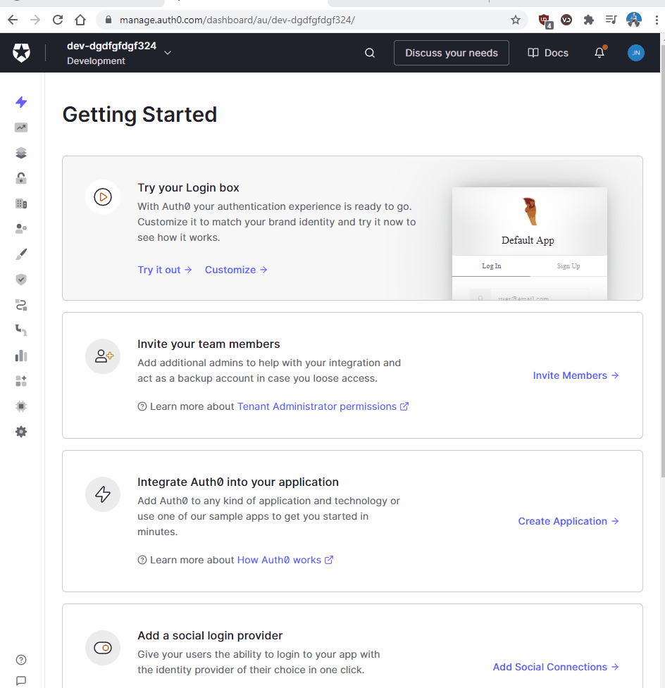
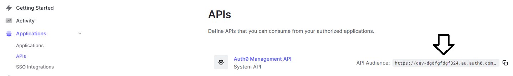

Earlier I showed you how to Display Auth0 user profiles in ASP.NET Core 5.0 but did not show you how to automatically renew the token. 

If you haven't noticed yet you'll see you can't get the users and will be returned this exception.

```
`ErrorApiException: {"statusCode":401,"error":"Unauthorized","message":"Expired token received 
for JSON Web Token validation","attributes": {"error":"Expired token received for JSON Web 
Token validation"}}`
```
If we did it the same way we did it in part one then we would have to manually regenerate the token in Auth0 dashboard and hardcoded it again!

Or...

We could request a refresh token from the Auth0 Dashboard and use that to generate a brand new token automatically. 

Also we left the token string in our project tree which can be dangerous if you commit the token to source control. You want to declare it outside of your project tree using either the ASP.NET Secrets Manager or an environment variable. 

In this article I will show you how to configure in memory token management.   

## Before starting ##

There are two ways you can complete this tutorial. You can:

1. Use the project you downloaded from the Auth0UserProfileDisplayStarterKit part1 blog and continue using that to follow along and complete this tutorial.

2. You can start from scratch and use the Part2 branch project I created for our Auth0UserProfileDisplayStarterKit with a link to the [starter kit project here](https://github.com/LayersOfAbstraction/Auth0UserProfileDisplayStarterKit/tree/part2). The project branch in that repository is created solely for this part 2 blog.

I would personally use option 1 to get the most out of this tutorial.
If you haven't already seen my [Part1 blog](https://layersofabstraction.github.io/displaying-auth0-user-profiles-in-ASP.NET-Core-MVC-part1.html) for this tutorial you are advised to go through it to understand how to use Auth0.   

In this blog we are going to update our previous logic and use new technologies. 

## Install Auth0 Authentication API SDK ##

We need access to the ClientCredentialsTokenRequest Class which lies in the Auth0.AuthenticationApi.
Download this into your project to access the library. 

```
dotnet add package Auth0.AuthenticationApi --version 7.7.0
```

## Copy these library folders from repository into your project ##

Please, [star this repository if you are logged in and clone it!](https://github.com/nikaburu/Example.Auth0.AuthenticationApi)
It is a version of the Identity Model library we will be using to renew the token 
automatically. 

Make sure you have cloned and extracted the repository. The folders you need to copy across from the repository are:

- AccessTokenManagement
- Services

Copy them into your project now.

## Paste new Auth0ManagementApi and Identity Model logic into our Home Controller ##

Go into Controllers\HomeController and declare these three models at the top of your code above
the namespace.

```
using Auth0.ManagementApi.Paging;
using Example.Auth0.AuthenticationApi.Services;
using System.Threading;
using Auth0.ManagementApi.Models;
```

We need to create a list and tell C# that we are using IUserService. So in the controller
create an IPagedList, declare that you are using the IUserService and pass it 
to the constructor. Also use the CancellationToken class to cancel retrieval of Auth0 
refresh token if unsuccessful. It should be in System.Threading. 
 

```
public IPagedList<Auth0.ManagementApi.Models.User> Users { get; private set; }
private readonly IUserService _userService;

public HomeController(IUserService userService)
{
    _userService = userService;
}
```

Now let's get to the action method being passed to the view which is GetAllAuth0Users()

This is what the action method looked like in part one of this tutorial.

```
public async Task <IActionResult> GetAllAuth0Users()
{
    //Get token
    var apiClient = new ManagementApiClient(Auth0UserProfileDisplayStarterKit.ViewModels.ConstantStrings.strToken, new Uri ("https://dev-dgdfgfdgf324.au.auth0.com/api/v2/"));
    //Get all auth0 users that have this application
    var allUsers = await apiClient.Users.GetAllAsync(new Auth0.ManagementApi.Models.GetUsersRequest(), new Auth0.ManagementApi.Paging.PaginationInfo());
    //Read each Auth0 user by field
    var renderedUsers = allUsers.Select(u => new User
    {                
        //Split their full name into first and last name if there is a space
        UserFirstName = u.FullName.Contains(' ') ? u.FullName.Split(' ')[0] : "no space",
        UserLastName = u.FullName.Contains(' ') ? u.FullName.Split(' ')[1] : "no space",
        //Get user profile email
        UserContactEmail = u.Email
    }).ToList();

    return Json(renderedUsers);
}
```

Now change it this.

```
/// <summary>
/// Display Auth0 users from list.
/// </summary>
/// <param name="cancellationToken">Notify application any action should be canceled</param>
/// <returns></returns>
public async Task <IActionResult> GetAllAuth0Users(CancellationToken cancellationToken)
{            
    //Get new token using Auth0ManagementApi with IUserService to interface with Identity Model library.
    var allUsers = await _userService.GetUsersAsync(new GetUsersRequest(), new PaginationInfo(), cancellationToken);
    //Get all auth0 user's first name, last name and email
    var renderedUsers = allUsers.Select(u => new Auth0UserProfileDisplayStarterKit.ViewModels.User
    {                
        UserFirstName = u.FullName.Contains(' ') ? u.FullName.Split(' ')[0] : "no space",
        UserLastName = u.FullName.Contains(' ') ? u.FullName.Split(' ')[1] : "no space",
        UserContactEmail = u.Email
    }).ToList();
    return Json(renderedUsers);
}
```

A lot of it is self explanatory from the comments I wrote. The big changes are we are no longer
using the Auth0ManagementApiClient class methods or the constant string we made earlier.
So you can delete that ConstantStrings class.

We are instead using the Auth0ManagementApi methods to get the Users Profiles we have 
connected to our application in Auth0 Dashboard. And we are using the IUserService which we
declared in the constructor to interface with the Identity Model library and get us a 
refresh token.

We also get the CancellationToken using this method.

```
public async Task OnGet(CancellationToken cancellationToken)
{
    Users = await _userService.GetUsersAsync(new GetUsersRequest(), new PaginationInfo(), cancellationToken);
}
```


## Get Access Token ##

Now we need to create two models to help us create access token. Here is the code for class LoginAuthentication.

```
using Auth0.AuthenticationApi;

namespace Auth0UserProfileDisplayStarterKit.ViewModels
{

    public class LoginAuthentication
    {

        public static Auth0Token Login(string ClientID, string ClientSecret, string domain)
        {
            var authenticationApiClient = new AuthenticationApiClient(domain);
            var token =  authenticationApiClient.GetTokenAsync(new Auth0.AuthenticationApi.Models.ClientCredentialsTokenRequest
            {                
                ClientId = ClientID,
                ClientSecret = ClientSecret,
                Audience = "https://dev-dgdfgfdgf324.au.auth0.com/api/v2/"
            }).Result;
            return new Auth0Token {strAuth0Token = token.AccessToken};   
        }
    }
}

```

## Make token globally accessible ##

Add the 2nd model to make our token globally accessible throughout our client side application. 

```
namespace Auth0UserProfileDisplayStarterKit.ViewModels
{
    public class Auth0Token
    {
        public string strAuth0Token {get;set;}
    }
}
```

Now we need to add AccessTokenManagement references to Startup.ConfigureServices. Code looks like this.

```
// Add the Auth0 HttpClientManagementConnection.
services.AddSingleton<IManagementConnection, HttpClientManagementConnection>();
// Add JWT renewal references  
services.AddAccessTokenManagement(Configuration); 
services.AddTransient<IUserService, UserService>();
```

And for those references to work we will have to add our own using statements

```
using Example.Auth0.AuthenticationApi.AccessTokenManagement;
using Example.Auth0.AuthenticationApi.Services;
using Auth0.ManagementApi;
```

## Create machine to machine application and Authorise an API ##

Now we need to login to the Auth0 dashboard server and create a machine application to act as an API between the Auth0 server and our ASP.NET client application. 

In the Auth0 Dashboard go to:

1. Applications
2. Create Application
3. Select Machine to Machine Applications. We will call it "User_Profile_Service"
4. Authorize Machine to Machine Application. Select the API in the list. If you don't know
which to use that's ok. Just use the default Auth0 API which is called Auth0 Management API.
5. Select one scope to make the 
5. Hit the Create button. API connection more secure. Select "read:users" and hit authorize. 

{:width="539px"}

Notice how you can see the ClientSecret? That is something you should not be able to see. Luckily I have rotated it which can be done in the client application.

## Bind Auth0 API keys to ASP.NET Secret Manager ##

Speaking of ClientSecrets, did you know we can keep the information out of source control without renaming the property values to nonsensical names in appsettings.json?

The answer is to use the ASP.NET Core Secret Manager. Warning, this is where it can get frustrating if done wrong, advise you backup your project now.

Open appsettings.json. No no don't set any values yet. Just notice how dangerous it is right now to put especially our client secret (private key) in the file and put it in a public repo. 

```
  "Auth0": {    
    "ManagementApi": 
      "BaseUri": "{BASE_URI}",
      "Domain": "{DOMAIN}",
      "ClientId": "{CLIENT_ID}",
      "ClientSecret": "{CLIENT_SECRET}"
  }
```

Look for the Auth0 server application you have made
for this client application. Can you see the values for the Domain? ClientID? ClientSecret. You should know all this if you've read the Auth0 Quickstart for ASP.NET5. 

Also you need the value for the Auth0 Management API. To find the value on the dashboard go to: 
-Applications 
-APIs
-And you should see the value right there.

{:width="739px"}
I will show you how to set the values for those 4 properties outside of the project quickly and easily so the API keys stay on your local environment away from the hackers prying eyes.

Fire up the .NET CLI and initialize the Secret Manager Tool which should appear with a unique ID in your project file.

```
dotnet user-secrets init
```

Do NOT copy and paste this into terminal!
Write each value into these properties by hand so as to insert your
own values. 
```
dotnet user-secrets set "Auth0:Domain" "INSERT DOMAIN VALUE HERE!"
dotnet user-secrets set "Auth0:ClientId" "INSERT CLIENTID VALUE HERE!"
dotnet user-secrets set "Auth0:ClientSecret" "INSERT CLIENTSECRET VALUE HERE!"
dotnet user-secrets set "Auth0:BaseUri" "INSERT CLIENTSECRET VALUE HERE!"
```

If you mess up, [please click here.](https://docs.microsoft.com/en-us/aspnet/core/security/app-secrets?view=aspnetcore-5.0&tabs=windows) Now run the code to ensure no runtime error occurs that stops the screen from showing.


The data in the table won't load yet and you should get these one or two of these errors in the properties inspector.

_Failed to load resource: the server responded with a status of 500 (Internal Server Error)_

_jquery.dataTables.js:6522 Uncaught Error: DataTables warning: table id=auth0UsersTable - Ajax error. For more information about this error, please see http://datatables.net/tn/7_

All you need to know is that wile we have inserted the keys to connect Auth0 to our client
app, we have not inserted the values to connect the Auth0 Management API to the client.
  
In appsetting.json insert this block that we call our _AccessTokenManagement_ code you can insert it just above your Auth0 block. 

```
  "AccessTokenManagement": {
    "Domain": "{DOMAIN}",
    "Clients": [
      {
        "Name": "UserService",
        "ClientId": "{CLIENT_ID}",
        "ClientSecret": "{CLIENT_SECRET}",
        "BaseUri": "{BASE_URI}"
      }
    ]
  },
```

Setting these properties are going to look different from the previous code block so here is how we do it in the terminal. If you have trouble 

```
dotnet user-secrets set "AccessTokenManagement:Domain" "INSERT DOMAIN VALUE HERE!"
dotnet user-secrets set "AccessTokenManagement:Clients:0:ClientId" "INSERT CLIENTID VALUE HERE!"
dotnet user-secrets set "AccessTokenManagement:Clients:0:ClientSecret" "INSERT CLIENTSECRET VALUE HERE!"
```
[//]: # (Up to step 10/10. TODO: - Add user-secret for Audience and BaseUri)


