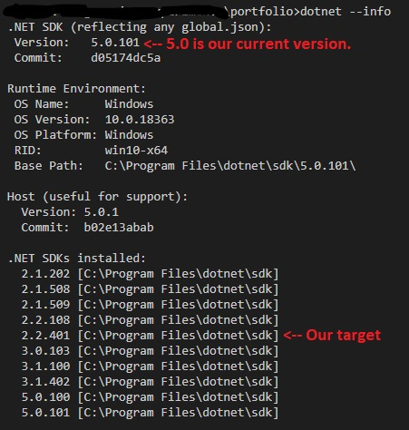

I once read a Shakespearean inspired technical quote "To update or not to update, there is no question." I simplify that in this blog with migrating from ASP.NET Core 2.2 to 3.1.

## But first, download the 3.0 SDK if you haven't already ##

Simply put this post is going to focus on improving the security of my demo application by ensuring it receives Long Term Support (LTS) from .NET Core 3.1.

If you get stuck in this tutorial you can [download the demo](https://github.com/LayersOfAbstraction/2.2_to_3.0_migration_project) I made and compare the code to yours to ensure you are properly migrating from 2.2 to 3.0. We will focus on 3.1 in the next blog.

First make sure you have installed the [.NET Core 3.0 SDK 3.0.100](https://dotnet.microsoft.com/download/dotnet-core/3.0#sdk-3.0.100:~:text=SDK%203.0.100,-Visual) we can download 3.1 later.

In the Terminal we will ensure that we are using .NET Core 2.2 and not just using the latest framework version. Write this code into the terminal to check which version of the .NET Core SDK you are using. 

## Check our version ##

`dotnet --version`

Does the CLI return this code? 

`2.2.401` or `2.2.108`

If it is not returning that and you have something later than 2.2 installed than we will manually have to tell .NET Core to use either of those versions for this project. 

I will revert to 2.2.401 for the project we have built. Open a folder and call it what you want. I called mine `2.2_to_3.0_migration_project`. Check to make sure we have it installed by using this command.

`dotnet --info`

And something similar to this should display.




<!--  -->

As you can see .NET Core 5.0 is our current version. I'm not going to the latest version until I am guaranteed LTS which I'm not yet. You will notice the version I have marked as our target version which is 2.2.401. 

## Switch versions ##

Let us manually set our version to our target version by creating a json file in our project directory with these commands. 

`dotnet new globaljson --sdk-version 2.2.401`

You may get warned that creating this template will make changes to existing files. If so just run this command else skip to the next instruction.

`dotnet new globaljson --sdk-version 2.2.401 --force`

Now check if we have successfully switched versions `dotnet --version`. We should get the following number. 

`2.2.401`

If we have, then we are ready to create a new ASP.NET Core MVC app in that version. 

## Create new project ##

Use this command to create project folder and files. `dotnet new mvc -o 2.2_to_3.0_migration_project`

Load project directory in VS Code and watch a new window open that displays only the project folder and files. When you execute this command you can close the previous VS Code window. 

`code 2.2_to_3.0_migration_project`

Now before we continue we must ensure we have a trusted certificate if you don't already have one.

`dotnet dev-certs https --trust`

## Run new project ##

Fire up the project with the command `dotnet watch run` and you should be able to navigate to the url that is listed in the terminal that ASP.NET Core is listening on. Click on it and make sure the template is functioning ok before continuing.  

With watches you should be able to make changes to the app and simultaneously read this article without stopping and starting the debugger. 

From the documentation in microsoft you have a large number of obsolete packages that are not needed. We need to change files around. 

We will be following the majority of what is in the microsoft docs but it also shows you information related to SignalR and health checks which for me wasn't related to MVC and I found so confusing I had to redo my project.

So those parts I am cutting out of the blog. If you want to check them out, [click here](https://docs.microsoft.com/en-us/aspnet/core/migration/22-to-30?view=aspnetcore-5.0&tabs=visual-studio). Just don't let them confuse you like they did with me.

If that all works then **_PLEASE DELETE_** your `global.json` file so we don't get versions confused. Also I suggest you terminate your watch using Ctrl + c.

## Update .csproj file for .NET Core 3.0 ##

Anyway go to the .csproj file in your project. It should look similar to this.

```
<Project Sdk="Microsoft.NET.Sdk.Web">

  <PropertyGroup>
    <TargetFramework>netcoreapp2.2</TargetFramework>
    <AspNetCoreHostingModel>InProcess</AspNetCoreHostingModel>
    <RootNamespace>_2._2_to_3._0_migration_project</RootNamespace>
  </PropertyGroup>


  <ItemGroup>
    <PackageReference Include="Microsoft.AspNetCore.App" />
    <PackageReference Include="Microsoft.AspNetCore.Razor.Design" Version="2.2.0" PrivateAssets="All" />
  </ItemGroup>

</Project>
```

Get rid off all those packages as they are obsolete in 3.0. change from target framework to "netcoreapp3.0". Let's also quickly add a framework reference to the ASP.NET Core runtime. 
To continue using features provided by packages references we removed, you need to add new assemblies for 3.0. Now it to look like this.

```
<Project Sdk="Microsoft.NET.Sdk.Web">

  <PropertyGroup>
    <TargetFramework>netcoreapp3.0</TargetFramework>
    <AddRazorSupportForMvc>true</AddRazorSupportForMvc>
  </PropertyGroup>

  <ItemGroup>
    <PackageReference Include="Microsoft.AspNetCore.Diagnostics.EntityFrameworkCore" Version="3.0.0" />
    <PackageReference Include="Microsoft.AspNetCore.Identity.EntityFrameworkCore" Version="3.0.0" />
    <PackageReference Include="Microsoft.AspNetCore.Identity.UI" Version="3.0.0" />
    <PackageReference Include="Microsoft.EntityFrameworkCore.SqlServer" Version="3.0.0" />
    <PackageReference Include="Microsoft.EntityFrameworkCore.Tools" Version="3.0.0" />
  </ItemGroup>

</Project>

```

## Update our startup.cs file for .NET Core 3.0 ##

Change our startup file from this.

```
using System;
using System.Collections.Generic;
using System.Linq;
using System.Threading.Tasks;
using Microsoft.AspNetCore.Builder;
using Microsoft.AspNetCore.Hosting;
using Microsoft.AspNetCore.Http;
using Microsoft.AspNetCore.HttpsPolicy;
using Microsoft.AspNetCore.Mvc;
using Microsoft.Extensions.Configuration;
using Microsoft.Extensions.DependencyInjection;

namespace _2._2_to_3._0_migration_project
{
    public class Startup
    {
        public Startup(IConfiguration configuration)
        {
            Configuration = configuration;
        }

        public IConfiguration Configuration { get; }

        // This method gets called by the runtime. Use this method to add services to the container.
        public void ConfigureServices(IServiceCollection services)
        {
            services.Configure<CookiePolicyOptions>(options =>
            {
                // This lambda determines whether user consent for non-essential cookies is needed for a given request.
                options.CheckConsentNeeded = context => true;
                options.MinimumSameSitePolicy = SameSiteMode.None;
            });


            services.AddMvc().SetCompatibilityVersion(CompatibilityVersion.Version_2_2);
        }

        // This method gets called by the runtime. Use this method to configure the HTTP request pipeline.
        public void Configure(IApplicationBuilder app, IHostingEnvironment env)
        {
            if (env.IsDevelopment())
            {
                app.UseDeveloperExceptionPage();
            }
            else
            {
                app.UseExceptionHandler("/Home/Error");
                // The default HSTS value is 30 days. You may want to change this for production scenarios, see https://aka.ms/aspnetcore-hsts.
                app.UseHsts();
            }

            app.UseHttpsRedirection();
            app.UseStaticFiles();
            app.UseCookiePolicy();

            app.UseMvc(routes =>
            {
                routes.MapRoute(
                    name: "default",
                    template: "{controller=Home}/{action=Index}/{id?}");
            });
        }
    }
}

```

We replace the file with the following code. I will explain the changes below so you know what I have changed.

```
using Microsoft.Extensions.Hosting;
using Microsoft.AspNetCore.Hosting;
using Microsoft.AspNetCore.Builder;
using Microsoft.Extensions.Configuration;
using Microsoft.Extensions.DependencyInjection;

namespace _2._2_to_3._0_migration_project
{
    public class Startup
    {
        public Startup(IConfiguration configuration)
        {
            Configuration = configuration;
        }

        public IConfiguration Configuration { get; }

        // This method gets called by the runtime. Use this method to add services to the container.
        public void ConfigureServices(IServiceCollection services)
        {
            services.AddRazorPages();
        }

        // This method gets called by the runtime. Use this method to configure the HTTP request pipeline.
        public void Configure(IApplicationBuilder app, IWebHostEnvironment env)
        {
            if (env.IsDevelopment())
            {
                app.UseDeveloperExceptionPage();
            }
            else
            {
                app.UseExceptionHandler("/Home/Error");
                // The default HSTS value is 30 days. You may want to change this for production scenarios, see https://aka.ms/aspnetcore-hsts.
                app.UseHsts();
            }

            app.UseHttpsRedirection();
            app.UseStaticFiles();
            app.UseRouting();

            app.UseAuthorization();
            app.UseEndpoints(endpoints =>
            {
                endpoints.MapControllerRoute("default", "{controller=Home}/{action=Index}/{id?}");
            });
        }
    }
}
```

Here are the changes.

* `services.AddMvc` to `services.AddRazorPages()`
* `CompatibilityVersion` replaced with `services.AddRazorPages();`.
* `IHostingEnvironment` to `IWebHostEnvironment`.
* `app.UseAuthorization` was added. If the app doesn't use authorization, you can safely remove the call to app.* UseAuthorization.
* `app.UseEndpoints` was added.
* `using Microsoft.Extensions.Hosting;` was added. 

## Kestrel configuration setup ##

Because Kestrel supports a wide array of platforms, it would be beneficial to get it up and running in our development environment. If you have it already setup in 2.2. Else if you only plan on using IIS you can skip this section. 

Anyway to port Kestrel from 2.2 to 3.0 open `Program.cs` and migrate kestrel configuration to the IHostBuilder class provided by ConfigureWebHostDefaults.

```
// requires using Microsoft.AspNetCore.Hosting;
// requires using Microsoft.Extensions.Hosting;

public class Program
{
    public static void Main(string[] args)
    {
        CreateHostBuilder(args).Build().Run();
    }

    public static IHostBuilder CreateHostBuilder(string[] args) =>
    Host.CreateDefaultBuilder(args)
        .ConfigureWebHostDefaults(webBuilder =>
        {
            webBuilder.UseStartup<Startup>();
        });
}

```

### Integrate Newtonsoft.Json into 3.0 ###

This one will be a little more complex. If you've read the microsoft migration docs you'll know that Newtonsoft.Json is not being used as much by Microsoft and they use System.Text.Json instead.
With that said there Newtonsoft.Json is still more popular than System.Text.Json. You can read about it [here](https://visualstudiomagazine.com/articles/2020/07/28/json-serializers.aspx) if you want.

 That said I will be covering Newtonsoft.Json setup instead. Use this console command.

`dotnet add package Microsoft.AspNetCore.Mvc.NewtonsoftJson --version 3.0.0`

Now go Startup and add `using Newtonsoft.Json.Serialization;` and then to ConfigureServices and add a call to the json libraries.  

```

services.AddMvc()
.AddNewtonsoftJson(options =>
    options.SerializerSettings.ContractResolver =
        new CamelCasePropertyNamesContractResolver());  
```

### Register MVC extension methods ### 

Add these extension methods in the `ConfigureServices` method. The following example is equivalent to calling AddMvc in ASP.NET Core 2.2: 

```
public void ConfigureServices(IServiceCollection services)
{
    services.AddControllersWithViews();
    services.AddRazorPages();
}
```

### Migrate Startup.Configure ###

Does your app uses authentication/authorization features like `AuthorizePage` or `[Authorize]`? 

If so place the call to the extension methods UseAuthentication and UseAuthorization after, UseRouting and UseCors, but before UseEndpoints:


```
public void Configure(IApplicationBuilder app)
{
  ...

  app.UseStaticFiles();

  app.UseRouting();

  app.UseAuthentication();
  app.UseAuthorization();

  app.UseEndpoints(endpoints => {
     endpoints.MapControllers();
  });

  app.UseEndpoints(endpoints =>
  {
    endpoints.MapControllerRoute("default", {"controller=Home}/{action=Index}/{id?}");
  });
```

Run it again  and it should work. If it doesn't work with watches, try pressing F5 and use the debugger. Another instance may be running, if so terminate any watches you have else open and close Visual Studio Code.

Well hopefully this made things easier for you. In my [next upcoming blog]() we will learn how to convert 3.0 apps to 3.1. 