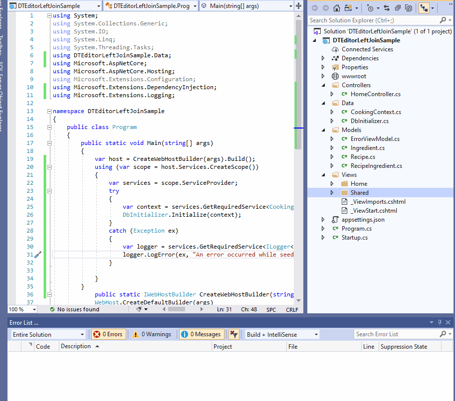

I noticed how DataTables results in way less code and more functionality out of the box. When you retrieve data from more than one related table that's where the heartache begins for many. This blog takes the frustration out of that, by showing you how to create a Left Join in DataTables Editor.

Completed demo code here.
<https://github.com/LayersOfAbstraction/DTEditorLeftJoinSample.git>

You could use a Entity Framework to create the UI for CRUD operations
but that would mean more code, a performance reduction and not nearly as
elegant if you design it yourself.

DataTables takes the heartache out of that. For example I will show you
the code for one controller and view built entirely in Entity Framework
Core. Don\'t worry you don\'t have to memorise all the code in the
samples right now especially in EF Core.

## The view


    @model PaginatedList<Pitcher.Models.Registration>

    @{
        ViewData["Title"] = "Registrations";
    }

    <h1>Registrations</h1>

    <p>
        <a asp-action="Create">Create New</a>
    </p>
        
    <form asp-action="Index" method="get">
        <div class="form-actions no-color">
            <p>
                Find by name: <input type="text" name="SearchString" value="@ViewData["currentFilter"]" />
                <input type="submit" value="Search" class="btn btn-primary" /> |
                <a asp-action="Index">Back to Full List</a>
            </p>
        </div>
    </form>

    <table class="table table-hover">
        <thead>
            <tr>
                <th>
                    <a asp-action="Index" asp-route-sortOrder="@ViewData["RegDateSortParm"]" asp-route-currentFilter="@ViewData["CurrentFilter"]">RegistrationDate</a>
                </th>
                <th>
                    @* COPY AND PASTE THIS METHOD CUSTOMIZATION INTO OTHER VIEWS BOUND TO COMPOSITE TABLES. Enables sorting. *@
                        <a asp-action="Index" asp-route-sortOrder="@ViewData["FullNameSortParam"]" asp-route-currentFilter="@ViewData["CurrentFilter"]">Full Name</a>
                </th>
                <th>
                    <a asp-action="Index" asp-route-sortOrder="@ViewData["JobTitleSortParam"]" asp-route-currentFilter="@ViewData["CurrentFilter"]">Job Title</a>
                </th>
                <th></th>
            </tr>
        </thead>
        <tbody>
    @foreach (var item in Model) {
            <tr>
                <td>
                    @Html.DisplayFor(modelItem => item.RegistrationDate)
                </td>
                <td>
                    @Html.DisplayFor(modelItem => item.User.UserFullname)
                </td>
                <td>
                    @Html.DisplayFor(modelItem => item.Job.JobTitle)
                </td>
                <td>
                    <a asp-action="Edit" asp-route-id="@item.ID" button type="button" class="btn btn-primary btn-block">Edit</a> 
                    <a asp-action="Details" asp-route-id="@item.ID" button type="button" class="btn btn-info btn-block">Details</a> 
                    <a asp-action="Delete" asp-route-id="@item.ID" button type="button" class="btn btn-primary btn-block">Delete</a>
                </td>
            </tr>
    }
        </tbody>
    </table>

    @{
        var prevDisabled = !Model.HasPreviousPage ? "disabled" : "";
        var nextDisabled = !Model.HasNextPage ? "disabled" : "";
    }

    <a asp-action="Index"
        asp-route-sortOrder="@ViewData["CurrentSort"]"
        asp-route-pageNumber="@(Model.PageIndex - 1)"
        asp-route-currentFilter="@ViewData["CurrentFilter"]"
        class="btn btn-secondary @prevDisabled"
        button type="button">
        Previous
    </a>
    <a asp-action="Index"
        asp-route-sortOrder="@ViewData["CurrentSort"]"
        asp-route-pageNumber="@(Model.PageIndex + 1)"
        asp-route-currentFilter="@ViewData["CurrentFilter"]"
        class="btn btn-secondary @nextDisabled"
        button type="button">
        
        Next
    </a>                                                  
                                       

## Controller with Index method

    public async Task Index(string sortOrder, string currentFilter, string searchString, int? pageNumber)
    {
        ViewData["CurrentSort"] = sortOrder;
        ViewData["FullNameSortParam"] = String.IsNullOrEmpty(sortOrder) ? "fullName_desc" : "";           
        ViewData["JobTitleSortParam"] = sortOrder == "jobTitle" ? "jobTitle_desc" : "jobTitle";
        ViewData["RegDateSortParm"] = sortOrder == "Date" ? "date_desc" : "Date";
        ViewData["CurrentFilter"] = searchString;
        IQueryable  registrations = _context.Registrations.Include(r => r.Job).Include(r => r.User);

        if (searchString != null)
        {
            pageNumber = 1;
        }
        else
        {
            searchString = currentFilter;
        }

        if (!String.IsNullOrEmpty(searchString))
        {
            registrations = registrations.Where(r => r.User.ToString().Contains(searchString)
                                || r.Job.ToString().Contains(searchString));
        }
        switch (sortOrder)
        {
            case "fullName_desc":
                registrations = registrations.OrderByDescending(r => r.User);
                break;
            case "jobTitle_desc":
                registrations = registrations.OrderByDescending(r => r.Job);
                break;
            case "Date":
            registrations = registrations.OrderBy(r => r.RegistrationDate);
                break;
            case "date_desc":
                registrations = registrations.OrderByDescending(r => r.RegistrationDate);
                break;
            case "jobTitle":
                registrations = registrations.OrderBy(r => r.User);
                break;
            //By default FullName is in ascending order when entity is loaded. 
            default:
                registrations = registrations.OrderBy(r => r.Job);
                break;
        }
        int pageSize = 20;
        return View(await  PaginatedList.CreateAsync(registrations.AsNoTracking(), pageNumber ?? 1, pageSize));
    }
                                    

Now I will show you what the UI looks like when I compile the code.

{:width="780px"}

Now if we write the code in DataTables Editor in the Index method for
the same controller and the view, it will be much shorter. I will show
you what it would look like if we run that.

{:width="780px"}

Obviously there is heaps more functionality in the UI, the code (which I
will show later) is cleaner too. Let\'s replicate this in a new project.
I will do this on Windows 10. You should be able to run and Entity
Framework Core on Linux too as .NET Core is open source though if you do
Mac then you will have to use Docker to install SQL Server which this
tutorial sadly does not cover.

## Download .NetCore

Make sure you have downloaded .NET Core SDK 2.2.

I would advise you do NOT do this using Visual Studio Code as even
Microsoft does not bother to generate EF Core objects in MVC such as
Views/Controllers using VS Code. Make sure you have downloaded .NET Core
SDK 2.2.

<https://dotnet.microsoft.com/download/dotnet-core>

## Create app in Visual Studio 2019

Microsoft\'s ASP.NET Core team use Visual Studio for MVC tutorials with
EF Core. So let's first open Visual Studio 2019 and create ASP.NET Core
WebApplication Template. You can always play around with this app in VS
Code later if you want once you complete it.


Make sure you have selected 2.2, have no authentication and have
configured for HTTPS.


After that create the project. We will now create a Recipe database 3
different models, Recipe, RecipeIngredient and Ingredient. Create each
of these classes in the model folder.

## Recipe

    using System.Collections.Generic;
    using System.ComponentModel.DataAnnotations;
    using System.ComponentModel.DataAnnotations.Schema;

    namespace DTEditorLeftJoinSample.Models
    {
        public class Recipe
        {
            public int ID { get; set; } 
            
            public string Title {get;set;}
            public string Descriptions {get;set;}
            public string Directions {get;set;} 

            public ICollection<RecipeIngredient> RecipeIngredient { get; set; }   
        }
    }

## RecipeIngredient

using System.Collections.Generic;
using System.ComponentModel.DataAnnotations;
using System.ComponentModel.DataAnnotations.Schema;

namespace DTEditorLeftJoinSample.Models
{
    public class RecipeIngredient
    {
        public int ID { get; set; }

        [Display(Name = "Recipe ID")]
        public int RecipeID { get; set; }

        [Display(Name = "Ingredient ID")]
        public int IngredientID { get; set; }

        public int Quantity { get; set; }
        public Recipe Recipe { get; set; }
        public Ingredient Ingredient { get; set; }
    }
}
                                        

## Create Ingredient class

    using System.Collections.Generic;
    using System.ComponentModel.DataAnnotations;
    using System.ComponentModel.DataAnnotations.Schema;

    namespace DTEditorLeftJoinSample.Models
    {
        public class Ingredient
        {
            public int ID {get;set;}
            [Display(Name = "Ingredient Name")]
            public string IngredientName {get;set;}

            public ICollection<RecipeIngredient> RecipeIngredient { get; set; }    
        }
    }                                       
                                        

Create the connection string in appsettings.json then copy and paste
this connection string there.

## Insert connection string into appsettings.json

    {
        "ConnectionStrings": {
            "DefaultConnection": "Server=(localdb)\\mssqllocaldb;Database=RecipeDB;Trusted_Connection=True;MultipleActiveResultSets=true"
        },
        "Logging": {
            "LogLevel": {
            "Default": "Warning"
            }
        },
        "AllowedHosts": "*"
    }                                         
                                        

Even though we cannot integrate Entity Framework Core directly with
DataTables Editor, we can still generate the database via EF Core to use
with the library. We will do this by creating the database context
class. Create a Data folder and add this class.

## Create CookingContext

    using DTEditorLeftJoinSample.Models;
    using Microsoft.EntityFrameworkCore;

    namespace DTEditorLeftJoinSample.Data
    {
        public class CookingContext : DbContext
        {
            public CookingContext(DbContextOptions options) : base(options)
            {
            }

            public DbSet Recipe { get; set; }
            public DbSet Ingredient {get;set;}
            public DbSet RecipeIngredient {get;set;}  
            
            protected override void OnModelCreating(ModelBuilder modelBuilder)
            {
                modelBuilder.Entity().ToTable("tblRecipe");
                modelBuilder.Entity().ToTable("tblIngredient");
                modelBuilder.Entity().ToTable("tblRecipeIngredient ");
            }
        }
    }                                                                             
                                        

## Register CookingContext as service in Startup.cs

Register the CookingContext as a service in Startup.cs using dependency
injection where the ConfigureServices method is. You can do that by
adding this code to the method. Go to Startup.cs now.

    services.AddDbContext(options => 
    options.UseSqlServer(Configuration.GetConnectionString("DefaultConnection")));                                  
                                        

Now add these statements to the startup file.

    using DTEditorLeftJoinSample.Data;
    using Microsoft.EntityFrameworkCore;
                                        

## Create data seed

Now we want to seed the database with test data. This is an optional
step but highly beneficial. If it does not work for you, the data can be
entered manually. In the Data folder create this file DbInitializer.cs
and insert this code.

## DbInitializer

    using DTEditorLeftJoinSample.Models;
    using System;
    using System.Linq;
    using Microsoft.EntityFrameworkCore;
    using Microsoft.Extensions.DependencyInjection;

    namespace DTEditorLeftJoinSample.Data
    {
        public static class DbInitializer
        {
            public static void Initialize(CookingContext context)
            {
                context.Database.EnsureCreated();

                // Look for any tables.
                if (context.Recipe.Any() && context.Ingredient.Any() && context.RecipeIngredient.Any())
                {
                    return;   // DB has been seeded
                }

                var recipes = new Recipe[]
                {
                    new Recipe { Title =" Korean-Style Steak and Noodles with Kimchi", 
                    Description="Lorem ipsum dolor sit amet, consectetur adipiscing elit. Praesent sed pharetra neque. Curabitur laoreet eu lectus eu tempus. Fusce elementum arcu ut justo tincidunt mattis.", 
                    Direction="1.Cras dignissim in neque a placerat." + "\r\n" + "2.Vestibulum vel vestibulum nunc." + "\r\n" +  "3. Vestibulum interdum est tellus, nec porta metus dignissim ut." 
                    },
                    new Recipe { Title =" Mashed Potatoes with Savory Thyme Granola", 
                    Description=" Etiam aliquam, magna quis lobortis facilisis, lorem eros dignissim nulla, ultrices pulvinar orci lectus a ligula.", 
                    Direction="1. Morbi fringilla, justo eu venenatis tempus, mauris leo ultricies magna, et aliquet mi lectus at nisi. Pellentesque vel gravida nunc. Donec in tortor lectus." + "\r\n" + "2.Vestibulum vel vestibulum nunc." + "\r\n" +  "3. Vestibulum interdum est tellus, nec porta metus dignissim ut."},
                    new Recipe { Title ="Lemon Garlic Mashed Potatoes", 
                    Description="Pellentesque habitant morbi tristique senectus et netus et malesuada fames ac turpis egestas.", 
                    Direction="1. Maecenas ultricies pretium quam id placerat. Mauris in ligula gravida, vehicula justo faucibus, semper neque." + "\r\n" + "2. Proin sodales aliquam erat quis venenatis." + "\r\n" +  "3. Morbi consectetur libero id sagittis vestibulum."},
                    new Recipe { Title =" Sour Cream and Corn Mashers", 
                    Description=" Donec posuere pellentesque mi, ac suscipit tellus finibus id.", 
                    Direction="1. Nulla placerat erat lorem, eget pellentesque dolor egestas vitae." + "\r\n" + "2. Proin sodales aliquam erat quis venenatis." + "\r\n" +  "3. Suspendisse ac purus lacinia, mollis velit aliquet, finibus arcu. Pellentesque molestie est in diam pulvinar, quis mattis justo volutpat."}
                                };
                foreach (Recipe r in recipes)
                {
                    context.Recipe.AddRange(r);
                }
                context.SaveChanges();

                var ingredients = new Ingredient[]
                {
                    new Ingredient{IngredientName="Duis eu ligula felis"},
                    new Ingredient{IngredientName="Donec id mollis arcu"},
                    new Ingredient{IngredientName="Cras nec enim luctus"}
                };
                foreach (Ingredient i in ingredients)
                {
                    context.Ingredient.AddRange(i);
                }
                context.SaveChanges();

                var recipeIngredients = new RecipeIngredient[]
                {
                    new RecipeIngredient{RecipeID=1, IngredientID=1, Quantity =4},
                    new RecipeIngredient{RecipeID=2, IngredientID=2, Quantity =3},
                    new RecipeIngredient{RecipeID=3, IngredientID=3, Quantity =15}
                };
                
                foreach (RecipeIngredient ri in recipeIngredients)
                {
                    context.RecipeIngredient.AddRange(ri);
                }
                context.SaveChanges();             
            }
        }
    }                                                                               
                                        

We want to get the database context instance from dependency injection
container.

## Call context and seed method

Now we call the context instance, the seed method and pass it to the
context. Then dispose the context when the seeding is complete. In
**Program.cs** delete any code in the Main method and add this all to
the method.

## Program.cs

``` {.csharp}
public static void Main(string[] args)
{
    var host = CreateWebHostBuilder(args).Build();
    using (var scope = host.Services.CreateScope())
    {
        var services = scope.ServiceProvider;
        try
        {
            var context = services.GetRequiredService<CookingContext>();
            DbInitializer.Initialize(context);
        }
        catch (Exception ex)
        {
            var logger = services.GetRequiredService<ILogger<Program>>();
            logger.LogError(ex, "An error occurred while seeding the database.");
        }
    }

    host.Run();
}
                                
                                    
```

Now add these statements

``` {.csharp}
using DTEditorLeftJoinSample.Data;
using Microsoft.Extensions.DependencyInjection;
                                    
```

## Generate controllers and views with scaffolding engine

You could write it all the views in DataTables but it is easier to first
auto generate all the CRUD view pages and controllers using Entity
Framework Core from the models we made and edit the pages later. We will
generate in the scaffolding engine. To that:

-   Right-click the **Controllers** folder in **Solution Explorer** and
    select **Add \> New Scaffolded Item**
-   In the **Add Scaffold** dialog box:
-   Select MVC controller with views, using Entity Framework.
-   Click Add. The Add MVC Controller with views, using Entity Framework
    dialog box appears.

{:width="780px"}

-   In **Model class** select **RecipeIngredient.**
-   In **Data context class** select **CookingContext**.
-   Accept the default **CookingController** as the name.
-   Click **Add**. The **Add MVC Controller with views, using Entity
    Framework** dialog box appears.

If all is ok then the RecipeIngredient folder generates with all the
views, Index, Edit, Details, Delete. Notice in the Controllers folder
the new generated controller RecipeIngredientsController.cs.

## Add RecipeIngredient to navbar

We want to be able to go to it from or home page to our \_layout.cshtml
file. In the second div tag of the header add this list item to the
navbar.

``` {.cshtml-razor}
<li class="nav-item">
    <a class="nav-link text-dark" asp-area="" asp-controller="RecipeIngredients" asp-action="Index">Recipe Ingredient</a>
</li>                         
```

Press F5. Running the program will generate the database and fill out
the tables. If it doesn't work please use the SQL Server Object Explorer
to fill the tables manually.

If all goes well you should be able to go directly to the table in the
Index view and render the project. But as I said there is no sorting,
paging and searching. Not only that, we want to render the RecipeTitle
and the IngredientName fields from the other tables not the foreign key
IDs!

{:width="780px"}

## Install DataTables

We will have to edit the index and install DataTables Editor server-side
libraries to render the related fields from another table. Enter this
into the Package Management Console.

`dotnet add package DataTables-Editor-Server`

Our priority is to activate DataTables Editor in the backend controller
and then write the code to link the View up to our controller. Remember
the backend will use DataTables Editor server-side libraries which are
free.

The front-end DataTables Editor libraries are not free so we won't use
that. The front end will instead use DataTables which is also free and
is compatible with EF Core as long as you aren't rendering foreign keys.

We need to install DataTables into the front end. We just have to
reference the javascript and css libraries from DataTables Content
Delivery Network. Add the following code to the head in our
\_Layout.cshtml file.

    <link rel="stylesheet" href="//cdn.datatables.net/1.10.22/css/jquery.dataTables.min.css"/>

Go ahead and add this under the footer in the body with all the other
scripts.

    <script type="text/javascript" charset="utf8" src="//cdn.datatables.net/1.10.22/js/jquery.dataTables.js"></script>

## Call database directly from Program or Startup

Now will need to bypass our RecipeIngredient model and bind our
controller directly to the database using
DbProviderFactories.RegisterFactory. Remember you can't use entity
framework with DataTables Editor libraries. Enter this into either your
startup.cs or program.cs file. I have chosen to add it to Program.cs.

    // using statement at top of Program.cs
    using System.Data.SqlClient;
    using System.Data.Common;

    // Register the factory in `Main`
    DbProviderFactories.RegisterFactory("System.Data.SqlClient", SqlClientFactory.Instance);

## Bypass model and bind tblRecipeIngredient from controller

    using DataTables;
    using Microsoft.Extensions.Configuration;

Add an IConfiguration object to get the connection string and make sure
it's value is set in the constructor.

Now go and add this method.

LeftJoinJobsAndUsersOntoRegistrations()

I will break it down for you with comments. As you can see I am
bypassing Entity Framework models, the database context and instead
connecting to the database directly from this method. Make sure your
RecipeIngredientsController constructor matches mine and make sure your
Index method matches! It will look different.

    private readonly IConfiguration _config;
    public RecipeIngredientsController(CookingContext context, IConfiguration config)
    {
        _context = context;
        _config = config;
    }

    // GET: RecipeIngredients
    public IActionResult Index()
    {
        return View();
    }

    public ActionResult LeftJoinRecipesAndIngredientsOntoRecipeIngredient()
    {
        //DECLARE database connection.
        string connectionString = _config.GetConnectionString("DefaultConnection");

        //CREATE database instance.
        using (var db = new Database("sqlserver", connectionString))
        {
            //CREATE Editor instance with starting table.
            var response = new Editor(db, "tblRecipeIngredient")
                .Field(new Field("tblRecipeIngredient.Quantity"))
                .Field(new Field("tblRecipe.Description"))
                .Field(new Field("tblIngredient.IngredientName"))

                //JOIN from tblIngredient column RecipeID linked from tblRecipe column ID
                //and IngredientID linked from tblUser column ID.  
                .LeftJoin("tblRecipe ", " tblRecipe.ID ", "=", " tblRecipeIngredient.RecipeID")
                .LeftJoin("tblIngredient ", " tblIngredient.ID ", "=", " tblRecipeIngredient.IngredientID")
                .Process(HttpContext.Request)
                .Data();
            return Json(response);
        }
    }

Most of the comments should explain what is happening. I am specifying a
single table for editing with additional optional data inserted into the
table from other tables. i.e I am joining up tables to
tblRecipeIngredient by performing an SQL Left Join and then formatting
it into a json object which will be passed to the front end. Notice I am
creating a DataTables Editor server instance which is free. The front
end ones however are not so we will have to use DataTables to fix that
in the front-end.

With the back end code complete let's go to our front end.

# Rewrite view Index in DataTables

Go to this directory Views\\RecipeIngredients\\ and look at the code now
in the Index.cshtml.

    @model IEnumerable<DTEditorLeftJoinSample.Models.RecipeIngredient>
    @{
        ViewData["Title"] = "Index";
    }

    <h1>Index</h1>

    <p>
        <a asp-action="Create">Create New</a>
    </p>
    <table class="table">
        <thead>
            <tr>
                <th>
                    @Html.DisplayNameFor(model => model.Quantity)
                </th>
                <th>
                    @Html.DisplayNameFor(model => model.Recipe)
                </th>
                <th>
                    @Html.DisplayNameFor(model => model.Ingredient)
                </th>
                <th></th>
            </tr>
        </thead>
        <tbody>
    @foreach (var item in Model) {
            <tr>
                <td>
                    @Html.DisplayFor(modelItem => item.Quantity)
                </td>
                <td>
                    @Html.DisplayFor(modelItem => item.Recipe.ID)
                </td>
                <td>
                    @Html.DisplayFor(modelItem => item.Ingredient.ID)
                </td>
                <td>
                    <a asp-action="Edit" asp-route-id="@item.ID">Edit</a> |
                    <a asp-action="Details" asp-route-id="@item.ID">Details</a> |
                    <a asp-action="Delete" asp-route-id="@item.ID">Delete</a>
                </td>
            </tr>
    }
        </tbody>
    </table>

We are going to edit most of this. So change the model title to this.

    @model DTEditorLeftJoinSample.Models.RecipeIngredient

Now change the html table class value "table" to the ID value of
recipeIngredientTable.

    <table id="recipeIngredientTable">

Erase all the code in the tbody tag so it looks like this.

    <tbody></tbody>

Now add all this just under the outside of the closing **tbody** tag. We
will break it down as much as possible.

    function renderDT_RowId(data) {
        return data.replace('row_', '');
    };
    var oTable = $('#recipeIngredientTable').DataTable({
        "ajax": {
            type: "POST",
            "url": "@Url.Action("LeftJoinRecipesAndIngredientsOntoRecipeIngredient ")",
            "dataSrc": function (result) {
                return result.data;
                }
        },
        "columns": [
            { "data": "tblIngredient.IngredientName"},
            { "data": "tblRecipe.Description" },
            { "data": "tblRecipeIngredient.Quantity" },
            {
                "data": null,
                "render": function (value) {
                    return '<a href="/RecipeIngredients/Details/' + renderDT_RowId(value.DT_RowId) + '"button type="button" class="btn btn-primary btn-block">Details</a> <br> '

                        + '<a href="/RecipeIngredients/Edit/' + renderDT_RowId(value.DT_RowId) + '"button type="button" class="btn btn-info btn-block">Edit </a> <br> '


                        + '<a href="/RecipeIngredients/Delete/' + renderDT_RowId(value.DT_RowId) + '"button type="button" class="btn btn-primary btn-block">Delete</a>';
                }
            }
            ]
    });
    </script>
    }

The oTable object contains the ID of our table header which is more
maintainable. We can link the header up with the rest of our oTable
object. Below that we are making an ajax request to get the name of our
controller method which will display all the data we specified in the
backend controller.

When we fire up the program we should be able to tell if our backend is
communicating with our frontend.

In DataTables Editor it is different in regard to getting the primary
key and there are some limitations there.

This would be ok if we used DataTables only but we are not. We need the
PK value so ASP knows which record to request from our database when we
perform CRUD operations. Notice the renderDT_RowId method where I am
calling the buttons that link to the other views Details, Edit and
Delete.

renderDT_RowId(value.DT_RowId)

That will store each PK value in RAM which also allows us to render the
records.

Now your entire Index.cshtml view should look like this.

    @model DTEditorLeftJoinSample.Models.RecipeIngredient
    @{
        ViewData["Title"] = "Index";
    }

    <h1>Index</h1>

    <p>
        <a asp-action="Create">Create New</a>
    </p>
    <table id="recipeIngredientTable">
        <thead>
            <tr>
                <th>
                    @Html.DisplayNameFor(model => model.Recipe)
                </th>
                <th>
                    @Html.DisplayNameFor(model => model.Ingredient)
                </th>
                <th>
                    @Html.DisplayNameFor(model => model.Quantity)
                </th>
                <th></th>
            </tr>
        </thead>
        <tbody></tbody>
    </table>
    @section scripts{
        <script>
        function renderDT_RowId(data) {
            return data.replace('row_', '');
        };
        var oTable = $('#recipeIngredientTable').DataTable({
            "ajax": {
                type: "POST",
                "url": "@Url.Action("LeftJoinRecipesAndIngredientsOntoRecipeIngredient")",
                "dataSrc": function (result) {
                    return result.data;
                    }
            },
            "columns": [
                { "data": "tblIngredient.IngredientName"},
                { "data": "tblRecipe.Description" },
                { "data": "tblRecipeIngredient.Quantity" },
                { "data": null,
                    "render": function (value) {
                        return '<a href="/RecipeIngredients/Details/' + renderDT_RowId(value.DT_RowId) + '"button type="button" class="btn btn-primary btn-block">Details</a> <br> '
                            + '<a href="/RecipeIngredients/Edit/' + renderDT_RowId(value.DT_RowId) + '"button type="button" class="btn btn-info btn-block">Edit </a> <br> '
                            + '<a href="/RecipeIngredients/Delete/' + renderDT_RowId(value.DT_RowId) + '"button type="button" class="btn btn-primary btn-block">Delete</a>';
                    }
                }
                ]
        });
        </script>
    }

## Run it one last time and enjoy 😊

Run your program now and go to the Index. It should work perfectly. You
can see the power and functionality that DataTables brings. As you can
see it has sorting searching and if you put in more records you will
even be able to divide it up into multiple pages and decide how many get
shown.

If we did that all in Entity Framework Core the code required would be
substantially longer and give us nowhere as much functionality.

{:width="780px"}

## Credit

This problem would not have been solved without the help of Herman
Starzhynski who I thank greatly!<https://www.linkedin.com/in/hstarzhynski>