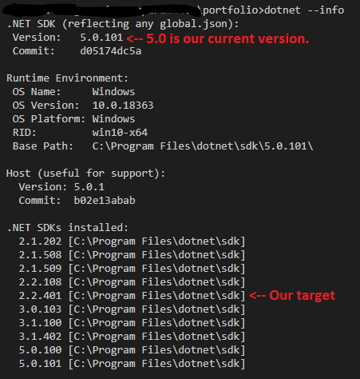

I once read a Shakespearean inspired technical quote "To update or not to update, there is no question." I simplify that in this blog with migrating from ASP.NET Core 2.2 to 3.1.

## But first, download the 3.0 SDK if you haven't already ##

Simply put this post is going to focus on improving the security of my demo application by ensuring it receives Long Term Support (LTS) from .NET Core 3.1.

First make sure you have installed the [.NET Core 3.0 SDK 3.0.100](https://dotnet.microsoft.com/download/dotnet-core/3.0#sdk-3.0.100:~:text=SDK%203.0.100,-Visual) we can download 3.1 later.

In the Terminal we will ensure that we are using .NET Core 2.2 and not just using the latest framework version. Write this code into the terminal to check which version of the .NET Core SDK you are using. 

## Check our version ##

`dotnet --version`

Does the CLI return this code? 

`2.2.401` or `2.2.108`

If it is not returning that and you have something later than.NET 2.2 installed than we will manually have to revert to either of those versions. 

I will revert to 2.2.401 for the project we have built. Open a folder and call it what you want. I called mine `2.2_to_3.0_migration_project`. Check to make sure we have it installed by using this command.

`dotnet --version`

And something similar to this should display.

As you can see .NET Core 5.0 is our current version. I'm not going to the latest version until I am guaranteed LTS which I'm not yet. You will notice the version I have marked as our target version which is 2.2.401. 

## Switch versions ##

Let us manually set our version to our target version by creating a json file in our project directory with these commands. 

`dotnet new globaljson --sdk-version 2.2.401`

You may get warned that creating this template will make changes to existing files. If so just run this command else skip to the next instruction.

`dotnet new globaljson --sdk-version 2.2.401 --force`

Now check if we have successfully switched versions `dotnet --version`. If we have, then we are ready to create a new ASP.NET Core MVC app in that version. 

## Create new project ##

Use this command to create project folder and files. `dotnet new mvc -o 2.2_to_3.0_migration_project`

Switch to project directory. 

`cd 2.2_to_3.0_migration_project`

Now load the project file. 

`code -r 2.2_to_3.0_migration_project`

Now before we continue. 

`dotnet dev-certs https --trust`