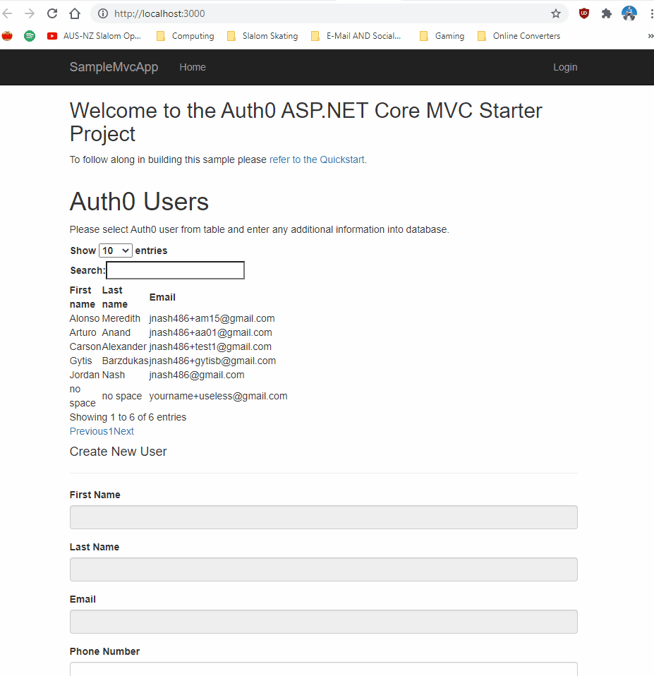

So maybe you want the end user to not have to manually enter into the database what they already entered into Auth0 user profile. Instead you may want to automatically display them from Auth0 and select them in your client application and add them into the database. In this blog we will learn how to do that by using the Auth0 Management API and ASP.NET 5.0, (no longer called .NET Core).

You can use what you want here. VS Code or Visual Studio. I will use VS Code in this blog.

## Important ##

Make sure you've read through the entire quickstart before going further in this blog.

You can start at the beginning of that quickstart if you want to better understand. Download the quickstart and run it to make sure it works. Once you're done we will create all the users in Auth0.

Login to Auth0 Dashboard. 

## Login ##

If you are new to Auth0 I highly recommend you create a [account](https://auth0.com/signup?&signUpData=%7B%22category%22%3A%22button%22%7D&email=undefined) and tenant for the region nearest to you. 

You can learn to use Auth0 by using [the quickstart written in .NET Core 3.1.](https://auth0.com/docs/quickstart/webapp/aspnet-core-3) Because there is no .NET 5 quickstart 

I have migrated it into a [simple starter sample in .NET 5 called Auth0UserProfileDisplayStarterKit.](https://github.com/LayersOfAbstraction/Auth0UserProfileDisplayStarterKit/tree/part1) you can use alongside this blog. 

Afterwards you will have two ways of completing this tutorial. 

1. You can attempt to migrate the quickstart from .NET Core 3.1 to 5.0 to match this blog and add all the code I display. 

2. You can download my Auth0UserProfileDisplayStarterKit and do minimal amount of work to change things around to match.

Obviously I recommend you pick option 2 and use my starter kit to complete this tutorial and keep things stupid simple. But if you feel you still don't understand after it, you can pick option 1. 

## Create Application on the Auth0 server ##

Look at `appsettings.json` in you client app and make sure you replace the Domain Name, ClientID and ClientSecret with the one you have made for your application you have made in the Auth0 server. If you do not know how to do that:

1. Go to Auth0 Dashboard and select Applications. And under that select Applications and then pick a name like "User_Profile_Client_Display_App"
or My App.

2. Hit Regular Web App.

3. Hit Create.

4. Once created select the app where the triple dot is and and go to Settings. The application should contain each the values to copy and paste into your `appsettings.json` file on the client side. Copy them across now.

{:width="539px"}

## Create Test email ##

We should create email aliases which are basically different user names that link to the same user which is you. There are lots of tools out there for this. I use Gmail to set up email aliases. Outlook does not support this. You can use whatever tool you're already comfortable with to do this but here is how to do it in Gmail:

* Go to your Gmail dashboard.
* Click the dropdown arrow (just next to the search box).
* In the ‘To’ field, enter your disposable address: yourname+useless@gmail.com.
* If you just don’t want to see messages sent to your Gmail account, select the ‘Skip the inbox’ option. If you’ve used a specific address to identify (say) a mailing list, you might want to apply a Gmail label instead.
* Click on ‘Create Filter’ and you’re done.

## Create database connection in Auth0. ##

Let's get back to Auth0 dashboard and create the database connection where we can create a bridge between our application and the Auth0 user sample profiles matching this connection look at the strip on the left.

1. Go to the "Authentication" tab and then to "Database".

2. Now go to the "Create DB Connection" tab and select the red button saying "Create DB Connection"

3. For the connection name call it "Auth0UserSampleProfileConn"  

4. If you're not sure select to Disable sign ups then leave the "Disable Sign Ups" switch alone. You may not just want
anyone to be able to access your application.

5. Hit the Create button. 

## Create Test user in Auth0 ##

Let's create the users now in the same dashboard.

1. On the left navigate to the User Management tab and select Users and create the following users. 

2. Copy and paste the password you wrote down and email. In this case you could use a password manager like I have or just some password book. NOTE: Might want to make a new folder for your Auth0 users in your password manager if you create them so they don't get mixed up with your real password accounts info.  

3. Choose the connection that you created earlier in the Database connections.  

4. Hit create done.

Steps clear as mud? Don't know how to navigate? That's why I made an image showing how to do everything here.

{:width="539px"}

## Install and configure Auth0 Authentication Management API ##

To get a list of users from Auth0 and read them in our application we have three ways of doing it. We can use the "export job", "User Import extension" or  the Auth0 Management API they wrote. 

We will use the API for this tutorial. Please note Auth0 limits the number of users you can return. If you exceed that limit [please click here and wait a few seconds before Auth0 automatically scrolls to the desired heading.](https://auth0.com/docs/api/management/v2#!/Users/get_users)

In case you are starting a project from scratch instead of using my Auth0UserProfileDisplayStarterKit go into the console windows and type this.

`dotnet add package Auth0.ManagementApi`

Now it should have installed Auth0 Management API into your project. We have declared the Management API namespace in the C# controller where we are going to render the users. 

We do this in HomeController in the sample you downloaded. Go to `HomeController.cs` now and add the Auth0 Management API namespace.

```
using Auth0.ManagementApi;
```

If you have some familiarity with Object Orientated Programming you will know that we need to instance a class in order to use it. We need to do that with the ManagementApiClient class.  

```
// Replace YOUR_AUTH0_DOMAIN with the domain of your Auth0 tenant, e.g. mycompany.auth0.com
var client = new ManagementApiClient("YOUR_MANAGEMENT_TOKEN", "YOUR_AUTH0_DOMAIN");
```

You should already replace the dummy domain name with the one for your tenant. If you forgot, you just need to go back up the page. I provide all the steps for that. 


It's more tricky with generating the API JSON Web Tokens (JWTs) and inputting the name of it as it is so long and requires that you create and authorize a machine-to-machine application.
Let's do that now. 

I assume you want to create a token that auto-renews. For that matter we need to create a production token which I plan to show in the next tutorial. But if you want to create a test token I will already show you how to do that.

[This link already does a good job of showing how to create and authorize a machine-to-machine application](https://auth0.com/docs/tokens/management-api-access-tokens/create-and-authorize-a-machine-to-machine-application). 

Make sure you selected the "Read Users" grant for now or have all the default ones enabled.
If you don't know which API to use, just use the Auth0 Management API.

## Create a JWT ## 

Keep in mind if you commit the JWT to a public version control system like Github make sure you then generate a new token else hackers can use the publicly accessible JWT to access your application when you run it. 
[Go here to learn how to generate the token and then copy it into memory.](https://auth0.com/docs/tokens/management-api-access-tokens/get-management-api-access-tokens-for-testing)

Make sure you set the tokens to a max of 2592000.

## Create our model fields to bind the Auth0 user data to ##

We are going to start with our ASP.NET application and ensure it can connect to our Auth0 server. Go to the models folder if you're using the start kit I made, it should show this model.
```
using System.ComponentModel.DataAnnotations;
using System.ComponentModel.DataAnnotations.Schema;

namespace Auth0UserProfileDisplayStarterKit.ViewModels
{
    public class User
    {
        public int ID { get; set; }

        [Required]
        [StringLength(20, MinimumLength = 2, ErrorMessage = "* First Name be between 2 to 20 characters.")]
        [DataType(DataType.Text)]
        [Display(Name = "First Name")]
        [Column("UserFirstName")]
        public string UserFirstName { get; set; }   

        [Required]
        [StringLength(30, MinimumLength = 2, ErrorMessage = "* Last Name be between 2 to 30 characters.")]
        [DataType(DataType.Text)]
        [Display(Name = "Last Name")]
        [Column("UserLastName")]
        public string UserLastName { get; set; }        
                
        [Required]
        [StringLength(30, MinimumLength = 3, ErrorMessage = "Email address must be between 3 to 30 characters.")]
        [DataType(DataType.EmailAddress)]
        [Display(Name = "Email")]
        [Column("UserContactEmail")]
        public string UserContactEmail{get;set;}      
        
        // [Required(AllowEmptyStrings = true)]
        [Display(Name = "Phone Number")]
        [Phone()]
        [Column("UserPhoneNumber")]
        public string UserPhoneNumber{get;set;}
        
        [StringLength(37,ErrorMessage = "Address cannot be longer than 37 characters.")]
        [DataType(DataType.Text)]
        [Display(Name = "Address")]
        [Column("UserAddress")]
        public string UserAddress{get;set;}
        
        //This regular expression allows valid postcodes and not just USA Zip codes.        
        [Display(Name = "Post Code")]
        [Column("UserPostCode")][DataType(DataType.PostalCode)]
        public string UserPostCode { get; set; }

        [StringLength(15,ErrorMessage = "Country cannot be longer than 15 characters.")]
        [DataType(DataType.Text)]
        [Display(Name = "Country")]
        [Column("UserCountry")] 
        public string UserCountry {get;set;}
        
        
        [Phone()]
        [Display(Name = "Mobile Number")]
        [Column("UserMobileNumber")]
        public string UserMobileNumber {get;set;}

        [StringLength(3,ErrorMessage = "State cannot be longer than 3 characters.")]
        [DataType(DataType.Text)]
        [Display(Name = "State")]
        [Column("UserState")]
        public string UserState {get;set;}           
        
        public string UserFullname => string.Format("{0} {1}", UserFirstName, UserLastName);
    }
}
```

## Bind Token to our ASP.NET client application ##

Now that you have generated the token it is time to copy it into a class. Let's create the class in the Models called ConstantString. Yes there are safer methods of doing this which I will cover in the next tutorial. For now let's keep it simple and keep this out of source control at all costs! If you accidentally commit it, you can also rotate the secret in the Auth0 dashboard so the token value is no longer functional.  

```
using System;
using System.Collections.Generic;
using System.Linq;
using System.Threading.Tasks;
using System.ComponentModel.DataAnnotations;
using System.ComponentModel.DataAnnotations.Schema;
using System.Web;

namespace Auth0UserProfileDisplayStarterKit.Models
{  
    public static class ConstantStrings
    {        
        public const string strToken = "{INSERT TOKEN HERE}";    
    }
}
```

You possibly had the computer lag when you copied in the string into the class. It happened with me and the results in the Task Manager don't paint a pretty picture with the VS Code process going to the top in terms of CPU and RAM usage.

{:width="925px"}

We are merely going to reference that string now so as not to display it.

This is how we are going to do that. 

## Call the token in our controller ##


If you are starting from scratch make sure you have inserted these statements at the top of the HomeController.cs class and have inserted this code. 

```
using Auth0.ManagementApi;
using Auth0UserProfileDisplayStarterKit.ViewModels;
```
```
public async Task <IActionResult> GetAllAuth0Users()
{
    //Get token
    var apiClient = new ManagementApiClient(Pitcher.Models.ConstantStrings.strToken, new Uri ("https://dev-dgdfgfdgf324.au.auth0.com/api/v2/"));
    //Get Auth0 Users
    var allUsers = await apiClient.Users.GetAllAsync(new Auth0.ManagementApi.Models.GetUsersRequest(), new Auth0.ManagementApi.Paging.PaginationInfo());
    var renderedUsers = allUsers.Select(u => new User
    {                
        UserFirstName = u.FullName.Contains(' ') ? u.FullName.Split(' ')[0] : "no space",
        UserLastName = u.FullName.Contains(' ') ? u.FullName.Split(' ')[1] : "no space",
        UserContactEmail = u.Email
    }).ToList();

    return Json(renderedUsers);
}
```
The code will act as the bridge between Auth0 and our client application and will retrieve our user profiles from Auth0 when a client sends a request from this client application. So we have created the backend server code. Now we have to create the client View cshtml file. 

I am going to install DataTables on the front end which is an open source javascript library capable of integrating advanced functionality into the front end of our project. 

## Call DataTables library in _Layout ##

We just have to reference the javascript and css libraries from DataTables Content Delivery Network. Add the following code to the head in our _Layout.cshtml file. 

 <link rel="stylesheet" href="//cdn.datatables.net/1.10.22/css/jquery.dataTables.min.css"/>

In our starter kit notice I have added this under the footer in the body with all the other scripts. Make sure you load it AFTER any jquery libraries you have in your project. I put mine just above the `@RenderSection` tag.

<script type="text/javascript" charset="utf8" src="//cdn.datatables.net/1.10.22/js/jquery.dataTables.js"></script>

## Call DataTables Library in Views/Home/Index.cshtml ##

Go to Views in Auth0UserProfileDisplayStarterKit and under the Home folder open Index.cshtml This code should be there.

```
@model Auth0UserProfileDisplayStarterKit.ViewModels.User
@{
    ViewData["Title"] = "Home Page";
}

<div class="row">
    <div class="col-md-12">
        <h2>Welcome to the Auth0 ASP.NET Core MVC Starter Project</h2>
        <p>To follow along in building this sample please <a href="https://auth0.com/docs/quickstart/webapp/aspnet-core">refer to the Quickstart</a>.
    </div>
</div>

<h1>Auth0 Users</h1>
<p>Please select Auth0 user from table and enter any additional information into database.</p>
<table id ="auth0UsersTable" style="width: 200px;">
        <thead>
        <tr>
            <th>
               First name
            </th>
            <th>
                Last name
            </th>   
            <th>
                Email
            </th>    
            <th>                
            </th> 
        </tr>        
        </thead>
        <tbody></tbody>
</table>
<h4>Create New User</h4>
<hr />
<div class="row">
    <div class="col-md-4">
        <form asp-action="Create">
            <div asp-validation-summary="ModelOnly" class="text-danger"></div>            
            <div class="form-group">
                <label asp-for="UserFirstName" class="control-label"></label>
                <input id="UFirstNameInput" readonly="true" disabled="true" asp-for="UserFirstName" class="form-control"/>
                <span asp-validation-for="UserFirstName" class="text-danger"></span>
            </div>
            <div class="form-group">
                <label asp-for="UserLastName" class="control-label"></label>
                <input id="ULastNameInput" readonly="true" disabled="true" asp-for="UserLastName" class="form-control"/>
                <span asp-validation-for="UserLastName" class="text-danger"></span>
            </div>
            <div class="form-group">
                <label asp-for="UserContactEmail" class="control-label"></label>
                <input id="UEmailInput" readonly="true" disabled="true" asp-for="UserContactEmail" class="form-control"/>
                <span asp-validation-for="UserContactEmail" class="text-danger"></span>
            </div>
            <div class="form-group">
                <label asp-for="UserPhoneNumber" class="control-label"></label>
                <input asp-for="UserPhoneNumber" class="form-control" />
                <span asp-validation-for="UserPhoneNumber" class="text-danger"></span>
            </div>
            <div class="form-group">
                <label asp-for="UserAddress" class="control-label"></label>
                <input asp-for="UserAddress" class="form-control" />
                <span asp-validation-for="UserAddress" class="text-danger"></span>
            </div>
            <div class="form-group">
                <label asp-for="UserPostCode" class="control-label"></label>
                <input asp-for="UserPostCode" class="form-control" />
                <span asp-validation-for="UserPostCode" class="text-danger"></span>
            </div>
            <div class="form-group">
                <label asp-for="UserCountry" class="control-label"></label>
                <input asp-for="UserCountry" class="form-control" />
                <span asp-validation-for="UserCountry" class="text-danger"></span>
            </div>
            <div class="form-group">
                <label asp-for="UserMobileNumber" class="control-label"></label>
                <input asp-for="UserMobileNumber" class="form-control" />
                <span asp-validation-for="UserMobileNumber" class="text-danger"></span>
            </div>
            <div class="form-group">
                <label asp-for="UserState" class="control-label"></label>
                <input asp-for="UserState" class="form-control" />
                <span asp-validation-for="UserState" class="text-danger"></span>
            </div>
            <div class="form-group">
                <input type="submit" value="Create" class="btn btn-primary" />
            </div>
        </form>
    </div>
</div>

@section Scripts {
    <script>
            $.fn.dataTable.ext.errMode = 'throw';
            var Auth0Table = $('#auth0UsersTable').DataTable({
                    "ajax": {
                    'type': 'get',
                    'dataType': "json",                  
                    "url": "@Url.Action("GetAllAuth0Users")",
                    "dataSrc": function (result) {
                        return result;
                        }
                    },            
                    "columns": [                
                    { "data": "userFirstName"},
                    { "data": "userLastName"},
                    { "data": "userContactEmail"}
                    ]
            });

        
        $('#auth0UsersTable').on( 'click', 'tbody tr', function DisplaySelectedRowItems() {            
            //IF table row you click on is already selected. 
            if ( $(this).hasClass('selected') ) {
                //deselect the row you already selected.
                $(this).removeClass('selected');
            }
            else {
                //Search all visible rows and deselect them.  
                Auth0Table.$('tr.selected').removeClass('selected');
                //Select new row you clicked.
                $(this).addClass('selected');

                //Get ID of table and some property.
                var table = document.querySelector('#auth0UsersTable');
                var firstName = document.querySelector('#UFirstNameInput');
                var lastName = document.querySelector('#ULastNameInput');
                var email = document.querySelector('#UEmailInput');        
                
                //Add listener for table click event.
                table.addEventListener('click', onTableClick);  

                //Get click of Table.
                function onTableClick (e) 
                {
                    var tr = e.target.parentElement;        
                    var data = [];
                    
                    for (var td of tr.children) 
                    {
                        data.push(td.innerHTML);
                    }
                
                    firstName.value = data[0];
                    lastName.value = data[1];
                    email.value = data[2];
                }
            }        
        });
    </script>
}
```

I'll break it all down for you. We are creating the cshtml layout of the DataTable that will contain all the Auth0 users. The users are from the Auth0 dashboard that are connected to and can be accessed from this application.

```
<h1>Auth0 Users</h1>
<p>Please select Auth0 user from table and enter any additional information into database.</p>
<table id ="auth0UsersTable" style="width: 200px;">
        <thead>
        <tr>
            <th>
               First name
            </th>
            <th>
                Last name
            </th>   
            <th>
                Email
            </th>    
            <th>                
            </th> 
        </tr>        
        </thead>
        <tbody></tbody>
</table>

```

Further along we create a form full of textboxes. The ones you really need to pay attention to are the ones with the Input id of UFirstNameInput, ULastNameInput and UEmailInput. Why those? I will explain in a second.

Go down to the asp.net @Section tag and observe this script. 

```
$.fn.dataTable.ext.errMode = 'throw';
var Auth0Table = $('#auth0UsersTable').DataTable({
        "ajax": {
        'type': 'get',
        'dataType': "json",                  
        "url": "@Url.Action("GetAllAuth0Users")",
        "dataSrc": function (result) {
            return result;
            }
        },            
        "columns": [                
        { "data": "userFirstName"},
        { "data": "userLastName"},
        { "data": "userContactEmail"}
        ]
});
```

If you have done everything correctly up to this point, this should occur.

{:width="625px"}

Simply put this will render the table if you have done two thing:

1. Change the value of strToken with your own token into the the ConstantStrings class we talked about earlier.

2. Changed all the values of "Domain","ClientId" and "ClientSecret"
to match the values of your Auth0 dashboard by going to "Applications"
"Your application Name" and going to Settings and then copying the "Domain","ClientId" and "ClientSecret" values from their server to your appsettings.json file. 


If you followed along with this tutorial that's really all you need to do in the client application. Most of the work you did was setting up everything in the Auth0 dashboard.

Hoped that worked. You should be able to hook this up to a database easily if you have learned how to already do in the microsoft tutorials how to handle DataAccess in their ASP.NET 5 Contoso University sample application. [Next blog here I will show how to use a Production Token so we don't have manually renew the Testing token.]() Stay tuned I will insert a link here when I'm ready!

This blog will not have being possible without the help of [Herman Starzhynski](https://www.linkedin.com/in/hstarzhynski/) who's input proved invaluable in solving the problem I originally faced before turning this into a blog.
