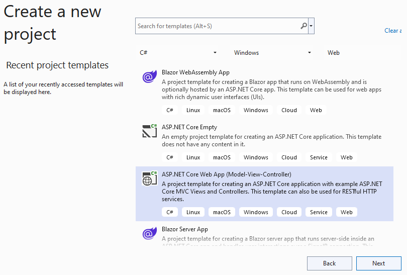
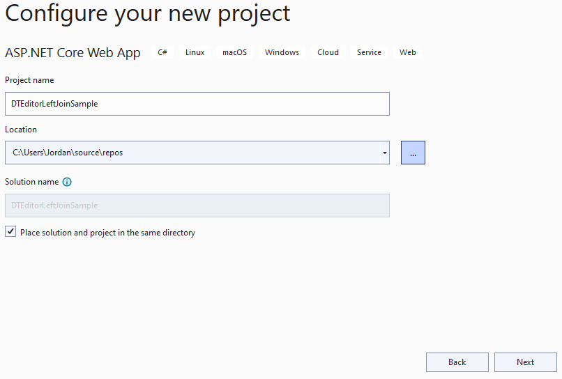
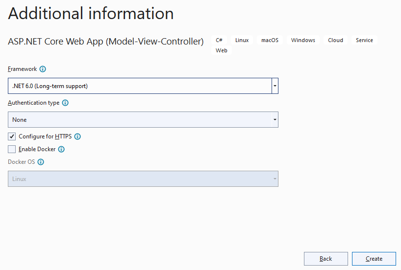
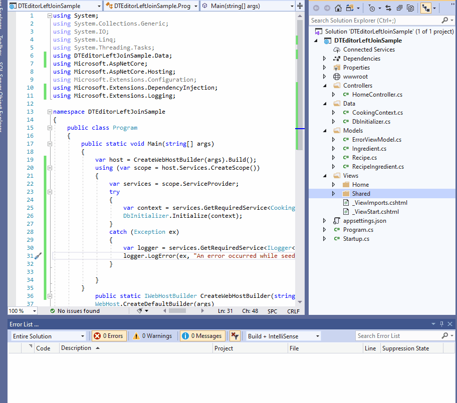
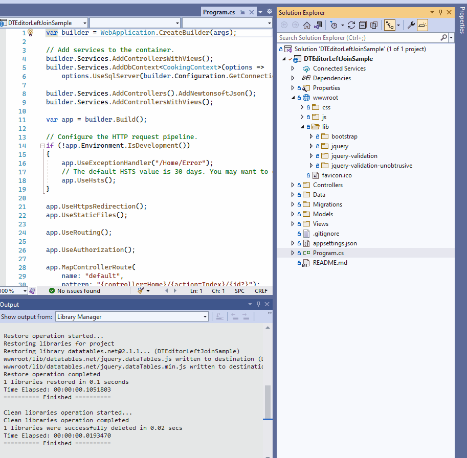
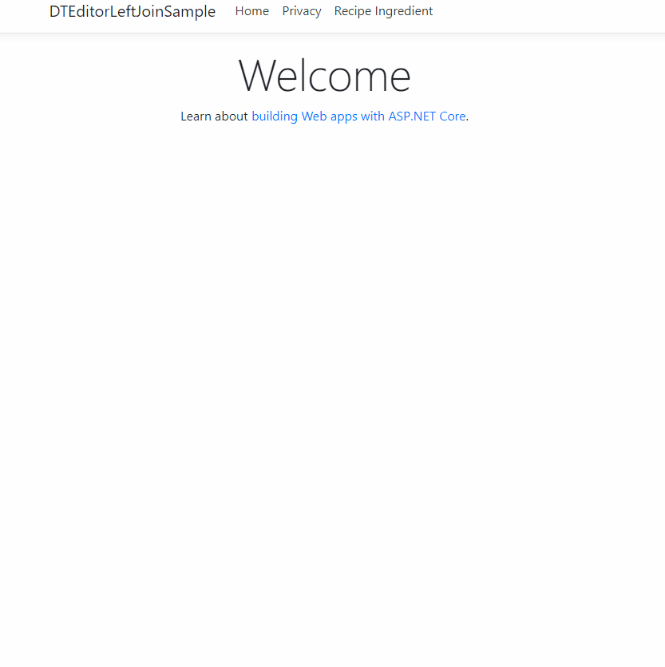

[Previously I showed you how to create an SQL Left Join using DataTables in ASP.NET 5 MVC]() Now that .NET 5 is no longer getting security updates it is time to upgrade to .NET 6, (not called .NET Core).

I have completed demo which you can [download here in .NET 6](https://github.com/LayersOfAbstraction/DTEditorLeftJoinSample). You can also go back through previous commits in the demo where I have listed the version it has upgraded to. You should know that I have methodically upgraded it from 2.2 to 3.0 and 3.1 to 5...

And now .NET 6. as that is how Microsoft have done it in their migration tutorial guides. The hard part was upgrading the project from 2.2 to 3.0. After that it's a breeze!

Don't worry I will show you how to build the project from scratch so you don't have to migrate it from different frameworks. 

## Download and setup .NET 6 ##

First check in the command line to see if you have .NET 6 already installed by typing cmd into the windows Start search bar to bring it up and then running the command `dotnet --info`.

If you see any `6.0` listed then you should be ok to skip to the next heading.

```
//.NET Core CLI output
.NET SDKs installed:
.NET SDKs installed:
  3.1.415 [C:\Program Files\dotnet\sdk]
  5.0.209 [C:\Program Files\dotnet\sdk]
  5.0.301 [C:\Program Files\dotnet\sdk]
  5.0.303 [C:\Program Files\dotnet\sdk]
  5.0.403 [C:\Program Files\dotnet\sdk]
  6.0.100 [C:\Program Files\dotnet\sdk]
```

Not seeing it? Then go here [download and install it](https://dotnet.microsoft.com/download), then use the same command to see if `6.0`  is listed.


## Create App In Visual Studio 2022 ##

Microsoft's ASP.NET team use Visual Studio for MVC tutorials with EF Core. So let's first open Visual Studio 2022 and create ASP.NET WebApplication Template. 

You can always play around with this app in VS Code later if you want once you complete it.



Make sure you have selected `ASP.NET 6.0 (Long-term support)` and have `no authentication` selected and have
`configure for HTTPS` selected as well.



After that create the project. 



We will now create a Recipe database 3 
different models, Recipe, RecipeIngredient and Ingredient. Create each 
of these classes in the model folder.

## Recipe
```

namespace DTEditorLeftJoinSample.Models
{
    public class Recipe
    {
        public int ID { get; set; } 
        
        public string Title {get;set;}
        public string Description {get;set;}
        public string Direction {get;set;} 

        public ICollection<RecipeIngredient> RecipeIngredient { get; set; }
    }
}
```
## RecipeIngredient

```

namespace DTEditorLeftJoinSample.Models
{
    public class RecipeIngredient
    {
        public int ID { get; set; }

        [Display(Name = "Recipe ID")]
        public int RecipeID { get; set; }

        [Display(Name = "Ingredient ID")]
        public int IngredientID { get; set; }

        public int Quantity { get; set; }
        public Recipe Recipe { get; set; }
        public Ingredient Ingredient { get; set; }
    }
}
```                                        

## Create Ingredient class

```

namespace DTEditorLeftJoinSample.Models
{
    public class Ingredient
    {
        public int ID { get; set; }
        [Display(Name = "Ingredient Name")]
        public string IngredientName { get; set; }

        public ICollection<RecipeIngredient> RecipeIngredient { get; set; }
    }
}                                  
```                                        

## Insert connection string into appsettings.json

Create the connection string in appsettings.json then copy and paste
this connection string there.
```
{
    "ConnectionStrings": {
        "DefaultConnection": "Server=(localdb)\\mssqllocaldb;Database=RecipeDB;Trusted_Connection=True;MultipleActiveResultSets=true"
    },
    "Logging": {
        "LogLevel": {
        "Default": "Warning"
        }
    },
    "AllowedHosts": "*"
}  
```

## Create CookingContext
Even though we cannot integrate Entity Framework Core directly with DataTables Editor, we can still generate the database via EF Core to use with the library. We will do this by creating the database context class. Create a Data folder and add this class.

```
using DTEditorLeftJoinSample.Models;
using Microsoft.EntityFrameworkCore;

namespace DTEditorLeftJoinSample.Data
{
    public class CookingContext : DbContext
    {
        public CookingContext(DbContextOptions<CookingContext> options) : base(options)
        {
        }

        public DbSet<Recipe> Recipe { get; set; }
        public DbSet<Ingredient> Ingredient { get; set; }
        public DbSet<RecipeIngredient> RecipeIngredient { get; set; }

        protected override void OnModelCreating(ModelBuilder modelBuilder)
        {
            modelBuilder.Entity<Recipe>().ToTable("tblRecipe");
            modelBuilder.Entity<Ingredient>().ToTable("tblIngredient");
            modelBuilder.Entity<RecipeIngredient>().ToTable("tblRecipeIngredient ");
        }
    }
}
```

## Install Entity Framework Core and other packages

Go to the bottom of the screen and to the Developer PowerShell. Enter the following commands to install the required packages for this tutorial. The directory path should be pointing to the application already unless you changed directories in the PowerShell.

```
dotnet add package Microsoft.EntityFrameworkCore --version 6.0.0
dotnet add package Microsoft.AspNetCore.Mvc.NewtonsoftJson --version 6.0.0
dotnet add package Microsoft.EntityFrameworkCore.Design --version 6.0.0
dotnet add package Microsoft.EntityFrameworkCore.SqlServer --version 6.0.0
dotnet add package Microsoft.VisualStudio.Web.CodeGeneration.Design --version 6.0.0
```
The errors in CookingContext.cs and in Startup.cs should disappear.

## Register CookingContext in Program.cs

Register the CookingContext as a service in Program using dependency
injection. You can do that by adding this code to the Program.cs including Newtonsoft.Json features so we can use json on the client side.

```
// Add services to the container.
builder.Services.AddControllersWithViews();
builder.Services.AddDbContext<CookingContext>(options =>
    options.UseSqlServer(builder.Configuration.GetConnectionString("DefaultConnection")));

builder.Services.AddControllers().AddNewtonsoftJson();
builder.Services.AddControllersWithViews();                        
```                                        

Now add these statements to the startup file.

```
using WebApplication2.Data;
using Microsoft.EntityFrameworkCore;
```                                        

## Create data seed

Now we want to seed the database with test data. This is an optional
step but highly beneficial. If it does not work for you, the data can be
entered manually. In the Data folder create this file DbInitializer.cs
and insert this code.

```
namespace DTEditorLeftJoinSample.Data
{
    public static class DbInitializer
    {
        public static void Initialize(CookingContext context)
        {
            context.Database.EnsureCreated();

            // Look for any tables.
            if (context.Recipe.Any() && context.Ingredient.Any() && context.RecipeIngredient.Any())
            {
                return;   // DB has been seeded
            }

            var recipes = new Recipe[]
            {
                new Recipe { Title =" Korean-Style Steak and Noodles with Kimchi",
                Description="Lorem ipsum dolor sit amet, consectetur adipiscing elit. Praesent sed pharetra neque. Curabitur laoreet eu lectus eu tempus. Fusce elementum arcu ut justo tincidunt mattis.",
                Direction="1.Cras dignissim in neque a placerat." + "\r\n" + "2.Vestibulum vel vestibulum nunc." + "\r\n" +  "3. Vestibulum interdum est tellus, nec porta metus dignissim ut."
                },
                new Recipe { Title =" Mashed Potatoes with Savory Thyme Granola",
                Description=" Etiam aliquam, magna quis lobortis facilisis, lorem eros dignissim nulla, ultrices pulvinar orci lectus a ligula.",
                Direction="1. Morbi fringilla, justo eu venenatis tempus, mauris leo ultricies magna, et aliquet mi lectus at nisi. Pellentesque vel gravida nunc. Donec in tortor lectus." + "\r\n" + "2.Vestibulum vel vestibulum nunc." + "\r\n" +  "3. Vestibulum interdum est tellus, nec porta metus dignissim ut."},
                new Recipe { Title ="Lemon Garlic Mashed Potatoes",
                Description="Pellentesque habitant morbi tristique senectus et netus et malesuada fames ac turpis egestas.",
                Direction="1. Maecenas ultricies pretium quam id placerat. Mauris in ligula gravida, vehicula justo faucibus, semper neque." + "\r\n" + "2. Proin sodales aliquam erat quis venenatis." + "\r\n" +  "3. Morbi consectetur libero id sagittis vestibulum."},
                new Recipe { Title =" Sour Cream and Corn Mashers",
                Description=" Donec posuere pellentesque mi, ac suscipit tellus finibus id.",
                Direction="1. Nulla placerat erat lorem, eget pellentesque dolor egestas vitae." + "\r\n" + "2. Proin sodales aliquam erat quis venenatis." + "\r\n" +  "3. Suspendisse ac purus lacinia, mollis velit aliquet, finibus arcu. Pellentesque molestie est in diam pulvinar, quis mattis justo volutpat."}
            };
            foreach (Recipe r in recipes)
            {
                context.Recipe.AddRange(r);
            }
            context.SaveChanges();

            var ingredients = new Ingredient[]
            {
                new Ingredient{IngredientName="Duis eu ligula felis"},
                new Ingredient{IngredientName="Donec id mollis arcu"},
                new Ingredient{IngredientName="Cras nec enim luctus"}
            };
            foreach (Ingredient i in ingredients)
            {
                context.Ingredient.AddRange(i);
            }
            context.SaveChanges();

            var recipeIngredients = new RecipeIngredient[]
            {
                new RecipeIngredient{RecipeID=1, IngredientID=1, Quantity =4},
                new RecipeIngredient{RecipeID=2, IngredientID=2, Quantity =3},
                new RecipeIngredient{RecipeID=3, IngredientID=3, Quantity =15}
            };

            foreach (RecipeIngredient ri in recipeIngredients)
            {
                context.RecipeIngredient.AddRange(ri);
            }
            context.SaveChanges();
        }
    }
}          
```                                        

We want to get the database context instance from dependency injection
container.

## Call context and seed method and register factory for DataTables

Now we call the context instance, the seed method and pass it to the 
context. Then dispose the context when the seeding is complete. In
**Program.cs** delete any code in the `Main` method and add this all to the method.

To use DataTables also we must register the database driver which is `System.Data.SqlClient`. We will do it all in Program.cs and also log any exceptions to do with seeding the database.  

## Program.cs

```
var host = CreateHostBuilder(args).Build();
using (var scope = app.Services.CreateScope())
{
    var services = scope.ServiceProvider;
    var context = services.GetRequiredService<CookingContext>();
    context.Database.EnsureCreated();
    DbInitializer.Initialize(context);
}
```

It is immperative that you write this and any over code above `app.Run` else C# will ignore any code below it upon compliling.

Now in the Data folder add a empty .cs file called `GobalNamespaces.cs` delete anything inside the file and copy and paste this into it.

```
global using DTEditorLeftJoinSample.Models;
global using Microsoft.EntityFrameworkCore;
global using System.ComponentModel.DataAnnotations;
global using DTEditorLeftJoinSample.Data;
global using Microsoft.AspNetCore.Builder;
global using Microsoft.Extensions.DependencyInjection;
global using Microsoft.Extensions.Configuration;
global using Microsoft.Extensions.Hosting;
global using System.Collections.Generic;
global using System.Linq;
global using System.Data.Common;
global using Microsoft.Data.SqlClient;                                 
```

Goodbye repetitive namespaces. C# 10 gives us the ability to minimize all the code files containing namespaces by centralizing them all into one file throughout our entire application. 

## Generate controllers and views with scaffolding engine

The scafolding engine on Windows CLI still has problems so we will have to use Visual Studio's GUI to access the scaffolding engine and generate the items.

Rather than write it manually it is easier to first auto generate all the CRUD view pages and controllers using Entity Framework Core from the models we made and edit the pages later. We will generate in the scaffolding engine. To that:

-   Right-click the **Controllers** folder in **Solution Explorer** and
    select **Add \> New Scaffolded Item**
-   In the **Add Scaffold** dialog box:
-   Select MVC controller with views, using Entity Framework.
-   Click Add. The Add MVC Controller with views, using Entity Framework
    dialog box appears.
-   In **Model class** select **RecipeIngredient.**
-   In **Data context class** select **CookingContext**.
-   Accept the default **CookingController** as the name.
-   Click **Add**. The **Add MVC Controller with views, using Entity
    Framework** dialog box appears.



If all is ok then the RecipeIngredient folder generates with all the
views, Index, Edit, Details, Delete. Notice in the Controllers folder
the new generated controller RecipeIngredientsController.cs.

I would like to note if you are getting painfully unclear errors like this:

`There was an error running the selected code generator.`

`Package restore failed. Rolling back package...`

It's highly likely you need to update all packages to the latest version in .NET 6. That's what helped me. I originally wrote this blog for .NET 3.1 Core and had problems generating the controllers and views in the VS Code CLI. Going to Visual Studio didn't help either so I migrated to the latest version which helped.

## Add Recipeingredient To Navbar

We want to be able to go the form in our _layout.cshtml file. In the second div tag of the header add this list item to the navbar.

```
<li class="nav-item">
    <a class="nav-link text-dark" asp-area="" asp-controller="RecipeIngredients" asp-action="Index">Recipe Ingredient</a>
</li>  
```

Now we got to add the migrations and update the database before we can run it. Enter this into our PowerShell.

```
dotnet ef migrations add InitialCreate
dotnet ef database update
```

You may have to update the to update the global tools to the latest available version if these commands do not work, which at the time is 6.0.0.
``
dotnet tool update --global dotnet-ef
``
Press F5. Running the program will generate the database and fill out the tables. If it doesn’t work please use the SQL Server Object Explorer to fill the tables manually.

If all goes well you should be able to go directly to the table in the Index view and render the project. But as I said there is no sorting, paging and searching. Not only that, we want to render the RecipeTitle and the IngredientName fields from the other tables not the foreign key IDs!


## Install DataTables

We will have to edit the index and install DataTables Editor server-side
libraries to render the related fields from another table. Enter this
into the Package Management Console.

`dotnet add package DataTables-Editor-Server`

Our priority is to activate DataTables Editor in the backend controller
and then write the code to link the View up to our controller. Remember
the backend will use DataTables Editor server-side libraries which are
free.


The front-end DataTables Editor libraries are not free so we won't use
that. The front end will instead use DataTables which is also free and
is compatible with EF Core as long as you aren't rendering foreign keys.

We need to install DataTables too. There are two ways of doing that. 

## OPTION 1 host it from DataTables CND 

We reference the javascript and css libraries from DataTables Content
Delivery Network. Add the following code to the head in our
_Layout.cshtml file.
```
    <link rel="stylesheet" href="//cdn.datatables.net/1.10.22/css/jquery.dataTables.min.css"/>
```
Go ahead and add this under the footer in the body with all the other
scripts. Make sure you load it AFTER any jquery libraries you have in your project.
```
    <script type="text/javascript" charset="utf8" src="//cdn.datatables.net/1.10.22/js/jquery.dataTables.js"></script>
```

## OPTION 2 Local download 

The other way is by doing a local download which can be useful should you need everthing to run offline during a demo where you want to convince your team or boss to use it and present it in a prototype so you could get the funding to use the client side libraries eventually.

### OPTION 2.1 Go to Library Manager (LibMan) to install DataTables.

We can use Visual Studio's built in library acquisition tool (LibMan)
to download DataTables. We will do that now.

1. Go to Project in Solution explorer.
2. Right Click Project and select Add.
3. Select Client-Side Library.
4. In the new windows Do not change provider and leave as cdnjs.
5. Type into the "Library" field, ``datatables.net@1.10.25`` unless
a later value is available. 

The files will be aquried through LibMan and delivered through a CDN(Conent Delivery Network) to your local system at which point they can be used locally, and offline. 



### OPTION 2.2 Go to website to download and install files.

We can download the library from here to go [here to download the files.](https://datatables.net/download/) and leave the defaults. There should be steps on what to do.

## Call database directly from Program or Startup

Now we will need to bypass our RecipeIngredient model to later bind our controller directly to the database using 

``DbProviderFactories.RegisterFactory``. Remember you can't use entity framework with DataTables Editor server-side libraries. To do it you would have to pay for the clientside libraries but we can do that, we just have to break a MVC rule.

 Enter this into Program.cs.
```
    // Register the factory in the method `Main`
    DbProviderFactories.RegisterFactory("System.Data.SqlClient", SqlClientFactory.Instance);
```
## Bypass model and bind tblRecipeIngredient from controller


using DataTables;
using Microsoft.Extensions.Configuration;

Add an IConfiguration object to get the connection string and make sure it's value is set in the constructor.

Now go and add this method.

```
public ActionResult LeftJoinRecipesAndIngredientsOntoRecipeIngredient()
{
    //DECLARE database connection.
    string connectionString = _config.GetConnectionString("DefaultConnection");

    //CREATE database instance.
    using (var db = new Database("sqlserver", connectionString))
    {
        //CREATE Editor instance with starting table.
        var response = new Editor(db, "tblRecipeIngredient")
            .Field(new Field("tblRecipeIngredient.Quantity"))
            .Field(new Field("tblRecipe.Description"))
            .Field(new Field("tblIngredient.IngredientName"))

            //JOIN from tblIngredient column RecipeID linked from tblRecipe column ID
            //and IngredientID linked from tblUser column ID.  
            .LeftJoin("tblRecipe ", " tblRecipe.ID ", "=", " tblRecipeIngredient.RecipeID")
            .LeftJoin("tblIngredient ", " tblIngredient.ID ", "=", " tblRecipeIngredient.IngredientID")
            .Process(HttpContext.Request)
            .Data();
        return Json(response);
    }
}
```
I will break it down for you with comments. As you can see I am breaking MVC traditions here and instead are connecting  the database directly from this method. Make sure your
RecipeIngredientsController constructor matches mine and make sure your
Index method matches! It will look different.
```
private readonly CookingContext _context;
private readonly IConfiguration _config;

public RecipeIngredientsController(CookingContext context, IConfiguration config)
{
    _context = context;
    _config = config;
}

// GET: RecipeIngredients
public IActionResult Index()
{
    return View();
}

public ActionResult LeftJoinRecipesAndIngredientsOntoRecipeIngredient()
{
    //DECLARE database connection.
    string connectionString = _config.GetConnectionString("DefaultConnection");

    //CREATE database instance.
    using (var db = new Database("sqlserver", connectionString))
    {
        //CREATE Editor instance with starting table.
        var response = new Editor(db, "tblRecipeIngredient")
            .Field(new Field("tblRecipeIngredient.Quantity"))
            .Field(new Field("tblRecipe.Description"))
            .Field(new Field("tblIngredient.IngredientName"))

            //JOIN from tblIngredient column RecipeID linked from tblRecipe column ID
            //and IngredientID linked from tblUser column ID.  
            .LeftJoin("tblRecipe ", " tblRecipe.ID ", "=", " tblRecipeIngredient.RecipeID")
            .LeftJoin("tblIngredient ", " tblIngredient.ID ", "=", " tblRecipeIngredient.IngredientID")
            .Process(HttpContext.Request)
            .Data();
        return Json(response);
    }
}
```
Most of the comments should explain what is happening. I am specifying a
single table for editing with additional optional data inserted into the
table from other tables. i.e I am joining up tables to
tblRecipeIngredient by performing an SQL Left Join and then formatting
it into a json object which will be passed to the front end. Notice I am
creating a DataTables Editor server instance which is free. The front
end ones however are not so we will have to use DataTables to fix that
in the front-end.

With the back end code complete let's go to our front end.

# Rewrite view Index in DataTables

Go to this directory Views\\RecipeIngredients\\ and look at the code now
in the Index.cshtml.

```
@model IEnumerable<DTEditorLeftJoinSample.Models.RecipeIngredient>
@{
    ViewData["Title"] = "Index";
}

<h1>Index</h1>

<p>
    <a asp-action="Create">Create New</a>
</p>
<table class="table">
    <thead>
        <tr>
            <th>
                @Html.DisplayNameFor(model => model.Quantity)
            </th>
            <th>
                @Html.DisplayNameFor(model => model.Recipe)
            </th>
            <th>
                @Html.DisplayNameFor(model => model.Ingredient)
            </th>
            <th></th>
        </tr>
    </thead>
    <tbody>
@foreach (var item in Model) {
        <tr>
            <td>
                @Html.DisplayFor(modelItem => item.Quantity)
            </td>
            <td>
                @Html.DisplayFor(modelItem => item.Recipe.ID)
            </td>
            <td>
                @Html.DisplayFor(modelItem => item.Ingredient.ID)
            </td>
            <td>
                <a asp-action="Edit" asp-route-id="@item.ID">Edit</a> |
                <a asp-action="Details" asp-route-id="@item.ID">Details</a> |
                <a asp-action="Delete" asp-route-id="@item.ID">Delete</a>
            </td>
        </tr>
}
    </tbody>
</table>
```

We are going to edit most of this. So change the model title to this.
```
@model DTEditorLeftJoinSample.Models.RecipeIngredient
```

Now change the html table class value “table” to the ID value of recipeIngredientTable.

```
<table id="recipeIngredientTable">
```

Erase all the code in the tbody tag so it looks like this.

```
<tbody></tbody>
```

Now add all this just under the outside of the closing **</table>** tag. We
will break it down as much as possible.

```
@section scripts{
    <script>
    $.fn.dataTable.ext.errMode = 'throw';
    function renderDT_RowId(data) {
        return data.replace('row_', '');
    };
    var oTable = $('#recipeIngredientTable').DataTable({
        "ajax": {
            type: "POST",
            "url": "@Url.Action("LeftJoinRecipesAndIngredientsOntoRecipeIngredient")"
        },
        "columns": [
            { "data": "tblIngredient.IngredientName"},
            { "data": "tblRecipe.Description"},
            { "data": "tblRecipeIngredient.Quantity" },
            {
                "data": null,
                "render": function (value) {
                    return '<a href="/RecipeIngredients/Details/' + renderDT_RowId(value.dT_RowId) + '"button type="button" class="btn btn-primary btn-block">Details</a> <br> '
                        + '<a href="/RecipeIngredients/Edit/' + renderDT_RowId(value.dT_RowId) + '"button type="button" class="btn btn-info btn-block">Edit </a> <br> '
                        + '<a href="/RecipeIngredients/Delete/' + renderDT_RowId(value.dT_RowId) + '"button type="button" class="btn btn-primary btn-block">Delete</a>';
                }
            }
            ]
    });
    </script>
}
```

The oTable object contains the ID of our table header which is more
maintainable. We can link the header up with the rest of our oTable
object. Below that we are making an ajax request to get the name of our
controller method which will display all the data we specified in the
backend controller.

When we fire up the program we should be able to tell if our backend is
communicating with our frontend.

In DataTables Editor it is different in regard to getting the primary
key and there are some limitations there.

This would be ok if we used DataTables only but we are not. We need the
PK value so ASP knows which record to request from our database when we
perform CRUD operations. Notice the renderDT_RowId method where I am
calling the buttons that link to the other views Details, Edit and
Delete.

renderDT_RowId(value.DT_RowId)

That will store each PK value in RAM which also allows us to render the
records.

Now your entire Index.cshtml view should look like this.

```
@model DTEditorLeftJoinSample.Models.RecipeIngredient
@{
    ViewData["Title"] = "Index";
}

<h1>Index</h1>

<p>
    <a asp-action="Create">Create New</a>
</p>
<table id="recipeIngredientTable">
    <thead>
        <tr>
            <th>
                @Html.DisplayNameFor(model => model.Recipe)
            </th>
            <th>
                @Html.DisplayNameFor(model => model.Ingredient)
            </th>
            <th>
                @Html.DisplayNameFor(model => model.Quantity)
            </th>
            <th></th>
        </tr>
    </thead>
    <tbody></tbody>
</table>
@section scripts{
    <script>
    function renderDT_RowId(data) {
        return data.replace('row_', '');
    };
    var oTable = $('#recipeIngredientTable').DataTable({
        "ajax": {
            type: "POST",
            "url": "@Url.Action("LeftJoinRecipesAndIngredientsOntoRecipeIngredient")",
            "dataSrc": function (result) {
                return result.data;
                }
        },
        "columns": [
            { "data": "tblIngredient.IngredientName"},
            { "data": "tblRecipe.Description" },
            { "data": "tblRecipeIngredient.Quantity" },
            { "data": null,
                "render": function (value) {
                    return '<a href="/RecipeIngredients/Details/' + renderDT_RowId(value.DT_RowId) + '"button type="button" class="btn btn-primary btn-block">Details</a> <br> '
                        + '<a href="/RecipeIngredients/Edit/' + renderDT_RowId(value.DT_RowId) + '"button type="button" class="btn btn-info btn-block">Edit </a> <br> '
                        + '<a href="/RecipeIngredients/Delete/' + renderDT_RowId(value.DT_RowId) + '"button type="button" class="btn btn-primary btn-block">Delete</a>';
                }
            }
            ]
    });
    </script>
}
```

## Run it one last time and enjoy 😊

Run your program now and go to the Index. It should work perfectly. You
can see the power and functionality that DataTables brings. As you can
see it has sorting searching and if you put in more records you will
even be able to divide it up into multiple pages and decide how many get
shown.

If we did that all in Entity Framework Core the code required would be
substantially longer and give us nowhere as much functionality.

