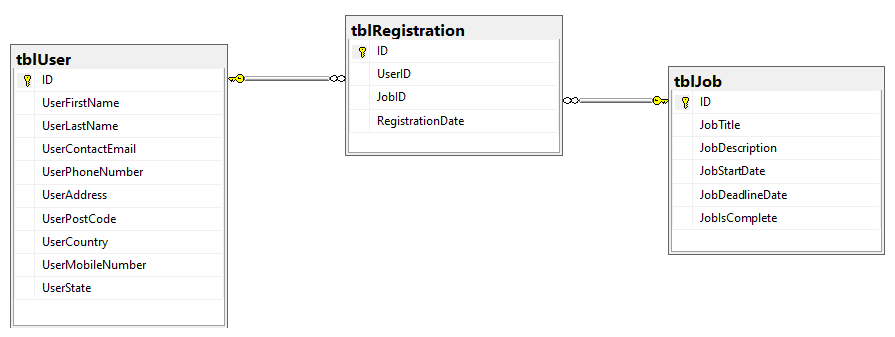

## Introduction ##

Assigning users from one table record to another and rendering it to the front end can be tricky but it can be done in serval ways. Our way will be via dataTables.net with ASP.NET Core MVC and SQL Server.

We will be dealing with at least 3 SQL Server database tables as shown in this diagram.

<p></p>

In most of my tutorials we have used Visual Studio. With the upgrades in Visual Studio. This time I will demo this in VS Code.

## Perquisites ##

I'm doing this on Windows 10. .NET Core is platform independent but if you use SQL Server on Mac then you will need to learn how to lunch it in Docker. This tutorial does not cover that.

First fire up VS Code and check in the below Terminal by running the command `dotnet --info`.

If you see any `6.0` listed then you should be ok to skip to the next heading.

```text
//.NET Core CLI output
.NET SDKs installed:
  3.1.415 [C:\Program Files\dotnet\sdk]
  5.0.209 [C:\Program Files\dotnet\sdk]
  5.0.301 [C:\Program Files\dotnet\sdk]
  5.0.303 [C:\Program Files\dotnet\sdk]
  5.0.403 [C:\Program Files\dotnet\sdk]
  6.0.100 [C:\Program Files\dotnet\sdk]
```

Not seeing it? Then go here [download and install it](https://dotnet.microsoft.com/download), then use the same command to see if `6.0`  is listed.

## Create ASP.NET Core template ##

We will use MVC here. Yes you could do Razor Pages yes, and I have no problems with it but if you want more job opportunities using MVC over Razor Pages is better because:

- Razor Pages is easier to switch to later.
- The company you are interviewing may want to just stick with MVC.
- Later if you if you are not happy in your job using MVC you could create a presentation after you gain public speaking experience at meetups. You can show why Razor or why a JS SPA like Angular, React or Vue are better choices (in the top 5 of the Stack Overflow Survey.)
