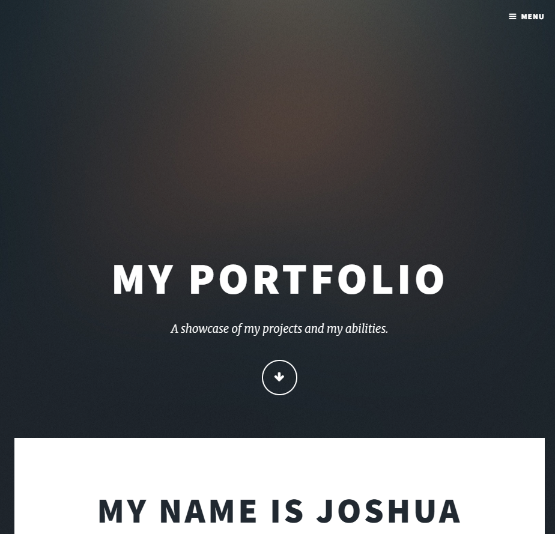
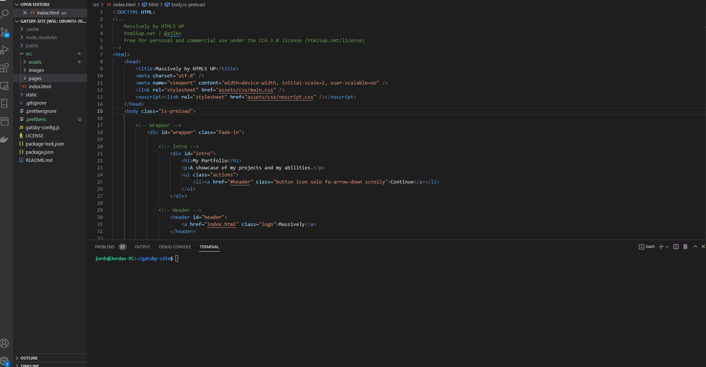

## Introduction ##

<br>

Photo by [Adeolu Eletu](https://unsplash.com/@adeolueletu?utm_source=unsplash&utm_medium=referral&utm_content=creditCopyText) on [Unsplash](https://unsplash.com/).  

A few years back I watched a [video by Joshua Fluke](https://www.youtube.com/watch?v=u-RLu_8kwA0) that taught me how to host a git repo as a GitHub Pages portfolio website without paying any money.

How cool! To think a few years ago I was paying to host my portfolio on Winhost where I was making no revenue but paying to host a portfolio site! But I wanted to go one step better. I wanted to share the knowledge of people who busted their guts trying to assist me. I wanted to make a blog about it.

But you don't want to host the blogs on a hosting service when you have a working domain because:

1. You may want to monetize it.
2. Even if you don't make anything you can get some reputation in the job market.
3. When you have enough content Google will allow you to use Google Adsense so you can make some money when someone visits your site.

I used my domain on a github Pages repo but because I had no blogging engine. I had to manually enclose every single paragraph in html tags.

To get around that I used Jekyll which works well but if you want to learn React or have trouble grasping the concepts that's where
you can use Gatsby to not only write awesome blogs and learn about React syntax but you can abstract the UI into separate loosely coupled and high cohesive components.

## Exciting! How to get started? ##

So today we are going to use a portfolio website from Joshua Fluke's original tutorial and turn it into a blogging platform.

And who knows maybe he will make a video about that himself. For now we are going to expand on what has already been done. So I will give you a link to his repository.

## Install the dependencies ##

You need to have installed Gatsby, Node.js and git. Run the following commands in your terminal to ensure you have installed them.

```text
node -v
git --version
gatsby --version

```

If one of these commands does not return a version number then you need to [go here to Gatsby's offical website](https://www.gatsbyjs.com/docs/tutorial/part-0/) so you can see how to install the dependencies depending on your operating system.

- For gatsby CLI use this command. Can only be
done after you have installed Gatsby.

```
npm install -g gatsby-cli
```

Use these tools in whatever text editor or IDE you are comfortable with.

## Watch Joshua Fluke's video or download his portfolio to start with ##

If you did not want to watch the video on how to create the github pages portfolio, that is ok you can just [download this portfolio](https://github.com/JoshuaFluke/joshuafluke.github.io) Joshua Fluke made.

Make sure you can run the static html files first. If you are using Visual Studio Code then I advise you install the LiveServer extension.

Then simply open index.html in the root folder and go to the button below on the blue bar that says Go Live. You should see this.  
<br>
<br>

## Generate the Gatsby site template ##

But first we need to generate the template we are going to use to build the Gatsby site. We do this in the command line.

Type the following commands.

```
gatsby new
```

This is optional if you want to update the Gatsby CLI.  

```
npm install -g gatsby-cli
```

You will be directed to go through a series of prompts in the Gatsby template you install.

```
What would you like to call your site?
✔ · Portfolio Blogging site
```


You can just select the default area to save the site to. As long as it does not exist outside of your porfolio project.
```
What would you like to name the folder where your site will be created?
✔ Desktop/ gatsby-companion-site
```

After that you just select the JavaScript prompt and you have generated the site.

```
Will you be using JavaScript or TypeScript?
❯ JavaScript
  TypeScript
```

Select "no (or I will add it later)". Yes a Content Management System is more powerful than a Static Site Generator but if you are not using something like Wordpress as some sort of back end then there isn't much point especially if you're just trying to write some blogs.

```
✔ Will you be using a CMS?
· No (or I'll add it later)
```

When it asks if you want to add a styling system, your answer is likely no unless you are creating styling template from Gatsby as in you are not using the styling we already have.

```
✔ Would you like to install a styling system?
· No (or I'll add it later)
```

In this case we are using a HTML5Up theme with some Unsplash photos so we want to reuse the theme we got. Not have to create a new one and fiddle with the styling. Select no.

Now just select done. We can install plugins later.

```
✔ Would you like to install additional features with other plugins?
· Done
```

I'm not going to explain the next prompt, just press "y" when you see it.

It should tell you if your site got set up.

## Run the site ##

From the root in the terminal go to the gatsby-companion-site folder.

```
cd gatsby-companion-site
```

Now we want to install the node modules. Say what you want about Node.js all I know is if it wasn't for that backend Javascript language we couldn't easily use the npm package manager to install the modules on any computer we work on which makes it much faster when we are cloning the repository say to a laptop in the library to escape the heat. I do it all the time in Summer.

So now just run `npm install` Once we have done that we run the following command. You will be using this a lot!

```
gatsby develop
```

Yes indeed. And it allows mostly live reloading. Except when you manipulate server dependent files like `gatsby-config.js` but you will be given warnings if you do that, that you need to restart the server. 

If that didn't work then you may need to run it from the package manager.

```
npm run develop
```

Hoped either of those commands worked. When this appears `http://localhost:8000/` in the terminal click on it and it should give you the default gatsby page. You can keep the Gatsby server running in the background. If you need to stop it just hold Ctrl + c to terminate it. Have a look at the generated boilerplate code in `src/pages/index.js`. After that let's delete all that code in index.js. Keep the file though!

## Do NOT move the Gatsby files around ##

I know it might not look pretty with all those subfolders you've generated but DO NOT cut and paste all the files out of it into the root. Leave them where they are else  you will get a 404 error and Gatsby will tell you have to have index.js in the default react generated path "src/pages/index.js".

## Transform the raw html to JSX ##

An arduous task? There is a way to ease the transformation. In fact most what you see will simply get thrown into the <></> section. We would have to rewrite a few key words, for example class is a reserved html word so in JSX it will become className.

We can use Find and Replace for some of these words later which we will do but there is a better way though which takes some of the effort away especially when you are new to React styled blogging frameworks. [Use transform](https://transform.tools/html-to-jsx).

We will take a bottom up approach here. Copy your entire index.html file into the HTML window of the transform page and you should see the resulting transformed code in the JSX section. Here is a copy of the HTML.

Yes I know, the indentation is off but that's how it came shipped, free.

```html
<!DOCTYPE HTML>
<!--
	Massively by HTML5 UP
	html5up.net | @ajlkn
	Free for personal and commercial use under the CCA 3.0 license (html5up.net/license)
-->
<html>
	<head>
		<title>Massively by HTML5 UP</title>
		<meta charset="utf-8" />
		<meta name="viewport" content="width=device-width, initial-scale=1, user-scalable=no" />
		<link rel="stylesheet" href="assets/css/main.css" />
		<noscript><link rel="stylesheet" href="assets/css/noscript.css" /></noscript>
	</head>
	<body class="is-preload">

		<!-- Wrapper -->
			<div id="wrapper" class="fade-in">

				<!-- Intro -->
					<div id="intro">
						<h1>My Portfolio</h1>
						<p>A showcase of my projects and my abilities.</p>
						<ul class="actions">
							<li><a href="#header" class="button icon solo fa-arrow-down scrolly">Continue</a></li>
						</ul>
					</div>

				<!-- Header -->
					<header id="header">
						<a href="index.html" class="logo">Massively</a>
					</header>

				<!-- Nav -->
					<nav id="nav">
						<ul class="links">
							<li class="active"><a href="index.html">This is Massively</a></li>
						</ul>
						<ul class="icons">
							<li><a href="#" class="icon fa-linkedin"><span class="label">Instagram</span></a></li>
							<li><a href="#" class="icon fa-github"><span class="label">GitHub</span></a></li>
						</ul>
					</nav>

				<!-- Main -->
					<div id="main">

						<!-- Featured Post -->
							<article class="post featured">
								<header class="major">
									
									<h2><a href="#">My Name is  Joshua Fluke</a></h2>
									<p>I'm a passionate developer but more importantly I'm passionate about technology.</p>
								</header>
								<a href="#" class="image main"></a>
								<ul class="actions special">
									<li><a href="#" class="button large">Check it out</a></li>
								</ul>
							</article>

						<!-- Posts -->
							<section class="posts">
								<article>
									<header>
										
										<h2><a href="#">Project 1<br />
										ipsum faucibus</a></h2>
									</header>
									<a href="#" class="image fit"></a>
									<p>Donec eget ex magna. Interdum et malesuada fames ac ante ipsum primis in faucibus. Pellentesque venenatis dolor imperdiet dolor mattis sagittis magna etiam.</p>
									<ul class="actions special">
										<li><a href="#" class="button">Full Story</a></li>
									</ul>
								</article>
								<article>
									<header>
										
										<h2><a href="#">Project 2<br />
										imperdiet lorem</a></h2>
									</header>
									<a href="#" class="image fit"></a>
									<p>Donec eget ex magna. Interdum et malesuada fames ac ante ipsum primis in faucibus. Pellentesque venenatis dolor imperdiet dolor mattis sagittis magna etiam.</p>
									<ul class="actions special">
										<li><a href="#" class="button">Full Story</a></li>
									</ul>
								</article>
							</section>

						<!-- Footer -->
							

					</div>

				<!-- Footer -->
					<footer id="footer">
						<section class="split contact">
							<section class="alt">
								<h3>Address</h3>
								<p>1234 Somewhere Road #87257<br />
								Nashville, TN 00000-0000</p>
							</section>
							<section>
								<h3>Phone</h3>
								<p><a href="#">(000) 000-0000</a></p>
							</section>
							<section>
								<h3>Email</h3>
								<p><a href="#">info@untitled.tld</a></p>
							</section>
							<section>
								<h3>Social</h3>
								<ul class="icons alt">
									<li><a href="#" class="icon alt fa-twitter"><span class="label">Twitter</span></a></li>
									<li><a href="#" class="icon alt fa-facebook"><span class="label">Facebook</span></a></li>
									<li><a href="#" class="icon alt fa-instagram"><span class="label">Instagram</span></a></li>
									<li><a href="#" class="icon alt fa-github"><span class="label">GitHub</span></a></li>
								</ul>
							</section>
						</section>
					</footer>

				<!-- Copyright -->
					<div id="copyright">
						<ul><li>&copy; Untitled</li><li>Design: <a href="https://html5up.net">HTML5 UP</a></li></ul>
					</div>

			</div>

		<!-- Scripts -->
			<script src="assets/js/jquery.min.js"></script>
			<script src="assets/js/jquery.scrollex.min.js"></script>
			<script src="assets/js/jquery.scrolly.min.js"></script>
			<script src="assets/js/browser.min.js"></script>
			<script src="assets/js/breakpoints.min.js"></script>
			<script src="assets/js/util.js"></script>
			<script src="assets/js/main.js"></script>
	</body>
</html>
```

You will see the JSX appear on the JSX window. Notice the changes. Some words like class have been changed to className, this is because class is a reserved word for implementing JavaScript
classes and Transform is avoiding those conflicts. Also you will notice the bootstrap class image fit

Now go to the settings button and tick the section `Create Function Component` then press confirm. I will do a snapshot to make sure you know where to go just below this next snippet.




Now copy the entire JSX file contents and create a new file under your "pages" folder called index.js. As you may have guessed this will hold the JSX code.

One thing we need it to not have a constant functional component. We want Gatsby to hold our home "default" component" which will return everything inside it to the the UI.

So we need to make some quick changes.

Change this line from this. 

```jsx
export const Home = () => (
  <>
  //... Ommited code.  
  </>
)
```

To look like this:

```jsx
export default function Home() {
  return(
  <>
  //... Ommited code.
  </>
  );
}
```
In case that URL to the Transform Gitub web app no longer works the complete code should now look like this. Very similar!

```jsx
export default function Home() {
  return (
  <>
    {/*
	Massively by HTML5 UP
	html5up.net | @ajlkn
	Free for personal and commercial use under the CCA 3.0 license (html5up.net/license)
*/}
    <title>Massively by HTML5 UP</title>
    <meta charSet="utf-8" />
    <meta
      name="viewport"
      content="width=device-width, initial-scale=1, user-scalable=no"
    />
    <link rel="stylesheet" href="assets/css/main.css" />
    <noscript>
      &lt;link rel="stylesheet" href="assets/css/noscript.css" /&gt;
    </noscript>
    {/* Wrapper */}
    <div id="wrapper" className="fade-in">
      {/* Intro */}
      <div id="intro">
        <h1>My Portfolio</h1>
        <p>A showcase of my projects and my abilities.</p>
        <ul className="actions">
          <li>
            <a
              href="#header"
              className="button icon solo fa-arrow-down scrolly"
            >
              Continue
            </a>
          </li>
        </ul>
      </div>
      {/* Header */}
      <header id="header">
        <a href="index.html" className="logo">
          Massively
        </a>
      </header>
      {/* Nav */}
      <nav id="nav">
        <ul className="links">
          <li className="active">
            <a href="index.html">This is Massively</a>
          </li>
        </ul>
        <ul className="icons">
          <li>
            <a href="#" className="icon fa-linkedin">
              <span className="label">Instagram</span>
            </a>
          </li>
          <li>
            <a href="#" className="icon fa-github">
              <span className="label">GitHub</span>
            </a>
          </li>
        </ul>
      </nav>
      {/* Main */}
      <div id="main">
        {/* Featured Post */}
        <article className="post featured">
          <header className="major">
            <h2>
              <a href="#">My Name is Joshua Fluke</a>
            </h2>
            <p>
              I'm a passionate developer but more importantly I'm passionate
              about technology.
            </p>
          </header>
          <a href="#" className="image main">
            
          </a>
          <ul className="actions special">
            <li>
              <a href="#" className="button large">
                Check it out
              </a>
            </li>
          </ul>
        </article>
        {/* Posts */}
        <section className="posts">
          <article>
            <header>
              <h2>
                <a href="#">
                  Project 1<br />
                  ipsum faucibus
                </a>
              </h2>
            </header>
            <a href="#" className="image fit">
              
            </a>
            <p>
              Donec eget ex magna. Interdum et malesuada fames ac ante ipsum
              primis in faucibus. Pellentesque venenatis dolor imperdiet dolor
              mattis sagittis magna etiam.
            </p>
            <ul className="actions special">
              <li>
                <a href="#" className="button">
                  Full Story
                </a>
              </li>
            </ul>
          </article>
          <article>
            <header>
              <h2>
                <a href="#">
                  Project 2<br />
                  imperdiet lorem
                </a>
              </h2>
            </header>
            <a href="#" className="image fit">
              
            </a>
            <p>
              Donec eget ex magna. Interdum et malesuada fames ac ante ipsum
              primis in faucibus. Pellentesque venenatis dolor imperdiet dolor
              mattis sagittis magna etiam.
            </p>
            <ul className="actions special">
              <li>
                <a href="#" className="button">
                  Full Story
                </a>
              </li>
            </ul>
          </article>
        </section>
        {/* Footer */}
      </div>
      {/* Footer */}
      <footer id="footer">
        <section className="split contact">
          <section className="alt">
            <h3>Address</h3>
            <p>
              1234 Somewhere Road #87257
              <br />
              Nashville, TN 00000-0000
            </p>
          </section>
          <section>
            <h3>Phone</h3>
            <p>
              <a href="#">(000) 000-0000</a>
            </p>
          </section>
          <section>
            <h3>Email</h3>
            <p>
              <a href="#">info@untitled.tld</a>
            </p>
          </section>
          <section>
            <h3>Social</h3>
            <ul className="icons alt">
              <li>
                <a href="#" className="icon alt fa-twitter">
                  <span className="label">Twitter</span>
                </a>
              </li>
              <li>
                <a href="#" className="icon alt fa-facebook">
                  <span className="label">Facebook</span>
                </a>
              </li>
              <li>
                <a href="#" className="icon alt fa-instagram">
                  <span className="label">Instagram</span>
                </a>
              </li>
              <li>
                <a href="#" className="icon alt fa-github">
                  <span className="label">GitHub</span>
                </a>
              </li>
            </ul>
          </section>
        </section>
      </footer>
      {/* Copyright */}
      <div id="copyright">
        <ul>
          <li>© Untitled</li>
          <li>
            Design: <a href="https://html5up.net">HTML5 UP</a>
          </li>
        </ul>
      </div>
    </div>
    {/* Scripts */}
  </>
  );
}
```

You may get rid of the link to the style sheets at any time as your site will not work with them and clean up the code a bit.

```jsx
<link rel="stylesheet" type="text/css" href="../assets/css/font-awesome.min.css" />
<link rel="stylesheet" type="text/css" href="../assets/css/main.css" />
<link rel="stylesheet" type="text/css" href="../assets/css/noscript.css" />
```

## Merge the assets and images into our Gatsby site sub folder ##

So we right now have done the declaration side of things. We have declared the structure of our component. Now we have to import the images and styles into our component. We always have to also import the Gatsby plugins which we will do later.

Don't worry if you lose the .ico icon file. You don't want a boiler plate Gatsby icon anyway.

Now let's create a layout component in the following directory.  

The folder structure inside `gatsby-companion-site` should look similar to this:

```text
node_modules/
src/
gatsby-config.js
package-lock.json
package.json
```

I suggest merging everything slowly into the `src` sub folder. You don't have to have like a git submodule or wipe out everything in your root folder! Just to make things a little more maintainable and less confusing. So outside our subfolder we have got the following folders:

```
images/
assets/
```

Just cut and paste them into the `src` subfolder.

Good, now FYI pictures from pic04.jpg to pic09.jpg can be deleted in `images/`. We are not using those. In fact they were never used in the original template!

## Import assets and images into index.js ##

First thing's first. Because Gatsby runs on the highest ranking framework currently in the world, let's ensure the home page is using React.js. Let's import it at the top of index.js.

```jsx
import React from "react"
```

You know how you have to declare style and script elements in the `<head>` tag for html?

Well in Gatsby we don't include any `<html>`, `<head>` or `<body>` tags as you would find in a html document. Gatsby makes a default HTML structure at runtime.
Most web frameworks do.

We're going to be doing something similar in the React file index.js. We have to allow our component to communicate with our assets. So these are the files we are importing.

```jsx
import pic1 from "../images/pic01.jpg"
import pic2 from "../images/pic02.jpg"
import pic3 from "../images/pic03.jpg"

import "../assets/css/font-awesome.min.css"
import "../assets/css/main.css"
import "../assets/css/noscript.css"
```

We must also change any static paths to our images in the actual component to match the image tag name.

```jsx


```

So for each of those paths including the quotes, do a find and replace (CTRL + F + H) and put the name of the image tags inside curly brackets {} and in the replace box. Should end up with these replaced html tags.

```jsx


```

You are getting near to rendering that home page in React. Great job if you made it this far! When you start replacing these images with your own, look to see here how you can make it more accessible to people who are vision impaired. The answer is easier than you think. Just put some text in the alt field so their screen reader tells them what the image is about when they hover over it.

## `<a href>` vs `<Link to>` ##


Gatsby has the `<Link>` component to allow for site navigation.
All you need to know is it behaves like the anchor `<a>` element except there are performance bonuses, the content from the link is already retrieved before the user clicks on the link  as soon as it enters their viewport (which is their screen area).

Keep in mind the `<Link to>` tags are used for internal links only to pages such as our site blogs. So `<a href>` can still be used for external links that may be our social media pages or repositories for projects we put up on Github.

Don’t forget to import the link component. To import it we must use Gatsby’s {Link} component like so.

```jsx
import {Link} from "gatsby"
```

Now fire up the Gatsby development server and navigate to http://localhost:8000/ You should see the page render. Congratulations you have converted your website to Gatsby!

Congratulations you have converted your website to Gatsby! Hope that helps. Goodbye for now.

## Resources

[Joshua Fluke’s Github Page Tutorial Video](https://www.youtube.com/watch?v=u-RLu_8kwA0)

[Repo of Joshua Fluke’s Github Pages Portfolio Used for This Tutorial](https://www.gatsbyjs.com/docs/tutorial/part-0/)

[Gatsby’s Official Site for Installing It](https://www.gatsbyjs.com/docs/tutorial/part-0/)

[Transform. The Site Helps Convert a HTML Webpage to JSX](https://transform.tools/html-to-jsx)