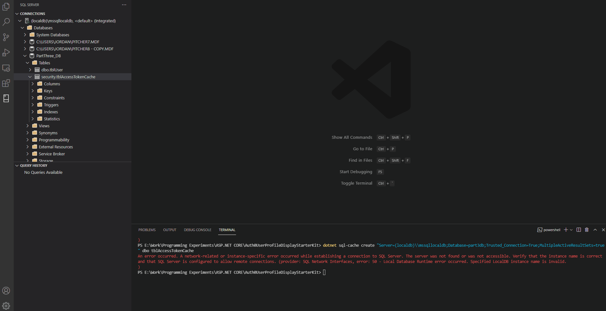

[Previously I showed you how to auto renew a token.]() We can improve the performance as well. We will look at storing our JWT in a distributed cache service to help us improve the performance and scalability of our ASP.NET 6 MVC client application and store it in a database.

But what exactly is a distributed cache? Microsoft puts it nicely.

_A distributed cache is a cache shared by multiple app servers, typically maintained as an external service to the app servers that access it. A distributed cache can improve the performance and scalability of an ASP.NET Core app, especially when the app is hosted by a cloud service or a server farm._

[Link here.](https://docs.microsoft.com/en-us/aspnet/core/performance/caching/distributed?view=aspnetcore-5.0) So your app may become very big. And you may be pushing a lot of changes to production. That means the more load it has, the more likely it crashes. A distributed cache divides that load by being split into a series of nodes.

We are going to use SQL Server to configure that or to be more exact we will configure a SQL Server Distributed Cache using the `Microsoft.Extensions.Caching.SqlServer` package.

## Add ErrorApiException to UserService ##

Go to `Services` folder and then `UserService.cs` and then swap the AuthenticationException for the ErrorApiException then add a global  namespace. 
```csharp
global using Auth0.Core.Exceptions; 
```
This is the method where you need to change the exception to be handled in the `catch statement`

```csharp
private async Task<TResponse> MakeCallAsync<TResponse>(Func<ManagementApiClient, Task<TResponse>> callFunc,
    CancellationToken cancellationToken)
{
    var apiClient = await GetApiClientAsync(forceRenewal: false, cancellationToken);
    try
    {
        return await callFunc(apiClient);
    }
    catch (ErrorApiException) // retry if 401
    {
        //Renew token in case of expiration.
        apiClient = await GetApiClientAsync(forceRenewal: true, cancellationToken);
        return await callFunc(apiClient);
    }
}
```

## Create models to manage JWT data ##

Create the model `AccessTokenCache.cs` with this code so we can store the properties of the token in the database.   

```csharp
using System;
internal partial class AccessTokenCache  
{  
    public string Id { get; set; }  
    public byte[] Value { get; set; }  
    public DateTimeOffset ExpiresAtTime { get; set; }  
    public long? SlidingExpirationInSeconds { get; set; }  
    public DateTimeOffset? AbsoluteExpiration { get; set; }  
}  
```

Now create a subfolder named `Data` under our main folder.

If you are familiar with the DbContext class for dependency injection then know that we will
not use that to configure the properties of this class. Instead we will use an EF Core interface called IEntityTypeConfiguration to:

 - Set up the schema type for the table and call it `security`. 
 - Set up some default values and whether they are required.
 - Use it to set up the table name.  

Here is the code for that. Notice the class acts as a child to AccessTokenCache but it uses an EF Core interface. Create it under our Data folder.

```csharp
using Microsoft.EntityFrameworkCore;
using Microsoft.EntityFrameworkCore.Metadata.Builders;

internal class AccessTokenCacheConfiguration : IEntityTypeConfiguration<AccessTokenCache>  
{    
    public void Configure(EntityTypeBuilder<AccessTokenCache> builder)  
    {  
        builder.ToTable(name: "tblAccessTokenCache", schema: "security");  
  
        builder.HasIndex(e => e.ExpiresAtTime);  
  
        builder.Property(e => e.Id)  
            .IsRequired()  
            .HasMaxLength(449);  
  
        builder.HasKey(e => e.Id);  
  
        builder.Property(e => e.Value).IsRequired();  
    }  
} 
```

We still have to use a database context class to set up the `AccessTokenCacheConfiguration` 
class which will be used to intermediate with the database. AccessTokenCache is just
telling it what to do.

Here is the code for the `TeamContext` class. Go ahead and make a new file for it in the `Data` folder. While we are at it we can build the User class and save the data to it. This is optional.

```csharp
using Microsoft.EntityFrameworkCore;
using Auth0UserProfileDisplayStarterKit.ViewModels;
using Microsoft.EntityFrameworkCore;
    public class TeamContext: DbContext
    {
        public TeamContext(DbContextOptions<TeamContext> options) : base(options)
        {
        }        

        //Remember setting up the table to save the user to is optional.
        public DbSet<User> Users { get; set;} 
        
        protected override void OnModelCreating(ModelBuilder modelBuilder)
        {
            //It is optional to create the user table.
            modelBuilder.Entity<User>().ToTable("tblUser");
            modelBuilder.ApplyConfigurationsFromAssembly(typeof(AccessTokenCacheConfiguration).Assembly);
        }      
    }  
```

## (OPTIONAL) Add Creation methods to Home class ##

So you can skip to the next heading if you don't want to a create user in the view as well as store JWT. But if you want to then we are going to use dependency injection to make that happen. In our HomeController add this code.

```csharp
        private readonly TeamContext _context;

        //Add the context to the constructor. Don't make another constructor. Use the one
        //that is already there.
        public HomeController(TeamContext context, IUserService userService)
        {
            _context = context;
            _userService = userService;
        }

        public IActionResult Index()
        {
            ViewData["UserID"] = new SelectList(_context.Users, "ID", "UserFullname", null);
            return View();
        }

        // POST: User/Create        
        [HttpPost]
        [ValidateAntiForgeryToken]
        public async Task<IActionResult> Index([Bind("UserLastName,UserFirstName,UserIsLeader,UserContactEmail,UserPhoneNumber,UserAddress,UserPostCode,UserCountry,UserMobileNumber,UserState,UserLogInName,UserPassword")] Auth0UserProfileDisplayStarterKit.ViewModels.User user)
        {
                if (ModelState.IsValid)
                {
                    _context.Add(user);
                    await _context.SaveChangesAsync();
                    return RedirectToAction(nameof(Index));
                }
            return View(user);
        }
```

Also add...

```csharp
global using Auth0UserProfileDisplayStarterKit.Data;
global using Microsoft.EntityFrameworkCore;
```

...to the top of the controller.
## Add services to Startup ##

We have got to add the services to activate the context class and our connection string to the
database in the `ConfigureServices` method. Enter it where you want in the method I just put it at the top.

```
services.AddDbContext<TeamContext>(options =>
            options.UseSqlServer(Configuration.GetConnectionString("DefaultConnection")));
services.AddDbContext<TeamContext>(options =>
    options.UseSqlServer(Configuration.GetConnectionString("DefaultConnection")));
```         

And add...
```
using Microsoft.EntityFrameworkCore;
using Auth0UserProfileDisplayStarterKit.Data;
```
...at the top of the class to activate the extension 
methods of EF Core and activate the context globally.  

## Install SQL Server cache packages ##

Install the package in the terminal using this command:

`dotnet add package Microsoft.Extensions.Caching.SqlServer --version 5.0.0`

In the AccessTokenManagement folder go to `TokenManagementServiceCollectionExtensions.cs`.

We swap the following. Delete this line.
 
```
services.AddDistributedMemoryCache();
```
Now add this code for setting up the SQL Server Distributed cache. For setting up an SQL Server IDistributedCache from [this article](https://docs.microsoft.com/en-us/aspnet/core/performance/caching/distributed?view=aspnetcore-5.0:)
```
services.AddDistributedSqlServerCache(options =>
{
options.ConnectionString = configuration.GetConnectionString("DefaultConnection");
options.SchemaName = "security";
options.TableName = "tblAccessTokenCache";
});
```

Now we have to set up the code for the cache. We are going to use code migrations to set the cache and install it with the sql server dotnet commands. Use this terminal tool to install sql-cache.

## Set up SQL Server localdb ##

We will need to set up the Microsoft SQL Server database
to store the JWT. To set it up we will use Entity Framework Core and the scaffolding engine in the terminal.  

Let us now install the packages.

```
dotnet add package Microsoft.AspNetCore.Diagnostics.EntityFrameworkCore
dotnet add package Microsoft.EntityFrameworkCore.SqlServer
```

The Diagnostics package is for error checking for EF Core while the other installs the database. This next command will install the cache tool for SQL Server.

```
dotnet tool install --global dotnet-sql-cache
```  

## Use Dependency Injection to create the models ##

We have to set up the database connection string now and the context class to allow EF to communicate with our models from the context class. This is so EF Core knows how to create the tables of the database with the given models. 

Here is the connection string we are going to use. Enter it just after the first brace character `{` at the top so you don't get errors.
```
{
  "ConnectionStrings": {
    "DefaultConnection": "Server=(localdb)\\mssqllocaldb;Database=PartThree_DB;Trusted_Connection=True;MultipleActiveResultSets=true" 
  },
```

## Fire it up! ##

Now run the database. If you have done everything correctly the application should still show the user profiles we got from Auth0 but here is a bonus, the backend database token was generated. 



If you want to know how to see the token yourself in the backend of VS Code then you need to install the "SQL Server (mssql)" extension.  

To make things a little easier I will let you know that what server and database values you can use when trying to connect to the database.

Server name: "(localdb)\mssqllocaldb"
Database name: "PartThree_DB"

And that should work as you have already installed SQL Server. If you don't want to install another VS Code Extension then you can do all this in Visual Studio instead.

## Didn't work? ##

If you created the database before inserting the table then you will get an error. You need to do a migration. Use this command to create a sql cache with our connection to table tblAccessTokenCache if the table did not appear in the SQL Server database explorer.

 ```
dotnet sql-cache create "Server=(localdb)\\mssqllocaldb;Database=part3db;Trusted_Connection=True;MultipleActiveResultSets=true" dbo tblAccessTokenCache
```

Hope that helped. Reach out by email if you have problems. Cheers. 

Jordan