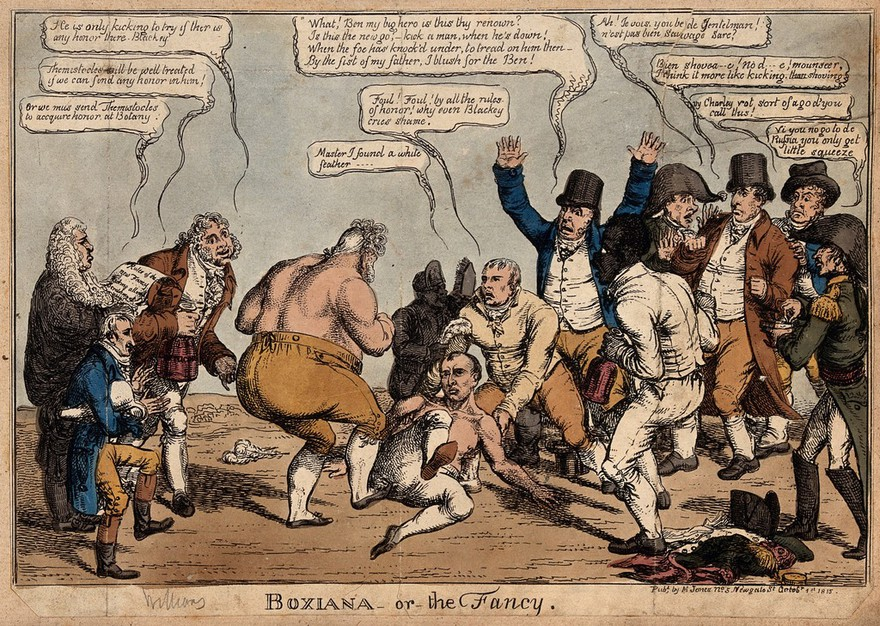

> Lu Chi Shen in Drunken Rage Smashing Guardian Figure at Temple on Five-Crested Mountain by [Tsukioka Yoshitoshi from the The Los Angeles County Museum of Art](https://collections.lacma.org/node/191716).

## Introduction

I just want to be clear if you believe yourself to be at serious risk of injury then please disregard this blog and do what you must to keep yourself safe. I'll admit, I by no means consider myself an expert on the subject of mental health. 

But as someone who has been a disability support worker who has come across some dangerous and highly stressful behaviors I can with no doubt assure you need but two things to help you survive. Resilience and understanding. I will tell you a bit about my background.

I did odd jobs but support work was really were I started to build... not so much a career, but a behavior. I built grit. Resilience. I had to run from some of my clients and get the retirement village manager to calm them down. Their behavior deescalated overtime by upping their medication as per doctor's orders. No matter how well I tried to do my job it was just part of who they were and in their state, I would likely behave the same way.

It was something I thought I was prepared for though, knowing previous support workers had been assaulted.

## Listen to the feedback, and take it. 

> A bare-knuckled boxing match between the Prince of Wales and Napoleon by Charles Williams from the [Welcome Collection](https://wellcomecollection.org/works/pdcba3ae/images?id=vna45cdh)  

Sometimes you got to admit that you're really not doing your job, you got to take the criticism that comes with that. Defensiveness don't pay the bills.

I was stuck with the same client for a year. At times I just kept my distance stayed outside on my phone and some resident in the retirement village said to their partner. 

"That's not care, that's bullshit."

"It's alright."

"No he's out there! And his client was all the way in there."

Obviously that hurt but I really, really needed to hear it because my client was at times a danger too himself. I took the feedback on and did more than other support workers including getting my client into public events, helping him get a companion card to enter venues, public transport, etc as well as seeing to his basic quality of life.

The way I survived the job was by doing coding projects in my spare time which mentally energized me from such a boring job and appreciated it more and my responsibilities to my client. He had Alzheimer's after all, and seeing my client loss himself over time really sucked. I did what I could. Probably at times more than ethical and had to know my professional boundaries. 

The job also got to me. I wasn't easy to live with at all and Mum had to kick me out of home. I wasn't violent but not nice, cold, distant, swearing, angry. Usually not in a good mood after work. 
Honestly, I could have shaped up and been better but I don't think anyone would if it was just them watching the same person for hours losing their mind and being helpless to stop it. 

It was a startup I was working for at the time so there were no real counseling resources or anything to help me manage what I was feeling or have any emotional debrief.

I had to start using medication. It was the smart thing. I'm mentally a lot better after that. I've seen good friends who go off there's become whole new people. Eventually, after a year and 8 months, work dried up. I can't believe I even lasted that long! Nothing is stable in support work. It was probably good for me to get out anyway.

## Analyze the circumstances. Is quitting really the best.

> Meme by [steverogersgf](https://memes.com/m/me-watching-my-life-fall-apart-b_41Vn_KJEV) on memes.com

Yep I would drink my green tea just like him. I would get out for walks almost everyday around the block during work breaks. Sometimes during every break as we would have to sit in our chairs most of the day.

I worked in a call centre and the turnover rate was so high that the company was bringing new hiring batches usually every fortnight. A colleague turned to me and said "they must not care about retaining their staff if they're always bringing in new people."

I could see why everyone wanted to leave. 

* Heavy workload.
* Always having to do overtime.
* A toxic team culture.
* No positive feedback after improving company's docs and that was after been asked to do so. 

"It's shit isn't it," someone said to me in the elevator. I lost two of my team leaders plus one. You could complain about everything, evil corp, your upbringing, the distance to work, the lack of milk at work for coffee and hand sanitizer, (happened with the next job.)

But I had to ask myself, how does that help me? What does that change?

I didn't want to rage quit like everyone else not because I saw any light at the end of my current job but there had to be something better out there. Also I did learn a lot about taxes. We got to understand Australian taxes better and how to slowly get people into a payment plan. I really learned how to direct people to the online government services for this, and got to understand things about my own debts, how indexation is applied to student loans.

Stuff anyone can learn but not everyone does. I feel if I hadn't learned this I would not have paid attention to my own debts. I learned about the 7% indexation increase our government imposed this year on college loans which meant I would have to pay $720 on top of my current debt. 
I paid off the debt and the money came through just a day before indexation kicked in. Phew!

Eventually, after putting up a few dozen resumes, a recruiter gave me an opportunity at a national telecommunication company/ISP which had outsourced it's services to a foreign IT firm that was all about minimizing costs. 

To be fair though, they gave you free health insurance, great feedback, positive reinforcement and I made absolute full use of that.

I thought, an IT firm! This is my chance. Someone who had worked for the telecommunication provider a few months earlier advises that they left because "they micromanage you like nothing else." He wasn't wrong, the problem was though, they paid a bit better. 

So I went to one of the most complained telcos in the country. 

## Search their intranet for professional free company certificates.

Of course I didn't get the IT job. 

But now the customers were really angry and no one could blame them. 

Eventually I got a Security Champion certificate that the company had up on there intranet. They took Cyber Security very seriously. Our computers were hard to login to especially after a rival company got breached and customer data leaked, including mine. This place, it was a cyber security maximum prison. It came after the hack so the executives likely became very scared about what was going to happen.

## Can't handle the stress? Take a sickie.

I found employees in there got in thinking they were going to get some golden tech job. One very talented former telecommunication technician worked so hard, always at the top.

Then he had enough. I met him one day in the cafeteria and he said he was quitting next week. 

He said he was going to go to try for IT support jobs. I hope he got it because for me, quitting without a better job seemed very risky. 

I really wanted to say something because I respected him but I didn't know what to say because I felt like him. 

There were days I felt so disorientated that I took a whole day off from work. I don't make it a habit but there were times I had to prioritize my mental health. I longed for annual leave and was so happy when I got it. 

The smallest sickness I had I would get a medical certificate for and used to get time off, paid or unpaid. Going call after call back to back took energy and I wanted to be mentally ready.

## Take some pride. Be a pillar. Grow with your team. Fight!

> Image by <a href="https://pixabay.com/users/stocksnap-894430/?utm_source=link-attribution&utm_medium=referral&utm_campaign=image&utm_content=2569234">StockSnap</a> from <a href="https://pixabay.com//?utm_source=link-attribution&utm_medium=referral&utm_campaign=image&utm_content=2569234">Pixabay</a>

I had a good team leader who strived for excellence in his staff and never once made me feel like an idiot when asking questions. I feel if it wasn't for him I would not have lasted. He was the workplace pillar and made the job worth staying for. It was just an incentive to fight on.

I also had people looking to me for guidance when they were unsure.

He advised me to not think about work during my holiday. I didn't. I just thought of how I could leave sadly. 

## That nice feedback can be broken down into selling points on your resume.

My boss said to me I took enormous pride and did what I could. I mean we helped ordinary people get connected for everything, telephone (yes the elderly use it still), working from home, business. 

I was very good at troubleshooting the issue and keeping things simple, I mean yeah we read from a script generated by machine learning algorithms but I learned to think outside it if I couldn't solve the issue, what systems to use, how to navigate through them, run the tests. 

I also listened to cyber security podcasts so when I had an actual cyber security victim (which was extremely rare) I knew how to explain to others in simple terms so the incident could be escalated. 

I learned a common hacking attack for victims was through USB Tethering where the attacker could log into our client's modem and take remote control of the client's computer regardless of how many times the client factory reset it, as the attacker was close by using bluetooth to attack.

Because of this I was able to cut the IT jargon, and explain to our Fraud Triage team that this wasn't some tech illiterate guy, mistaking scam emails for actual attacks.

But some actual USB tethering hacking victim. After explaining that the colleague was convinced and escalated it.
That can be turned into a selling point in the terrifying "tell me about yourself", job interview question.

I also knew that actual cyber security researchers who's mission is to prevent attacks, point out a fault in our network or hardware that requires immediate resolution. 

They get customer service folk like me who don't know as much and dealing with us can be frustrating, including the supervisor. Sadly I never got the honour of dealing with one. I take my hat off to anyone in cyber security right now. We need more defenders than attackers. 

I was so good I could tell when others made huge mistakes and had to debrief their TL privately to prevent repeated mistakes. 

For me it wasn't about pointing the finger, it was about learning and if mistakes were continuously made, the health and safety of our vulnerable clients could have been at risk.

If I made a mistake, I would admit fault and take ownership. 

## Can't work your way up? Work your way out (which I did).

At some point my boss said to not be so hard on myself. There were personal reasons for this but what he didn't know at the time was I was trying to be the best I could so I could breakdown the awesome feedback I got from the company into selling points on my resume/cover letter and initial phone interview.

Eventually I found an awesome employer for a customer service IT sales job who would have a consistent schedule, awesome pay and great team culture but I had to go through 3 interviews.

They asked me in the first round what my salary expectations were. I knew when it comes to salary negotiation you do not give a number. I tried to find out the budget so I asked along the lines of:

"I don't have an overall figure in mind as I have never done a particular job like yours. Do you know the budget allocated for this?" 

When they told me I at first I asked for $17,500 more than what I was making. 

Eventually he asked me about salary again upon offering me the job interview again (as he likely forgot due to workload, or maybe out of interest I don't know). I gave my new figure which was $18k more than what I was making and reasons for it. This time I was feeling more confident. Here were my reason.

- I had a very, very old car that needs replacing. 
- I lived in a inner city high rent area.

I ended up getting $19k more which made me realize how lucky I was.

## Lessons learned.

Experience is such a hard thing to teach because the tests she gives first and the lessons after. In this case I learned on the job that I had people I worked with had stayed in really low paying jobs for years before coming here.

They toughed it out. Bled it out and reaped the rewards for doing so. You don't want to put in all that effort of leaving your job for something worse. Almost everyone in my team has been in for years and years on end. Some well over a decade. Not the high turn over I went with earlier because I knew by staying in the horrible job and focusing on good cover letters/resumes you will one day go into an amazing role.