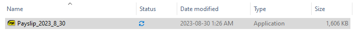
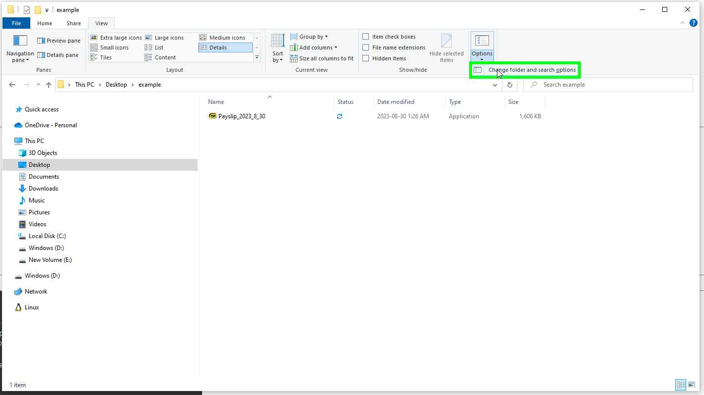
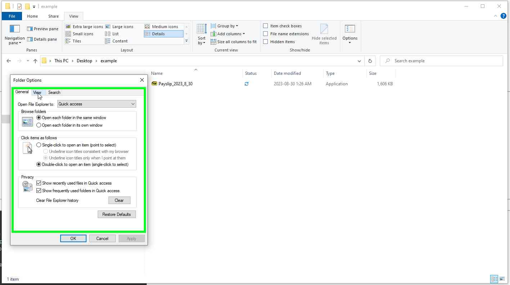
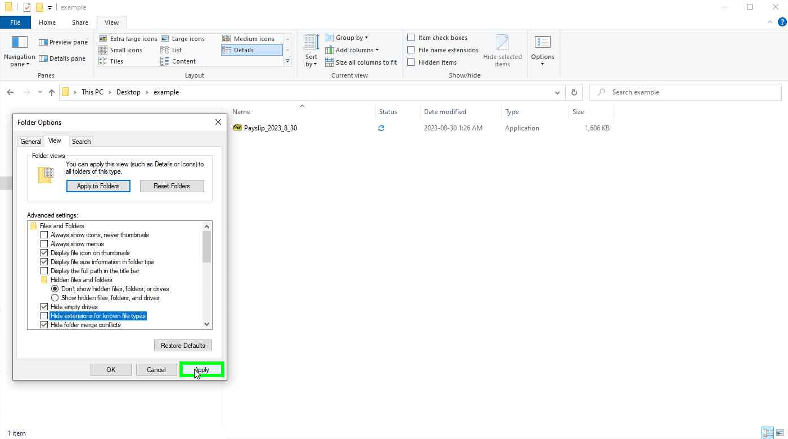

## Introduction

>Photo by <a href="https://unsplash.com/@moneyphotos?utm_source=unsplash&utm_medium=referral&utm_content=creditCopyText">rc.xyz NFT gallery</a> on <a href="https://unsplash.com/photos/1C37UztDU8s?utm_source=unsplash&utm_medium=referral&utm_content=creditCopyText">Unsplash</a>
  

I have turned the paywall on for almost every article except this one.

Why? Because, based on the amount of scams and how even the most tech-savvy IT pros can fall for these scams, I feel this one should remain free.

Yes, I heard somewhere on the Darknet Diaries podcast how one very smart cyber security penetration tester confessed to falling victim to an Amazon delivery phishing scam.

Whether you operate a server, run a business, or surf the net at home, this may very well stop you from clicking that "PDF" file you just downloaded.

It's easy to download a file thinking it's Word doc or PDF or video when in reality it's just an executable designed to ransomware encrypt your computer, overload the storage, RAM, CPU etc.

There is one setting though that could make all the difference. And that is by disabling "Hide extension for the known file type".

## What does the "Hide extension for known file type" feature do?

It will make a file name go from this:

To this:

In a nutshell, we are showing the extension at the end of the file name. The first image looks like a legit payslip from our company right? 

It has a PDF icon on my default Sumatra PDF reader that I use so it should be fine?

Look again under the file type. You'll notice the file there is really just an executable I made using Inno Setup 6. It's harmless. But in the wrong hands, it's deadly.

We cannot count on end users to always look under that column to the right. But by enabling that feature to show the extension at the end of the file name we could prevent a thousand people falling victim.

## How to disable the "Hide extension for known file type" feature?

It's very easy. Simply open the Windows File Explorer.

1. Left click on **Options** and then the **Change folder and search options**.

2. Left click on **View** tab in **Folder Options**.

3. Left click on the **Hide extensions for known file types** checkbox in Folder Options. Then left click on **Apply** (button).

And that's it.

## What you can do to help make this the default Windows feature.

Won't be suprised if business and governments are asking Microsoft to default this feature in Windows. I actually gave them feedback on there [Consumer Feedback Australia](https://www.microsoft.com/en-au/microsoftfeedback/) webpage. 

Other than that I shamelessly suggest you share this article link there, not just to promote my content but really to raise awareness about this feature. When you are bombarded with email after email in your day job, having this feature enabled could prevent a very costly mistake from occurring.
