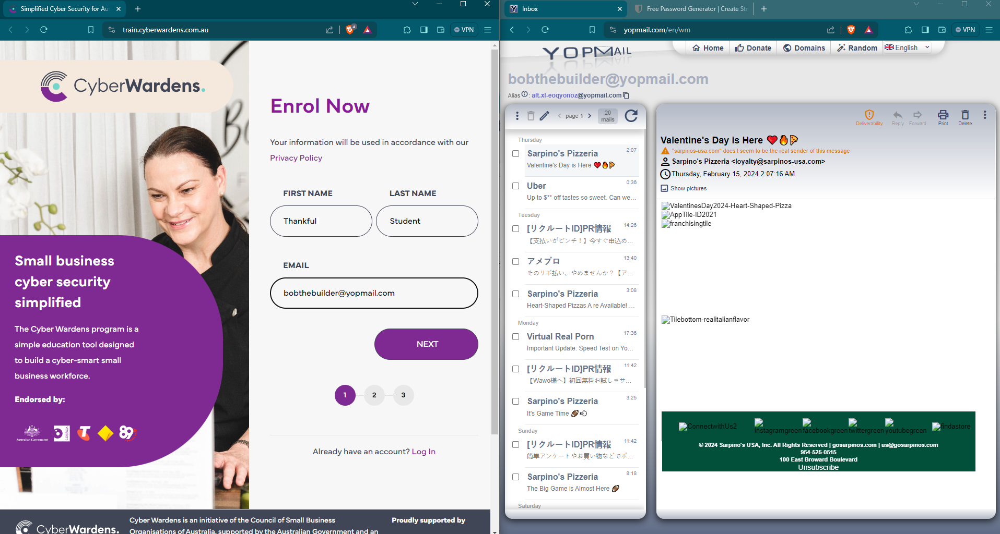
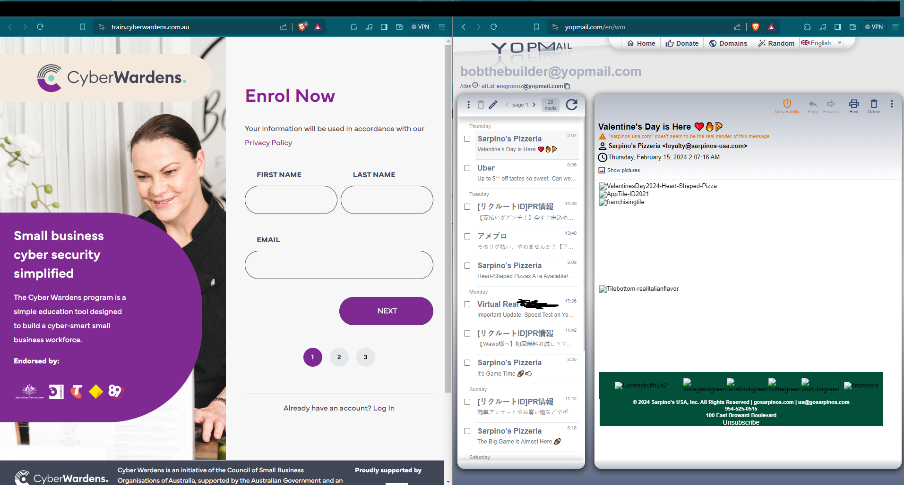
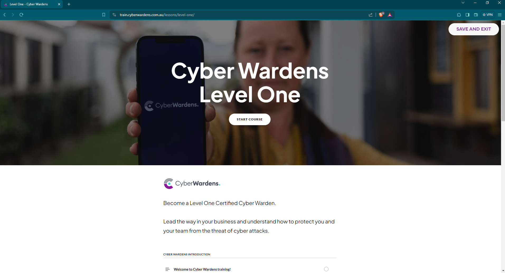

# Introduction

I am sick of spam. Not really just ads but the aggressive kind of ads that want to know your personal email or dumb details about you, just to get access to something like a "job interview cheat sheet " or a "document you will never use". 

As long as they don't want your credit card details for their service (scam) we can change all of that with Disposable Email Generators. 

## What is a Disposable email generator?

It is a email client (desktop software) or web email application. Just like your usual email, except we can make up a false email address.

There are heaps out there like Guerilla Mail. One I use is YopMail which puts it together very well!

_If you think that registering on the web may result in spam, preferably use a temporary email address. Your information could be abused._

They're also great for penetration testing because they can help you find out how easily your site can be exploited for malicious purposes.

Some websites have safeguards in place to prevent you using disposable email generators, but not the one we're about to make an account for! 😈

[Cyber Wardens](https://train.cyberwardens.com.au/) is a site endorsed in Australia by the government and various organizations. They have a free course that teaches everyday folks how to protect themselves. 

But rather than give your name and email and identify yourself, how about we make up an email and false name instead? 😏

## Using YOPmail

### Step 1: Create your disposable email address.

Go to https://yopmail.com/en/ and type a easy email on screen. You can generate a random one but some sites do not allow us to paste information so you won't be able to copy and paste so click the arrow next to it to take you to the inbox.

### Step 2: Check inbox

As you can see the inbox is there it's been used already. Don't worry about that. Once we fill out the information we can create a new account. 

### Step 3: Generate strong password

Easy as. Just use BitWarden. You have no choice but to manually type it into the website though. 

The next screen you can skip everything. 

You should now have access to your unknown Cyber Warden Account and through that access to some serious inbox decluttering tools!