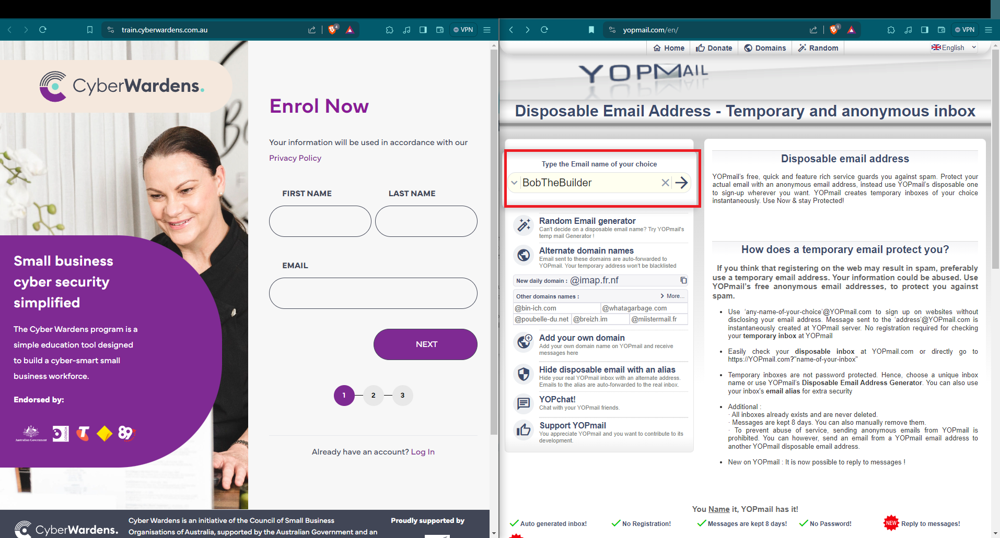
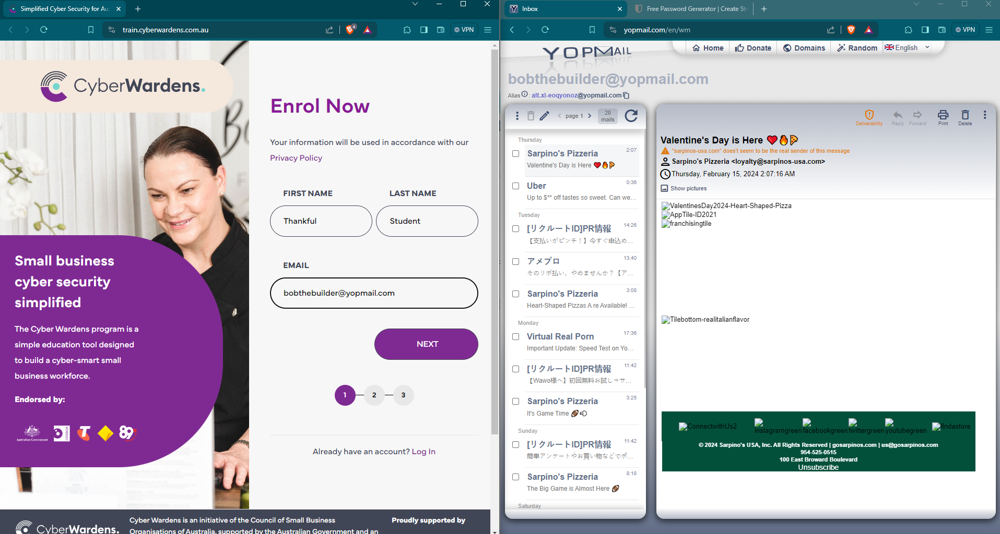
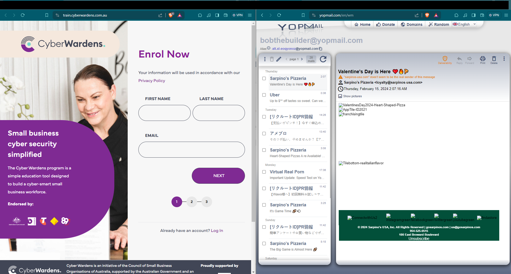
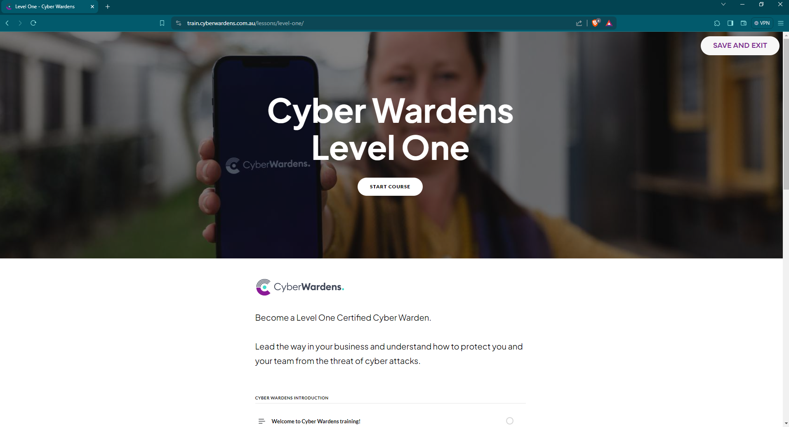

---
{::options parse_block_html="true" /}
layout: post
title:  "Breaking Free From Spam. The Power of Disposable Email Generators"
date: "2023-02-16"
published: true
---

# Introduction

I am sick of spam. Not just ads but the aggressive kind that want your personal email or full name just to get access to something like a "job interview cheat sheet" or some fossilized relic you will never use. 

## What is a Disposable email generator?

It is email software. Just like your usual email, except we can make up a false email address.

There are ones out there like Guerilla Mail. One I use is the the Batman of email generators, YopMail which puts it together very well.

_If you think that registering on the web may result in spam, preferably use a temporary email address. Your information could be abused._

Some websites have safeguards in place to prevent you using disposable email generators, but not the one we're about to make an account for! 

[Cyber Wardens](https://train.cyberwardens.com.au/) is a site endorsed in Australia by various reputable organizations. They have a free course that teaches everyday folks how to protect themselves. 

But rather than give your name and email and identify yourself to Cyber Wardens, how about we go undercover? 😏

## Using YOPmail

### Step 1: Create your disposable email address.

Go to https://yopmail.com/en/ and type a easy to read email on screen. You can generate a random one but some sites do not allow us to paste information so you won't be able to copy and paste so click the arrow next to it to take you to the inbox. It’s like entering a secret lair!

### Step 2: Check inbox

As you can see the inbox is there it's been used already. Don't worry about that. Once we fill out the information we can create a new account. 

### Step 3: Generate strong password

Easy peasy lemon squeezy. Just use BitWarden. You have no choice but to manually type it into the website though. 

The next screen you can skip everything. 

You should now have access to your incognito Cyber Warden Account and through that, access to some serious inbox decluttering tools!