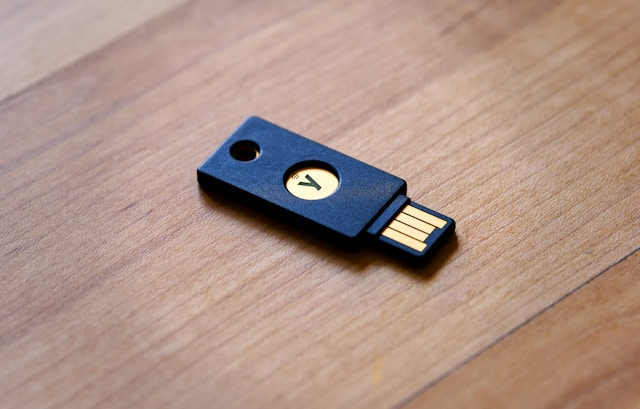
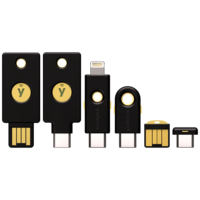
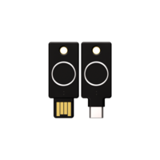

Photo by <a href="https://unsplash.com/@packetdiscards?utm_content=creditCopyText&utm_medium=referral&utm_source=unsplash">Andy Kennedy</a> on <a href="https://unsplash.com/photos/a-wooden-usb-stick-sitting-on-top-of-a-wooden-table-CpbI_SbiKqs?utm_content=creditCopyText&utm_medium=referral&utm_source=unsplash">Unsplash</a>
  

## Introduction

Just a disclaimer, I have independently written this without payment from Yubico or any of their partners.

We live in a world where we build passwords that make it easy for machines to remember but make it difficult for humans to remember. So we write passwords that are far too easy to remember. 

If we want to get this right we can use password managers, which (depending on what employee demographic we are training) could be comparable to taking a very rough stallion to water who can barely drink.
 
This phenomena is called password fatigue. 

_Password fatigue is the feeling experienced by many people who are required to remember an excessive number of passwords as part of their daily routine, such as to log in to a computer at work, undo a bicycle lock or conduct banking from an automated teller machine. The concept is also known as password chaos, or more broadly as identity chaos._

Wikipedia

Choosing the right kind of YubiKey can prevent this. It is most important before planning anything else. Getting a bulk purchase of incompatible YubiKeys can cost your business thousands of dollars and if taken out of their packaging, will not be refundable as they defeat the purpose of been a secure device.
 
## Choosing the correct yubikey

Keep in mind that many YubiKeys are available. The general term is hardware token. Other brands include Feitian, Thetis, Kensington, Nitrokey and Google.

There is a [YubiKey Quiz](https://www.yubico.com/quiz/) and it is strongly recommended to use this quiz to determine which online account and applications are supported by Yubico and the appropriate YubiKey based on your organization size, needs, budget and what industry you work for. 

To help narrow it down, if you work in a regulated industry which is typically federal or state government then you may need to check if you are usually FIPS.

When selecting against your budget and security requirements, [this table helps with that comparison.](https://yubikey.com.ua/en/compare-yubikey) 

All images were obtained from Yubico's website. I used the YubiKey 5 NFC key as it has USB A connection and can get a wireless Near Field Communication connection with my iPhone.

**YubiKey 5 Series:**
- Price: From $50 USD
- Communication Support: USB-A, USB-C, NFC, Lightning
- Security Functions: WebAuthn, FIDO2 CTAP1, FIDO2 CTAP2, U2F, Smart card (PIV-compatible), Yubico OTP, OATH – HOTP (Event), OATH – TOTP (Time), OpenPGP, Secure Static Passwords
- Certifications: FIDO U2F, FIDO2, NIST - FIPS 140-2, IP68, FIDO L2
- Cryptographic Specifications: RSA 2048, RSA 4096 (PGP), ECC p256, ECC p384
- Password Managers: Dashlane Premium, Keeper®, LastPass Premium, 1Password, Bitwarden Premium
- Device Type: FIDO HID Device, CCID Smart Card, HID Keyboard
- Design & Durability: Water Resistant, Crush Resistant, Dustproof, No Batteries Required, No Moving Parts
- Authentication Methods: Passwordless, Strong Two Factor, Strong Multi-Factor
- Manufacturing: Made in USA, Made in Sweden

**Security Key Series:**
- Price: From $25 USD
- Communication Support: USB-A, USB-C
- Security Functions: WebAuthn, FIDO2 CTAP1, FIDO2 CTAP2, U2F
- Certifications: FIDO U2F, FIDO2
- Device Type: FIDO HID Device
- Design & Durability: Water Resistant, Crush Resistant, Dustproof, No Batteries Required, No Moving Parts
- Authentication Methods: Passwordless, Strong Two Factor, Strong Multi-Factor
- Manufacturing: Made in USA, Made in Sweden

**YubiKey 5 FIPS Series:**
- Price: From $80 USD
- Communication Support: USB-A, USB-C, NFC
- Security Functions: WebAuthn, FIDO2 CTAP1, FIDO2 CTAP2, U2F, Smart card (PIV-compatible), Yubico OTP, OATH – HOTP (Event), OATH – TOTP (Time), OpenPGP, Secure Static Passwords
- Certifications: FIDO U2F, FIDO2, NIST - FIPS 140-2, IP68, FIDO L2
- Cryptographic Specifications: RSA 2048, RSA 4096 (PGP), ECC p256, ECC p384
- Password Managers: Dashlane Premium, Keeper®, LastPass Premium, 1Password, Bitwarden Premium
- Device Type: FIDO HID Device, CCID Smart Card, HID Keyboard
- Design & Durability: Water Resistant, Crush Resistant, Dustproof, No Batteries Required, No Moving Parts
- Authentication Methods: Passwordless, Strong Two Factor, Strong Multi-Factor
- Manufacturing: Made in USA

**YubiKey Bio Series:**
- Price: From $90 USD
- Communication Support: USB-A, USB-C
- Security Functions: WebAuthn, FIDO2 CTAP1, FIDO2 CTAP2, U2F
- Certifications: FIDO U2F, FIDO2
- Device Type: FIDO HID Device
- Design & Durability: Water Resistant, Crush Resistant, Dustproof, No Batteries Required, No Moving Parts
- Authentication Methods: Passwordless, Strong Two Factor, Strong Multi-Factor
- Manufacturing: Made in Sweden

## Setting up your Yubikey
Before setting them up, it is wise to trial a single YubiKey you purchased before going any further to slowly roll them out to the organization. 

You want to do it preferably from a non-administrative account with a single user and then the whole user group that single user resides in before moving on to the next group.

Setting up the Yubikey involves using the correct software. There’s more than one software tool to achieve this to interface with your Yubikey and set it up in accordance with your workplace security policies. 

There is the YubiKey Manager, YubiKey personalization tool, Yubico Authenticator etc. A popular method involves using the Yubikey Personalization Tool. 

It can be used to program multiple Yubikeys and set them up with a master admin key and print out the codes on paper as a backup and backed up to a minimal of 3 different secure places in case the Yubi key were to suddenly malfunction.

Especially the admin key. This ensures that we have alternatives on the table should the admin key malfunction.

Ensure you follow the steps in the Yubikey quiz to select the authentication method, used to login to the application or operating system etc. 

For example, one of the popular ones is the Challenge Response Mode. General instructions for setting them up as a single user to unlock KeepassXC can [be found in this video.](https://www.youtube.com/watch?v=ATvNK5LKpv8&t=592s)  

If you are deploying many YubiKeys then ensure you tick the “Automatically program YubiKeys when inserted.” Depending on your organization, it can be advisable to enable touch for the Yubikey device but it can be tedious depending on how you set it up. 

If it is set to always then you will have to touch it each time there is a change to the account configured with the Yubikey. It is far more important that you implement a PIN code for each Yubi key. 

##	Provisioning Yubikeys by access control groups 

Now that you know how to program the YubiKey and use it to login to a computer operating system or application, you may need to understand how to provision them in an Identity Provider (IDP) if your organization uses one. 

There are many IDPs that Yubico support, including Microsoft Entra ID, AWS Identity and Access Management (IAM) and Auth0 just to name a few. 
If you go to the Yubico Catalogue online, you can search for your IDP to see if it’s supported. When you find the IDP, click on it and follow any setup instructions associated with the IDP. 

We may set it up for example with the [Azure Privileged Identity Manager.](https://www.yubico.com/blog/enforcing-yubikeys-for-privilege-elevation-with-azure-privileged-identity-manager-pim/) 
Yubico provides a good resource for that in one of their blogs.

Another important thing to consider is implementing each Yubikey inline with your organization’s access control policies. If you don’t know what access control policies are, [this article](https://www.goodaccess.com/blog/access-control-models-explained) shows an in depth analysis of the subject. 

At the core, access is allowed to certain individuals or groups based on the access control policy the organization has decided to implement.

Therefore you need to ensure that your YubiKey is provisioned is in accordance with your organization’s access control policies as well as selecting a IDP.  

If you do not have a IDP solution in place then you can still use the YubiKey Personalization Tool to program each YubiKey with the appropriate configuration based on the role. 

A warning, this will be a very time consuming manual process as you monitor and manage the YubiKeys and their configurations to ensure compliance with the access control policies. It is better to use your organization's IDP or third-party tools and services to automate the process of configuring and managing YubiKeys at scale.

## Automation management of mass yubikey provisioning

Remember that once you are satisfied with the configurations, you can start trialing the YubiKey to a single person, preferably through your IDP (if you have one) then through a whole IDP group and then throughout your IDP organization domain. 

It can provide an effective process for validating and testing YubiKeys prior to deployment.

If you wanted to program a set of keys all at once for say 127 people, you can use USB hubs. The USB specification advices a USB flash drive can support up to 127 USB devices. You may have to do them in several batches depending on the number of ports available.

There are a few other ways to test and optimize the provisioning phase. You can script out the policies to manage Yubikey accounts as well as to assign Yubikeys to specific users using Yubico’s SDKs and APIs. 

You can do this by integrating the APIs and SDKs with some of the popular scripting languages like JavaScript or Python and use deployment tools such as Docker.

The script could read the user data from a data source like a CSV file or database, create the Yubikey configurations based on each user role and program each Yubikey that is connected to your hardware.

Within the script you could map out to each YubiKey the access control policies and user group specific to your organization.

To keep a record of all YubiKey user assignments you can use a database or CSV file that maps YubiKey serial numbers to user roles. 

Else you can encode this information into the Yubikey configuration so it can be read programmatically via your command line interface. 

I already found a 16 port USB hub on Amazon Australia. Each USB device can define up to 32 endpoints. You may need more root USB host controllers to increase the number of endpoints as USB hub chaining does not add more endpoints but rather reduces them. 

You can use the USB Device Tree Viewer to show the number of endpoints a device has taken up but doesn’t show the limit of the root controller.

You should ensure that your system’s power supply can handle the number of endpoints reserved by your USB hubs and each YubiKey inside those hubs. 

You can consult the hardware reference manual of your microcontroller for this, talk to the power supply manufacture or contact Yubico so they can provide guidance based on the specific model of YubiKey and your hardware specifications used to program the YubiKeys in batch.

 
## References

Wikipedia. (2022). _Password fatigue._ [online] Available at: https://en.wikipedia.org/wiki/Password_fatigue [Accessed 22 Feb. 2024]

Yubico. (n.d.). _Quiz_. [online] Available at: 
https://www.yubico.com/quiz/  [Accessed 22 Feb. 2024]

strongauthworks.com. (n.d.). _Yubico Compare Products StrongAuthWorks.com._ [online] Available at: https://strongauthworks.com/compare.asp  [Accessed 22 Feb. 2024]

www.youtube.com. (n.d.). _How To Use A Yubikey With KeePassXC._ [online] Available at: https://www.youtube.com/watch?v=ATvNK5LKpv8&t=592s  [Accessed 22 Feb. 2024]

Yubico. (n.d.). _YubiKey Personalization Tool._ [online] Available at: https://www.yubico.com/support/download/yubikey-personalization-tools/ [Accessed 22 Feb. 2024]

www.youtube.com. (n.d.). _How To Use A Yubikey With KeePassXC._ [online] Available at: https://www.youtube.com/watch?v=ATvNK5LKpv8&t=592s. [Accessed 22 Feb. 2024]

_YubiKey Personalization Tool User’s Guide._ (n.d.). Available at: https://downloads.yubico.com/support/YubiKeyPersonalizationToolUserGuideMarch2016.pdf  [Accessed 22 Feb. 2024].

 Yubico (2021). _How to select the correct YubiKey._ Available at: https://support.yubico.com/hc/en-us/articles/4403770046354-How-to-select-the-correct-YubiKey (Accessed: 24 February 2024).

www.computerhope.com. (n.d.). _How to Connect More USB Devices to a Computer._ [online] Available at: https://www.computerhope.com/issues/ch000685.html [Accessed 24 Feb. 2024].

Super User. (n.d.). _windows 11: is there a limit to the number of USB devices?_ [online] Available at: https://superuser.com/questions/1725434/windows-11-is-there-a-limit-to-the-number-of-usb-devices [Accessed 24 Feb. 2024].

www.amazon.com.au. (n.d.). _SABRENT USB 3.0 16-Port Aluminum HUB with Power Switches and LEDs, Power Adapter Included (HB-PU16) : Amazon.com.au: Computers._ [online] Available at: https://www.amazon.com.au/Sabrent-Aluminum-Switches-Included-HB-PU16/dp/B07KHRLSTT?th=1 [Accessed 25 Feb. 2024].

Yubico. (n.d.). _Works with YubiKey catalog._ [online] Available at: https://www.yubico.com/works-with-yubikey/catalog/?sort=popular [Accessed 25 Feb. 2024].

