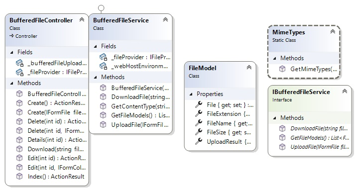
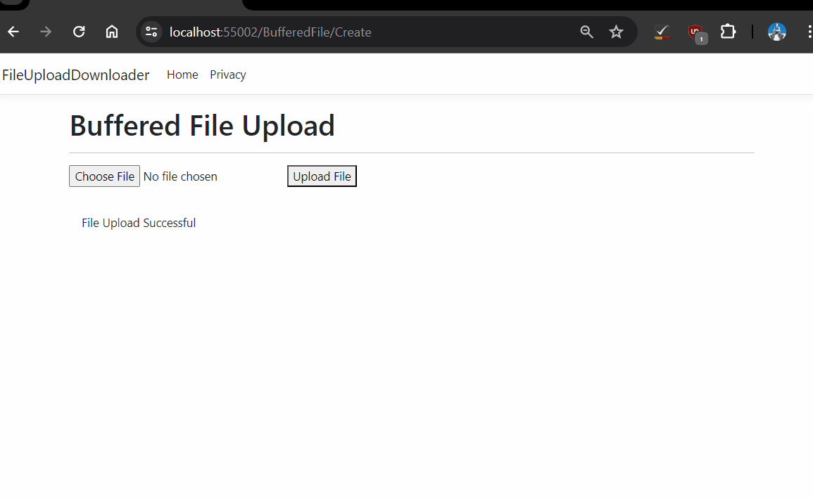
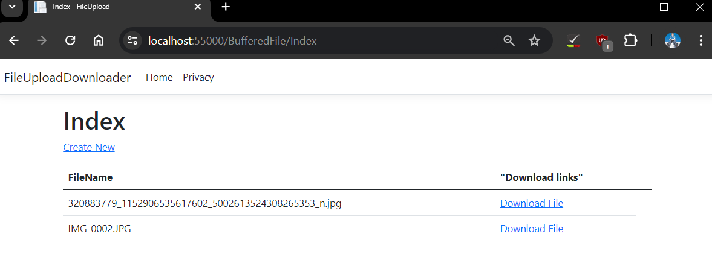

Photo by <a href="https://unsplash.com/@maximalfocus?utm_content=creditCopyText&utm_medium=referral&utm_source=unsplash">Maximalfocus</a> on <a href="Textures & Patterns">Unsplash</a>
  
## Introduction

In this tutorial you'll learn to create and see an index of files to download in your local filesystem, using ASP.NET 8 MVC and C#.  

⚠ I won't be covering large file uploads. Only buffered (small files).

You'll create clean, thin controllers with no model property references, by using service classes and interfaces that interact with your models. This will make your code more reusable.

I will show you this in a moment. I am hopping to make this into a 3 part series, the second one will be for updating and deleting from the View file actions and the last will show how to link file references to a database so their records can track which file in the file system links to what record. 

We generally store files in a file system instead of a database like Access or MySQL, as documented on Microsoft Learn.

- It can handle larger uploads.
- Less expensive than using a cloud data storage service, especially if the data is on premises.
- Images and video files depending on their size are especially heavy on the database unless stored outside.

## Perquisites and setup

Do this in either a text editor, or an IDE that you know supports .NET 8 or if you hate locally installing dependencies, you can always find a Docker image for it. 

Visual Studio 2022 should have this already built in so I will quickly walk you through it:

1. Select `Create a new project`. 
2. Select from the available templates: `ASP.NET Core Web App (Model-View-Controller)` and hit next.
3. Name your project what you want. I named it as `File-Upload-Downloader`, and hit next.
4. In the Additional Information window, select .NET 8.0. 
5. (OPTIONAL). Highly recommend you tick `Enable Docker`. The reason being is because if you reinstall Windows then it makes your application more portable in the future so you don't have to install .NET 8. Set the Docker OS as `Linux` so you can use it outside of Windows if applicable.
6. Hit Create.

## What the structure looks like?



We will create the models, then service and interfaces and after that we will just have the create the Controller and Views.

First we will break this into a series of tasks. My first one is upload files.

## Uploading files

First we will create a model and interface that will be the intermediary between our controller and service class to upload the files. 

### FileModel.cs

Create a new folder in your project called `FileViewModels` and then under that create a model called `FileModel`.

```csharp
public class FileModel
{
    public IFormFile? File { get; set; }
    public string? FileName { get; set; }
    public string? FileExtension { get; set; }
    public long FileSize { get; set; }
    public bool UploadResult { get; set; }
}
```

This will be our view model representing a single file running in memory. We'll use the IFormFile primarily for uploading buffered files while the FileName property will be used for reading them.

### IBufferedFileService.cs

If you are not aware of what an interface is, then there is no shame in checking [this out](https://learn.microsoft.com/en-us/training/paths/get-started-c-sharp-part-1/). That aside this is what it would look like. We will be implementing our service through as a child of our interface and create  more methods later. For now you want to create this method which will be implemented in our service. 

```csharp
public interface IBufferedFileService
{
    Task<bool> UploadFile(IFormFile file);
}
```

### BufferedFileService.cs

This is my faviroute class of the whole application. It helps abstract a lot of the business logic away from our Controller where won't have to know any of the model names.  

Create a Service folder and add this code. Notice we are implmenting it as a child of IBufferedFileService.

```csharp
using Microsoft.AspNetCore.Hosting;
using Microsoft.AspNetCore.Mvc;
using Microsoft.Extensions.FileProviders;
using FileUploadDownloader.FileInterfaces;
using FileUploadDownloader.FileViewModels;
using Microsoft.AspNetCore.Routing.Constraints;

namespace FileUploadDownloader.Services
{
       private readonly IWebHostEnvironment _webHostEnvironment;
       private readonly IFileProvider _fileProvider;

       public BufferedFileService(IWebHostEnvironment webHostEnvironment, IFileProvider provider)
       {
           _webHostEnvironment = webHostEnvironment;
           _fileProvider = provider;
       }
}
```

All our class methods will communicate with the interface via our constructor.

Our UploadFile method is quite a long one. Note how we are inputting the model properties in this method to avoid doing so in our Controller. 

```csharp
/// <summary>
/// Method uploads file to the wwwroot/Uploads subfolder.
/// </summary>
/// <param name="file">Represents a file sent with the HttpRequest.</param>
/// <returns>Executes upload of file</returns>
/// <exception cref="Exception">File Copy Failed</exception>
public async Task<bool> UploadFile(IFormFile file)
{
    try
    {
        //Bind service to FileUploadModel.
        FileModel fileUploadModel = new FileModel
        {
            File = file,
            FileName = file.FileName,
            FileExtension = Path.GetExtension(file.FileName),
            FileSize = file.Length
        };
        //Validate current file extension against dictionary.
        var allowedExtensions = MimeTypes.GetMimeTypes();
        
            var maxFileSize = 5 * 1024 * 1024; // 5MB
            if (fileUploadModel.FileSize > maxFileSize)
            {
                return false;
            }

            // Save the file to the server.
            var fileName = Path.GetFileName(fileUploadModel.File.FileName);
            //Get the root path of your application via IWebHostEnvironment.
            var path = Path.Combine(_webHostEnvironment.WebRootPath, "Uploads", fileName);
            using (var stream = new FileStream(path, FileMode.Create))
            {
                await fileUploadModel.File.CopyToAsync(stream);
            }

            return true;
    }
    catch (Exception ex) 
    {
        throw new Exception("File Copy Failed", ex);
    }
}
```

I'm going to explain most of the code except the try catch part. All you need to know is it stops user from seeing an error on screen.

```csharp
var allowedExtensions = MimeTypes.GetMimeTypes();
```

We are comparing the extension to our MimeTypes class dictionary which I haven't shown you yet. 

If the extensions matches any in the dictionary then we will allow the extension to be concatenated to the file path. Else an exception will be thrown.

```csharp
var maxFileSize = 5 * 1024 * 1024; // 5MB
if (fileUploadModel.FileSize > maxFileSize)
{
    return false;
}
```

We're buffering files so the file upload system does not get abused with very large files like employees, customers... hackers.

```csharp
// Save the file to the server.
var fileName = Path.GetFileName(fileUploadModel.File.FileName);
//Get the root path of your application via IWebHostEnvironment.
var path = Path.Combine(_webHostEnvironment.WebRootPath, "Uploads", fileName);
using (var stream = new FileStream(path, FileMode.Create))
{
    await fileUploadModel.File.CopyToAsync(stream);
}

return true;
```

This code simply uploads the file to a relative filepath: `wwwroot/Uploads` in our current directory. In production you would normally save the files outside the application tree. Lastly the UploadFile method tells our controller to advise the user the files uploaded with the `return true` statement.

Our Get ContentType method is the next to analyse as it gets called in our UploadFile method. If you go to the GetContentType method, you will see how we analyse for valid extensions.


```csharp
/// <summary>
/// Checks if extension is in our MimeTypes dictionary and if not throws an error.
/// </summary>
/// <param name="path"></param>
/// <returns></returns>
/// <exception cref="Exception"></exception>
public string GetContentType(string path)
{
    var allowedExtensions = MimeTypes.GetMimeTypes();
    var ext = Path.GetExtension(path).ToLowerInvariant();
    if (allowedExtensions.ContainsKey(path))
    {
        return allowedExtensions[ext];
    }            
    
    else
    {
        throw new Exception("Extension invalid");
    }            
}
```

After that our MimeTypes dictionary is called to compare that it exists. All you really need to know about it's structure is that a MIME type consists of a type and subtype e.g image/png, application/pdf etc. Type is the general categroy like documents or audio while a subtype identifies the exact kind of data specified that the MIME type holds. [Mozillia Developer Docs](https://developer.mozilla.org/en-US/docs/Web/HTTP/Basics_of_HTTP/MIME_types) has some more greta info on them. So if image/png is the type and subtype then the .png extension would be it's value. 

MimeTypes help the browser figure out how to process a URL since browsers don't use the actual file extension.

### MimeTypes.cs
```csharp
public static class MimeTypes
{
    public static Dictionary<string, string> GetMimeTypes()
    {
        return new Dictionary<string, string>
        {
            {".png", "image/png"},
            {".jpg", "image/jpeg"},
            {".jpeg", "image/jpeg"},
            {".gif", "image/gif"},
            {".pdf", "application/pdf"},
            {".doc", "application/msword"},
            {".docx", "application/vnd.openxmlformats-officedocument.wordprocessingml.document"},
            {".xls", "application/vnd.ms-excel"},
            {".xlsx", "application/vnd.openxmlformats-officedocument.spreadsheetml.sheet"}
        };
    }
}
```

### BufferedFileController.cs

To weave it all beautifully together, we access the Controller through our IBufferedFileService interface in the  Controller's constructor. The way we can upload the files here is through the `IFormFile` as shown in the Create action method. You will also notice Create does not need to know anything about our model properties which is delegated to our 
UploadFile method. 

You won't always be able to do this with a Object Relational Mapping tool but in this case our controller code is abstracted enough to have a reusable service that is not tightly coupled to the controller. Do not ship any features that persist to storage i.e create read, update or deletes without inputting the [ValidateAntiForgeryToken] paramater onto the method. 

Without inputting that your customers will be vulnerbel cross-site-scripting-attacks! Someone could commit identity theft, impersonate someone to social engineer someonelse, etc. 

```csharp
using System.Diagnostics;
using System.Net.Mime;
using Microsoft.Extensions.FileProviders;

   public class BufferedFileController : Controller
   {
        private readonly IBufferedFileService _bufferedFileUploadInterface;

        private readonly IFileProvider _fileProvider;

        public BufferedFileController(IBufferedFileService bufferedFileUploadInterface, IFileProvider provider)
        {
            _bufferedFileUploadInterface = bufferedFileUploadInterface;
            _fileProvider = provider;
        }

       // POST: StreamFileUploadController/Create
       [HttpPost]
       [ValidateAntiForgeryToken]
       public async Task<ActionResult> Create(IFormFile file)
       {
           try
           {
               //If the file is valid in size and extension. 
               if (await _bufferedFileUploadInterface.UploadFile(file))
               {
                   ViewBag.Message = "File Upload Successful";
               }
               else
               {
                   ViewBag.Message = "File Upload Failed";
               }
           }
           catch (Exception ex)
           {
               ViewBag.Message = "File Upload Failed";
           }
           return View();
       }
   }
```

### Create.cshtml

Next in Visual Studio we will create one View parent folder Views/BufferedFile and under that we will create two empty views. 

- Create.cshtml 
- Index.cshtml


For now we will focus on `Create.cshtml`. 

The code will look like this.

```html
<h1>Buffered File Upload</h1>

<hr />

<form method="post" enctype="multipart/form-data">
    <input type="file" name="file" />
    <button type="submit">Upload File</button>
</form>

@if (ViewBag.Message != null)
{
    <div class="alert" style="margin-top:20px">
        @ViewBag.Message
    </div>
}
```

If you don't understand MVC too well just renember, we use the Create method from the controller to open the Create view page. The code will use the input type of `file` to open your local file explorer where you can upload the file. After you have selected the disired button you would use the button type called submit which will persist a single file to storage.

### Run the app and upload a file.

Just press F5 and ensure you upload an image before submitting to your local file system.



## Browsing files and downloading files.

Now we want to simply create an index of all the files so we can see what we got and view them. 

We will start the way we did before in the interface file, then the service file, then controller and view file. Except we will first need to get an instance of the PhysicalFileProvider class. Watch.

### Program.cs

Mahesh Sabni's [awesome blog](https://www.webnethelper.com/2022/01/aspnet-core-6-downloading-files-from.html) shows us how the IFileProvider service in the dependency container of the application needs declaration so we can browse through the files.

In your minimal hosting model, simply put in this code to allow IFileProvider to communicate with the rest of our applications.
Ensure you specify the wwwroot/Uploads folder as shown in the environment variable.

```csharp
//Inject wwwroot/Uploads path to dependency container via IFileProvider. 
builder.Services.AddSingleton<IFileProvider>(services =>
{ 
    var env = services.GetRequiredService<IWebHostEnvironment>();
    return new PhysicalFileProvider(
        Path.Combine(env.WebRootPath, "Uploads"));
});
```

Ensure you declare the following namespaces too. We have already made our contructor in the controller aware of IFileProvider.

```csharp
using Microsoft.Extensions.FileProviders;
```

### IBufferedFileService.cs

In your IBufferedFileService file declare the following methods which we will use in our service. 

```csharp
Task<byte[]> DownloadFile(string filename);
List<FileModel> GetFileModels();
```

### BufferedFileService.cs

We have already previously advised the service of the IFileProvider in our constructor.  

Time to add the methods to do the browsing/downloading part. The following code will loop through a list and output each file name in the current dirctory. It doesn't need to know yet we will be using the Uploads directory. By the way the FileExtension is really our path. You should notice as we are assigning, item.PhysicalPath to it.

```csharp
        public List<FileModel> GetFileModels()
        {
            var fileModels = new List<FileModel>();
            foreach (var item in _fileProvider.GetDirectoryContents(""))
            {
                fileModels.Add(new FileModel()
                {
                    FileName = item.Name,
                    FileExtension = item.PhysicalPath
                });
            }
            return fileModels;
        }
```

Now that we have created a list and looped through it, we can download each file like so. 

```csharp
        public async Task<byte[]> DownloadFile(string fileName)
        {
            var path = Path.Combine(_webHostEnvironment.WebRootPath, "Uploads", fileName);
            byte[] fileBytes;

            using (var sourceStream = new FileStream(path, FileMode.Open))
            {
                fileBytes = new byte[sourceStream.Length];
                await sourceStream.ReadAsync(fileBytes, 0, fileBytes.Length);
            }
            return fileBytes;
        }
```

We're getting the path like before. Except to view the file content we have to download from the file server by storing it in a byte array and using the ReadAsync method to read all the bytes in the array so we can dowload the file when clicked on. 

### BufferedFileController.cs

```csharp
// GET: StreamFileUploadController
/// <summary>
/// Returns a list of hyperlinked files to download.
/// </summary>
/// <param name="fileName">Gets the file name from whatever path the DownloadFile extension method has</param>
/// <returns>Returns view.</returns>
public ActionResult Index()
{
    var fileModels = _bufferedFileUploadInterface.GetFileModels();
    return View(fileModels);
}
```

Generic binary data can be returned in a http request for MIME types using `application/octet-stream`. We will use this in our download method.

```csharp
public async Task<IActionResult> Download(string filename)
{
    byte[] fileBytes = await _bufferedFileUploadInterface.DownloadFile(filename);

    return File(fileBytes, "application/octet-stream", filename);
}
```

### Index.cshtml

In our BufferedFile folder we will do a couple of things:

- Enable a Create New button to link to our Create view.
- Loop through all FileName properties in our FileModel and output a clickable hyperlink for each file.
- Output all file names

```csharp
@model IEnumerable<FileUploadDownloader.FileViewModels.FileModel>
<!-- Get all the files from the server -->
@{
    ViewData["Title"] = "Index";
}

<h1>Index</h1>

<p>
    <a asp-action="Create">Create New</a>
</p>
<table class="table">
    <thead>
        <tr>
            <th>
                @Html.DisplayNameFor(model => model.FileName)
            </th>
            <th>
                Download links
            </th>
            <th></th>
        </tr>
    </thead>
    <tbody>
        @foreach (var item in Model)
        {
            <tr>
                <td>
                    @Html.DisplayFor(modelItem => item.FileName)
                </td>
                <td>
                    <a asp-action="Download"
                       asp-route-filename="@Url.Content(item.FileName)">
                        Download File
                    </a>
                </td>
            </tr>
        }
    </tbody>
</table>

```



## REFERENCES:

_Rick-Anderson (2023). Upload files in ASP.NET Core. [online] learn.microsoft.com. Available at: [https://learn.microsoft.com/en-us/aspnet/core/mvc/models/file-uploads?view=aspnetcore-8.0#storage-scenarios](https://learn.microsoft.com/en-us/aspnet/core/mvc/models/file-uploads?view=aspnetcore-8.0#storage-scenarios) [Accessed 21 May 2024]._

_link, G., Facebook, Twitter, Pinterest, Email and Apps, O. (2022). ASP.NET Core 6: Downloading Files from the Server. [online] Available at: [https://www.webnethelper.com/2022/01/aspnet-core-6-downloading-files-from.html](https://www.webnethelper.com/2022/01/aspnet-core-6-downloading-files-from.html) [Accessed 23 May 2024]._

_Anon, (2022). File Upload in ASP.NET Core 6 - Detailed Guide | Pro Code Guide. [online] Available at: [https://procodeguide.com/programming/file-upload-in-aspnet-core/](https://procodeguide.com/programming/file-upload-in-aspnet-core/) [Accessed 24 May 2024]._
‌
_developer.mozilla.org. (n.d.). MIME types (IANA media types) - HTTP | MDN. [online] Available at: https://developer.mozilla.org/en-US/docs/Web/HTTP/Basics_of_HTTP/MIME_types._

_‌link, G., Facebook, Twitter, Pinterest, Email and Apps, O. (2022). ASP.NET Core 6: Downloading Files from the Server. [online] Available at: https://www.webnethelper.com/2022/01/aspnet-core-6-downloading-files-from.html._