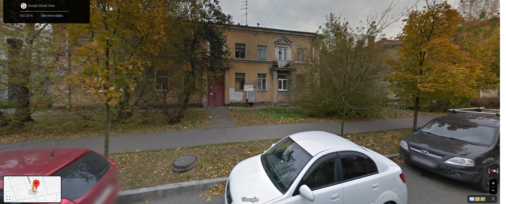
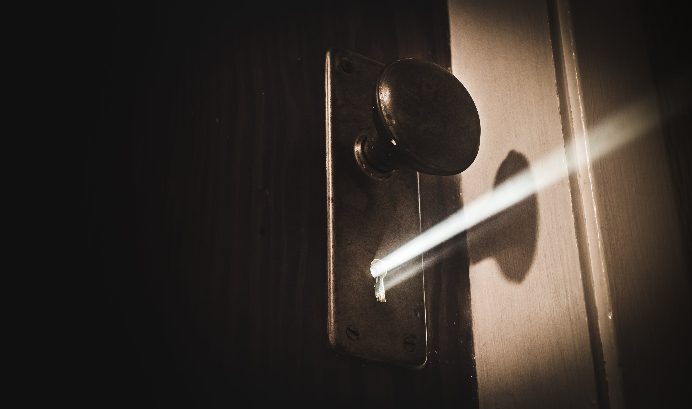

## Introduction

_Screenshot I took from Google Maps of potential scammer house_

Long ago my details were taken from a data breach and sold online to the highest bidder. This included my DOB, address, email and full name. Since then I have had random scammers phone me by my real name to help build trust. 

These type of scams can make phishing scams easier as your name and details are not something you give out to everyone. They can also feel more personal when you are been phished when you already know you're been scammed.

Just knowing that your identity is no longer your own and used maliciously, leads to a larger loss of innocence!

But you can legally can down the site and report the phishing email used. 

This blog was inspired by the Darknet Daries episode [Magecart](https://darknetdiaries.com/episode/52/) with interviewee Yonathan Klijnsma. 

## Step 1: Find out what we need to target (DO NOT make this personal!)

_
Photo by <a href="https://collection.sciencemuseumgroup.org.uk/objects/co62556/aircraft-bomb-aiming-mechanical-computer">The Science Museum Group Collection</a> of a computer bombsight type T1_

The domain name is like the central island of the scammer's site. 

We could say the website hosting provider builds a bridge to your island to allow people to visit it.

Informing the scammer's web host provider that the website is hosted for illegal purposes can result in either a refusal or silence as they will continue to make money. 

Others are more responsive. But even then it would be like destroying the bridge leading to the scammer's island. 

We could anomalously hack the site in various ways and set up a botnet to route a DDOS attack through insecure computers that unwitting people own. But if they were discovered by the scammer then they can be at risk of retaliation.

We could destroy all the infrastructure on the island through the hack. Even if we destroyed the site, it could have been backed up elsewhere. Their base of operations can always later be rebuilt and quite easily if they have a backup.

Then there is the domain name provider. We could imagine they own the island which the scammer rents. 

If we can convince the domain name provider that the island (domain name) is being used for illegal purposes, then it can be enough to evict the scammer from the island. 

Once the domain name is taken offline, the scammer will need to find a new provider or change their contact and company details to find a suitable domain name, and may have to even have to tailor the website to that domain name.

It's just more stress for them to recover from which makes it the best target. 

**Whatever you do though, do not taunt the scammer from your own email or phone number. These are criminals, if you make it personal, they will make it personal.**

You are best blocking them ASAP if they are in contact with you, now.

## Step 2: Gather information about the target

 

_Photo by <a href="https://www.shopify.com/stock-photos/@matthew_henry?utm_campaign=photo_credit&amp;utm_content=Browse+Free+HD+Images+of+Drone+View+Of+Car+Driving+Through+Forest&amp;utm_medium=referral&amp;utm_source=credit">Matthew Henry</a> from <a href="https://www.shopify.com/stock-photos/api-nature?utm_campaign=photo_credit&amp;utm_content=Browse+Free+HD+Images+of+Drone+View+Of+Car+Driving+Through+Forest&amp;utm_medium=referral&amp;utm_source=credit">Burst</a>_

We want to grab some meta data, find out who hosts the site and who owns the domain. I once saw a russian company hosting a scam website. 

Some of these Russian web hosting companies are a favorite among criminals who allow them to act with impunity, so if you are unsuccessful with taking down the domain, you will want to contact these guys as a last resort. 

You can go to https://who.is/whois/ and enter the domain there.

Look at the Registrar Info:

You will notice the domain is owned by [publicdomainregistry.com](https://publicdomainregistry.com/process-for-handling-abuse/) who I have provided an abuse response link for. You can select the Domain Abuse section and then select the Phishing "Get Started" button if you were dealing with a phishing scam for example.

Sometimes the domain provider does not have a "report abuse" form. In that case if you go to [https://lookup.icann.org/en/lookup](https://lookup.icann.org/en/lookup) and type the domain, you should be able to see the Abuse contact email under the Registrar Information heading. 

Back to the who.is site if you check the Important Dates section, that can be a clear indicator that the scammer hasn't been in business long, as it was used in 2024/8/23.

If you look at the Name Servers, notice most are within Russia. And if you find the geo coordinates of the ip address, it will lead to a house in Russia as shown in the title image. For all I know, the scammer may have used a VPN. So this may be the house of some other person. I am definitely not going to dox anyone. But if this is where the scammer lives, the house's horrid state shows that the scammer themselves may be struggling financially. 

Again this is why you need to avoid dealing with these people directly. A struggling dog backed into a corner can still be very dangerous. 

## Step 3: Inform antivirus sites of your discovery

_
Photo by <a href="https://www.shopify.com/stock-photos/@saltyshots">Dave Salter</a> on <a href="https://www.shopify.com/stock-photos">Burst</a>_

You can use [my template](https://gist.github.com/LayersOfAbstraction/aabca490d4cd60f3dfbbadb32690aac6) for this if preferred. Make it as detailed as needed, you can always trim some details in a tailored copy if there are limits. If you are new to this you can use Notepad++ with the dspellcheck plugin, Libre Office, or if you have some money, you can purchase Microsoft 365. 

Before we try to take the domain down, we want to already try to alert the trusted anti-virus entities so the Domain name provider has more of a reason to take the domain offline. Contact the antivirus sites or internet browser companies. I would definitely watch [Joe's youtube video](https://www.youtube.com/watch?v=0fIUiv9-UFk), on who to report first, he should have provided a list on most of the companies. I have added a few others.   

Report to as many as possible. There are likely more that could be included. Try at least 5. _You don't have to do them all!_ If it helps the first 2 are the most important as Google and Microsoft will block the site from their internet browsers.

* [Google SafeBrowsing](https://safebrowsing.google.com/safebrowsing/report_phish/)
* [Microsoft](https://www.microsoft.com/en-us/wdsi/support/report-unsafe-site)
* [Virus Total](https://www.virustotal.com/gui/home/upload)
* [Palo Alto Networks](https://urlfiltering.paloaltonetworks.com/)
* [McAfee](https://sitelookup.mcafee.com/)
* [Symantec](https://sitereview.symantec.com/#/) 
* [Kaspersky](https://opentip.kaspersky.com/) 
* [Cisco Talos](https://talosintelligence.com/reputation_center) 
* [Total AV](https://www.totalav.com/submit-file)
* [Fortiguard](https://www.fortiguard.com/webfilter) 
* [BrightCloud](https://www.brightcloud.com/tools/url-ip-lookup.php)
* [CRDF](https://threatcenter.crdf.fr/submit_url.html)
* [Netcraft](https://report.netcraft.com/report) 
* [ESET](https://phishing.eset.com/en-us/report)
* [Trend Micro](https://global.sitesafety.trendmicro.com/index.php)
* [BitDefender](https://www.bitdefender.com/consumer/support/answer/29358/)
* [Spam404](https://www.spam404.com/report.html) 

## Step 4: Report the domain to the domain name registrar 

I cannot provide specific advise for how to report to each registrar but if you have a email from the scammer, check if you need to include email meta-data header. Be sure not to click any links in the scam email unless you know how to test them in a secure sandbox. If the registrar does want the headers, you can check how to provide them as shown in the 3 most commonly used email clients of which you may be using. 

[Apple Mail](https://support.apple.com/en-au/guide/mail/mlhlp1089/mac#:~:text=Go%20to%20the%20Mail%20app,View%20%3E%20Message%20%3E%20Default%20Headers.)
[Gmail](https://support.google.com/mail/answer/29436?hl=en)
[Outlook](https://support.microsoft.com/en-au/office/view-internet-message-headers-in-outlook-cd039382-dc6e-4264-ac74-c048563d212c)

After reporting it will be a waiting game. It took almost two weeks get the scammer domain taken offline for me so I wish you best of luck! Thanks for reading!

## REFERENCES:

Salter, D. (2018). Mysterious Keyhole Light. [online] Burst. Available at: https://www.shopify.com/stock-photos/photos/mysterious-keyhole-light [Accessed 22 Sep. 2024].

Stone, J. (2016). Russian web hosting service a favorite among cybercriminals. [online] The Christian Science Monitor. Available at: https://www.csmonitor.com/World/Passcode/2016/0803/Russian-web-hosting-service-a-favorite-among-cybercriminals [Accessed 22 Sep. 2024].

darknetdiaries.com. (n.d.). Magecart – Darknet Diaries. [online] Available at: https://darknetdiaries.com/episode/52/ [Accessed 22 Sep. 2024].

‌Henry, M. (2018). Drone Flying Over Road. [online] Burst. Available at: https://www.shopify.com/stock-photos/photos/drone-flying-over-road?c=drone [Accessed 23 Sep. 2024].