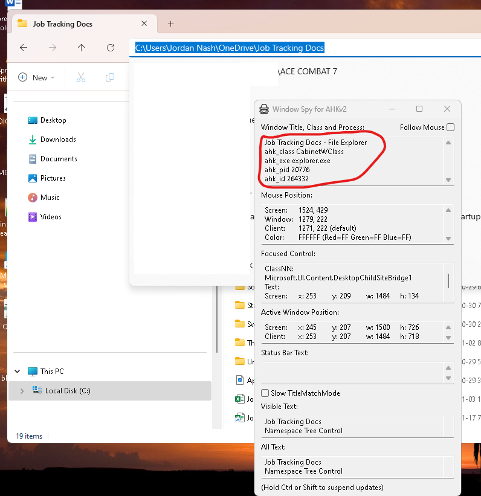

## Introduction


Disclaimer: This is only for people using Windows. The frustration of "messing up" in a job search 
is too real. Often it is probably not your fault. Only you have several you want to apply for in 
several job boards "Linked In", "Glassdoor" and "Indeed".
How does one keep track?? 

Excel? Well spreadsheets are something many organizations move a way from but for your 
own job search, why not?

Automation. Sometimes you want to hyperlink your tailored resume/cover letter for each job 
and not have applied for and navigate through less folders to simply do that. 
You could use a Visual Basic macro but what if you want to do this outside of Excel?

AutoHotkey is the answer. An open source scripting language made in C++. Very easy to implement.
As my Software Development teacher once said "if you are repeatedly doing things several times, 
there is probably a better way to do it."

## What are we learning other than building a job tracker?

In short we are learning:

- Automation.
- Debugging.
- Logging.

So let's say we are in a directory saying, "job tracker". And underneath that we have several folders for each company say "Google"
and "Amazon" and then under those we have several "job title" folders. What if we had one and were navigating back and forth to 
that folder to make changes. Wouldn't be good if we could make one less click.

So rather than navigating into Google and then it's only subfolder "Staff Software Engineer" what if it just opens it up automatically?
Well AutoHotkey can listen for that on startup. If you're interested, let's see how.

## Create the spreadsheet (optional)

You can skip this if you want to build your own. Else you can just download my template as provided. I am not going to waste your time showing you how to insert
data in cells. Rather you can do this.
```csv
Date Applied,Job Title,Company,Job URL,Application Status,Interview Date,Notes,Cover Letter Link,Resume Link,Job Description
2024-11-20,Software Engineer,Tech Innovators Inc.,https://www.techinnovators.com/jobs/123,Applied,2024-11-27,Researching company details.,https://link.to/coverletter1,https://link.to/resume1,Developing cutting-edge software solutions.
2024-11-18,Marketing Specialist,Creative Solutions Ltd.,https://www.creativesolutions.com/jobs/456,Interview Scheduled,2024-11-25,Prepare portfolio.,https://link.to/coverletter2,https://link.to/resume2,Creating and executing marketing campaigns.
2024-11-15,Data Analyst,Data Crunchers Corp.,https://www.datacrunchers.com/jobs/789,Rejected,,Follow-up for feedback.,https://link.to/coverletter3,https://link.to/resume3,Analyzing and interpreting complex data sets.
```

Unfortunately you would need to then SAVE AS xlsx format if you want to save any changes made in Excel. This is the path where you could store your docs for example. As you will notice it's in OneDrive.

After you have changed the Spreadsheet format to xlsx, you can then click on the whole row by selecting it's reference letter on the left left which should be number 1. Turn on the Autofilter option, (one of Excel's killer features) by going in the Data Tab and then filter, which should allow you to search for the data you need. 

```
C:\Users\Jordan Nash\OneDrive\Job Tracking Docs
```

Documents like our cover letter and resume could be hyperlinked from this folder layout under our "Job Tracking Docs".


```
Job Tracking Docs            
│
├─\[Default]
|                            
├─Google                     
│ │                          
│ ├─Junior Software Developer
│ └─Senior Software Developer
│                            
└─Amazon                     
  │                          
  └─Junior Software Developer                         
```

You will notice we could also have a default folder at the top in square brackets if we are
applying to multiple jobs and don't have time to tailor each resume. I put it in square brackets 
so if we have to find it alphabetically, it is easier. 

You will notice I have created my own script to use any shortcuts globally throughout Windows. 
That's the beauty of AutoHotkey v2. 

You don't need to remember the shortcuts of different applications.
Just make your own. Especially useful for job hunting as I notice some companies block the browser's 
autofill feature on their websites in such a way that turning autofill off in the developer console doesn't alway work.

## Installation of AHK tools. 

You can add it to your path in your environment variables. Usually would add it to "C:\Program Files\AutoHotkey\v2\AutoHotkey64.exe".  

Ensure you also have Visual Studio code installed. Even it's depreciated extensions will make debugging easier. I have used [Mark Wiemer's](https://marketplace.visualstudio.com/items?itemName=mark-wiemer.vscode-autohotkey-plus-plus) extension so I can set breakpoints to know how my code executes upon compilation, where I screwed up and why.

```ahk
#Requires AutoHotkey v2.0

::_jn::Jordan Nash
::_jnA:: my address
::_eo:: my outlook email
::_eg:: my gmail
::_dob:: my date of birth
::_mob:: my mobile number
::_salary:: ;Expected salary for software developer

; Current date and time. Optimized for filename automation.
::_dt::
{
    currentDateTime := FormatTime(A_Now, ' yyyy-MM-dd hhmmtt')
    
    ; This ensures that result will always be in english even if user's locale is not.
    currentDateTime := FormatTime(A_Now . ' L0x809', ' yyyy-MM-dd hhmmtt')

	Sendinput currentDateTime
}
```

Ensure you rename the values where applicable. You should be able to run the script with CTRL + F9.

## Create new script to skip company folder

This is to automate some actions in our directory that skips to the single job folder that exists in the company folder. 
Say our current folder is "Amazon" and it's subfolder is "Junior Software Developer". In that case AutoHotkey can auto select that "Junior Software Developer" folder and
navigate there in the file explorer.  

For now create the following file. SkipCompanyFolder.ahk. 

We will start with the following lines:

```ahk
#Requires AutoHotkey v2
logFile := "E:\Work\ProgrammingExperiments\AutoHotKey\SkipCompanyFolder_logFile.txt"
targetDir := "C:\Users\<Username>\OneDrive\Documents\Job Tracking Docs"
```

## Implement error handling.

As you can see this is where I have decided to declare the log file and directory where AutoHotkey will scan for. First thing first, error catching. We can log our bugs and see incremental changes to them in our code and if the output is successful. 

## Process the File Explore's selected paths.

```ahk
try
{
   currentDateTime := FormatTime(A_Now, ' yyyy/MM/dd hh:mmtt')
    
    ; This ensures that result will always be in English even if user's locale is not.
    currentDateTime := FormatTime(A_Now . ' L0x809', ' yyyy/MM/dd hh:mmtt')
    FileAppend("Script started on " currentDateTime "`n", logFile)
}

catch Error as err { 
    FileAppend("Error: " err.Message "`n", logFile) 
}
```

The code in our try block is similar to our _dt function. If you wanted to you could inherit the 
_dt function from our previous script as AHK supports the Object Orientated paradigm. 
Which means it's reusable.

But we won't go into that.

We want to continue the script.

## Create method to check our directory:

```ahk
CheckDirectory() {
    static hwnd := 0
    static navigated := false ; Declare static variable within the function
```

The two variables set the WindowsTitle to 0 and navigated is a flag to tell our program if we navigated to our target directory.

To give more context, in Windows 11, `ahk_id HWND` is each window with a unique ID. The ID can be used to keep track of the specific window even if it's text or title were to change. But the ID is not unique to each individual program or window. 

It helps us identify the type of window wether it is the ID of the Windows File Explorer or Firefox. Do not confuse it with ahk_pid which is the process id.

If this is starting to feel very confusing and abstract, do not worry! It will make a lot more sense when you see how Windows Spy works, an amazing AHK tool which comes packaged with the programming language. 

Shows the backend values of the currently selected window. Stops us from having to figure out what is the identification value of the selected file explorer window that we need to search for.



So I have used my mouse to select the file explorer and made sure I am in the target path and that the window is in focus so that I
can grab all the info needed to id it.

```ahk
    try 
    {
        ; Find the File Explorer window with the specified title
        hwnd := WinExist("ahk_class CabinetWClass ahk_exe explorer.exe")
        if !hwnd {
            return
        }
        
        for window in ComObject("Shell.Application").Windows {
            if (window.HWND == hwnd) {
                currentDir := StrReplace(window.LocationURL, "file:///", "")
                break
            }
        }             
```

So we are going through a process of elimination. Making sure the Windows Spy values match up. So for the Windows Explorer we can help ensure we choose the right objects where object could be ahkclass and it's value could be CabinetWClass.

## Process the File Explore's selected paths.

Wre checked we are getting the correct object which is the File Explorer.

Now all that is required is to ensure it is scanning for when we have selected the target path and that it matches our currently selected folder in the File Explorer.

```ahk
; Check if the current directory starts with the target directory
        if (InStr(currentDir, targetDir) = 1) {
            if (!navigated) {
                FileAppend("Current directory starts with the target directory" "`n", logFile)
                subfolders := []
                Loop Files, currentDir "\*.*", "D"  ; D = directories only
                {
                    subfolders.Push(A_LoopFileFullPath)
                }
```

I will not explain what the first line is doing. The second line will check that we are not in the target directory anymore and have 
navigated to one of the subdirectories.
## REFERENCES:

Autohotkey.com. (2024). WinTitle & Last Found Window | AutoHotkey v2. \[online] 
Available at: https://www.autohotkey.com/docs/v2/misc/WinTitle.htm#ahk_id \[Accessed 1 Dec. 2024].

```ahk
#Requires AutoHotkey v2
logFile := "E:\Work\ProgrammingExperiments\AutoHotKey\SkipCompanyFolder_logFile.txt"
targetDir := "C:\Users\Jordan Nash\OneDrive\Job Tracking Docs"
checkInterval := 1000 ; Time in milliseconds between checks (1 second)

try {
    currentDateTime := FormatTime(A_Now, ' yyyy/MM/dd hh:mmtt')
    
    ; This ensures that result will always be in English even if user's locale is not.
    currentDateTime := FormatTime(A_Now . ' L0x809', ' yyyy/MM/dd hh:mmtt')
    FileAppend("Script started on " currentDateTime "`n", logFile)
    SetTimer CheckDirectory, checkInterval
} 
catch Error as err { 
    FileAppend("Error: " err.Message "`n", logFile) 
}

CheckDirectory() {
    static hwnd := 0
    static navigated := false ; Declare static variable within the function

    try {
        for window in ComObject("Shell.Application").Windows {
            if (window.HWND == hwnd) {
                currentDir := StrReplace(window.LocationURL, "file:///", "")
                break
            }
        }             

        currentDir := StrReplace(currentDir, "%20", " ") ; Decode URL-encoded spaces
        currentDir := StrReplace(currentDir, "/", "\") ; Convert to backslashes for consistency

        ; Check if the current directory starts with the target directory
        if (InStr(currentDir, targetDir) = 1) {
            if (!navigated) {
                FileAppend("Current directory starts with the target directory" "`n", logFile)
                subfolders := []
                Loop Files, currentDir "\*.*", "D"  ; D = directories only
                {
                    subfolders.Push(A_LoopFileFullPath)
                }
                if (subfolders.Length = 1) {  ; Check if only one subfolder is present
                    folder := subfolders[1]
                    ; Navigate to the subfolder within the same window
                    for window in ComObject("Shell.Application").Windows {
                        if (window.HWND == hwnd) {
                            window.Navigate(folder)
                            break
                        }
                    }
                    FileAppend("Navigated to: " folder "`n", logFile)
                } else {
                    FileAppend("Manual navigation required: multiple subfolders found" "`n", logFile)
                }
            }
        } else {
            ; Reset the navigated flag if the current directory is not within the target directory
            navigated := false
            FileAppend("Current directory does not start with the target directory" "`n", logFile)
        }
    } catch Error as err { 
        FileAppend("Error: " err.Message "`n", logFile) 
    }
}
```